# BÁO CÁO TỔNG HỢP VÀ THỰC HÀNH GIT / GITHUB

## 1. Khái niệm Git & Lịch sử ra đời

### 1.1. Git là gì?
- **Định nghĩa:** Git là một hệ thống quản lý phiên bản mã nguồn mở phân tán 
- **Công dụng:**
  - Theo dõi và lưu lại lịch sử thay đổi của source code.
  - Cho phép các thành viên làm việc nhóm hiệu quả, chia nhánh để phát triển tính năng độc lập mà không ảnh hưởng đến nhánh chính.
  - **Mô hình phân tán:** Mỗi local đều sở hữu một repo riêng đầy đủ toàn bộ lịch sử, không bị phụ thuộc hoàn toàn vào máy chủ trung tâm.

### 1.2. Lý do Git được tạo ra
- **Lịch sử:** Do Linus Torvalds khởi xướng phát triển vào năm 2005 để phục vụ việc quản lý mã nguồn nhân Linux (Kernel) sau khi dự án mất quyền truy cập miễn phí vào công cụ BitKeeper.
- **Các tiêu chuẩn thiết kế cốt lõi:**
  - **Tốc độ là ưu tiên hàng đầu:** Viết bằng ngôn ngữ C, tối ưu hóa hiệu năng phần cứng.
  - **Thiết kế phân tán:** Mỗi lập trình viên đều có bản sao đầy đủ của dự án để làm việc offline
  - **Chuyển nhánh siêu nhẹ:** Nhánh trong Git thực chất chỉ là một con trỏ dung lượng 41 byte trỏ tới một commit. Việc chuyển nhánh diễn ra tức thì.
  - **Tính bảo mật & toàn vẹn:** Sử dụng mã hóa SHA-1 để đảm bảo dữ liệu không bị hỏng hoặc bị chỉnh sửa lén lút mà không bị phát hiện.


| Tiêu chí | Git | SVN (Subversion) | Mercurial (Hg) |
| :--- | :--- | :--- | :--- |
| **Mô hình kiến trúc** | **Phân tán (DVCS):** Mỗi máy local chứa full lịch sử dự án. | **Tập trung (CVCS):** Chỉ máy chủ trung tâm lưu giữ toàn bộ lịch sử. | **Phân tán (DVCS):** Mỗi máy local chứa full lịch sử dự án. |
| **Lưu trữ dữ liệu** | **Snapshots:** Lưu ảnh chụp trạng thái toàn bộ dự án tại thời điểm commit. | **Deltas:** Lưu vết sự thay đổi qua từng phiên bản. | **Changesets:** Lưu các tập hợp thay đổi dựa trên delta. |
| **Tốc độ & Ngoại tuyến** | **Rất nhanh:** Hầu hết thao tác thực hiện offline ngay trên máy local. | **Chậm hơn:** Phải kết nối mạng tới Server cho mỗi commit/log/checkout. | **Nhanh:** Hoạt động offline tương tự Git. |
| **Quản lý Nhánh (Branching)** | **Siêu nhẹ & Nhanh:** Nhánh chỉ là con trỏ dung lượng 41 bytes trỏ tới commit. | **Nặng & Chậm:** Mỗi nhánh tạo ra là một bản copy toàn bộ thư mục code. | **Tương đối đơn giản:** Nhưng tạo nhánh ít linh hoạt hơn Git. |
---

## 2. So sánh Git và GitHub / GitLab / Bitbucket

| Tiêu chí | Git | GitHub / GitLab / Bitbucket |
| :--- | :--- | :--- |
| **Bản chất** | Phần mềm / Công cụ quản lý phiên bản mã nguồn | Dịch vụ điện toán đám mây lưu trữ kho chứa Git |
| **Nơi hoạt động** | Cài đặt và chạy trực tiếp trên máy local của dev | Chạy trên máy chủ đám mây thông qua giao diện Web / API |
| **Chức năng chính** | Theo dõi lịch sử thay đổi, tạo nhánh, khôi phục phiên bản | Lưu trữ code online, chia sẻ code, quản lý issue, Pull Request, phân quyền |
| **Kết nối mạng** | Hoạt động Offline, không cần kết nối Internet | Cần có kết nối Internet để đẩy (Push) hoặc kéo (Pull) code |
| **Giao diện** | Tương tác chủ yếu qua Terminal | Giao diện Web trực quan, dễ thao tác quản lý dự án |

> **Tóm lại:** Git là **động cơ** của chiếc xe, còn GitHub / GitLab / Bitbucket là **bãi đỗ xe hay gara**.

---

## 3. Cài đặt Git và cấu hình ban đầu

### 3.1. Kiểm tra phiên bản Git
Mở Terminal / Git Bash và kiểm tra phiên bản đã cài đặt:
```bash
git --version
Output: git version 2.54.0.windows.1
```

### 3.2. Cấu hình thông tin người dùng
Khi tạo một commit, Git sẽ gắn thông tin tác giả vào commit đó. Chạy các lệnh sau để thiết lập tên và email toàn cục:
```bash
git config --global user.name "Lê Tiến Dũng"
git config --global user.email "ledung85499@gmail.com"
```

### 3.3. Cấu hình SSH Key

Sử dụng SSH Key giúp xác thực an toàn và không cần nhập lại mật khẩu/token mỗi khi push hoặc pull code.
  - **Bước 1: Chạy câu lệnh khởi tạo SSH Key mới (sử dụng thuật toán ed25519):**
  ```bash
  ssh-keygen -t ed25519 -C "ledung85499@gmail.com"
  ```

- **Bước 2: Lấy nội dung Public Key để dán vào GitHub (Settings -> SSH and GPG keys):**
  ```bash
  cat ~/.ssh/id_ed25519.pub
  ```
  *Public Key thu được có dạng:*
  ```text
  ssh-ed25519 AAAAC3NzaC1lZDI1NTE5AAAAIH0PYQ7AXUrYo1xoWUuz7WTYoNjV8YtigR3/ghm+tC02 ledung85499@gmail.com
  ```

- **Bước 3: Kiểm tra kết nối SSH tới GitHub:**
  ```bash
  ssh -T git@github.com
  ```

> **Minh chứng thực hành:**
 
> 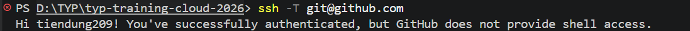
---

## 4. Khởi tạo và Clone Repository

### 4.1. `git init`
Dùng để khởi tạo một kho lưu trữ Git mới hoàn toàn trong một thư mục trống trên máy local. Lệnh này sẽ tạo ra một thư mục ẩn `.git`.
```bash
git init
```
>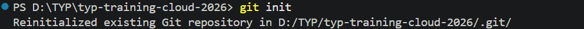
Reinitialized vì đã được thêm file .git từ trước rồi

### 4.2. `git clone`
Dùng để sao chép một kho lưu trữ đã có sẵn từ trên remote Github về máy cá nhân, bao gồm đầy đủ lịch sử commit và thư mục ẩn `.git`.
```bash
git clone <URL_REPOSITORY>
```
> 

### 4.3. Cấu trúc thư mục `.git`
Thư mục `.git` chứa toàn bộ metadata, lịch sử commit, thông tin branch, con trỏ `HEAD` và các file cấu hình của repository.
Thư mục `.git` nằm ở gốc dự án chứa toàn bộ dữ liệu quản lý của Git, bao gồm các thành phần cốt lõi:
- **`HEAD`:** Là một file con trỏ chỉ định branch hoặc commit hiện tại mà Working Directory đang checkout.
- **`config`:** File chứa toàn bộ cấu hình riêng của Repository này (ví dụ: đường dẫn remote URL, thiết lập branch.
- **`objects/`:** Cơ sở dữ liệu lưu trữ toàn bộ nội dung file, thư mục, thông tin commit
- **`refs/`:** Thư mục chứa các con trỏ trỏ tới các commit cụ thể:
  - `refs/heads/`: Chứa các nhánh ở local .
  - `refs/tags/`: Chứa các nhãn phiên bản.
  - `refs/remotes/`: Chứa trạng thái các nhánh trên remote.

---

## 5. Trạng thái file trong Git và các lệnh kiểm tra

### 5.1. Các trạng thái của file
1. **Untracked:** File mới được tạo trong dự án nhưng chưa được Git theo dõi.
2. **Staged:** File đã được đưa vào khu vực chuẩn bị (Staging Area) bằng lệnh `git add`, chờ để lưu ở lần commit tiếp theo.
3. **Committed:** File đã được lưu trữ an toàn vào lịch sử của kho chứa sau khi chạy lệnh `git commit`.
4. **Modified:** File đã có trong lịch sử Git nhưng vừa bị chỉnh sửa ở máy local so với phiên bản commit gần nhất.

### 5.2. Các câu lệnh kiểm tra trạng thái
- `git status`: Kiểm tra trạng thái hiện tại của các file trong thư mục làm việc (hiển thị file nào đang ở dạng Untracked, Staged hay Modified).
- `git diff`: Xem chi tiết các dòng code cụ thể được thêm vào hoặc xóa đi so với phiên bản trước đó.

```bash
git status
git diff
```

> **Minh chứng thực hành:**
> 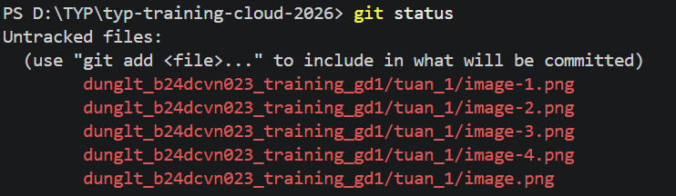
> 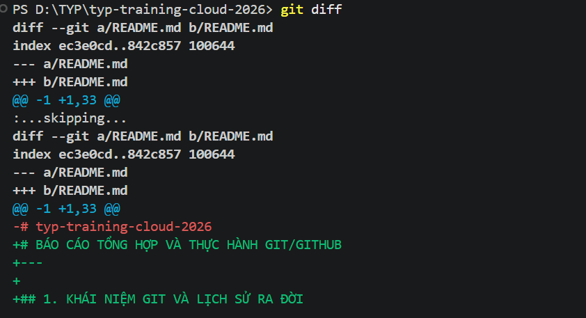

---

## 6. Các thao tác Commit căn bản

### 6.1. Các câu lệnh thực hiện
- **Đưa thay đổi vào Staging Area:**
  ```bash
  git add <tên_file>
  # Hoặc đưa toàn bộ file thay đổi vào Staging Area:
  git add .
  ```
- **Lưu thay đổi vào Repository:**
  ```bash
  git commit -m "Nội dung mô tả ngắn gọn về thay đổi"
  ```
  > 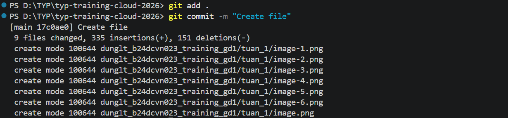

### 6.2. Quy chuẩn viết Commit Message tốt
- Sử dụng câu mệnh lệnh ngắn gọn ở thì hiện tại như `add`, `fix`, `update`, `refactor` (tránh dùng thì quá khứ như `added`, `fixed`).
- Dòng đầu tiên nên dưới 50 ký tự, tóm tắt rõ mục đích thay đổi.
- Nếu cần thiết, xuống dòng để viết thêm phần mô tả chi tiết lý do và cách thức thay đổi.
---
## 7. Quản lý lịch sử và phiên bản

- `git log`: Liệt kê toàn bộ danh sách các commit trước đó (bao gồm tác giả, thời gian, mã commit ID và thông điệp commit).
- `git show <commit_id>`: Xem chi tiết một mốc thời gian cụ thể ở lần commit trước đó đã sửa những dòng code nào.
- `git blame <tên_file>`: Hiển thị từng dòng code trong file do ai viết và commit vào lúc nào (dùng để tra cứu trách nhiệm).
- **Commit ID:** Là một chuỗi mã hóa SHA-1 dài 40 ký tự (độc nhất cho mỗi lần commit), đóng vai trò như "CCCD" để Git nhận diện chính xác từng mốc thời gian.

```bash
git log --oneline
git show a1b2c3d
git blame main.cpp
```

>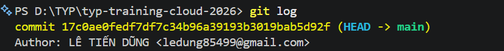


>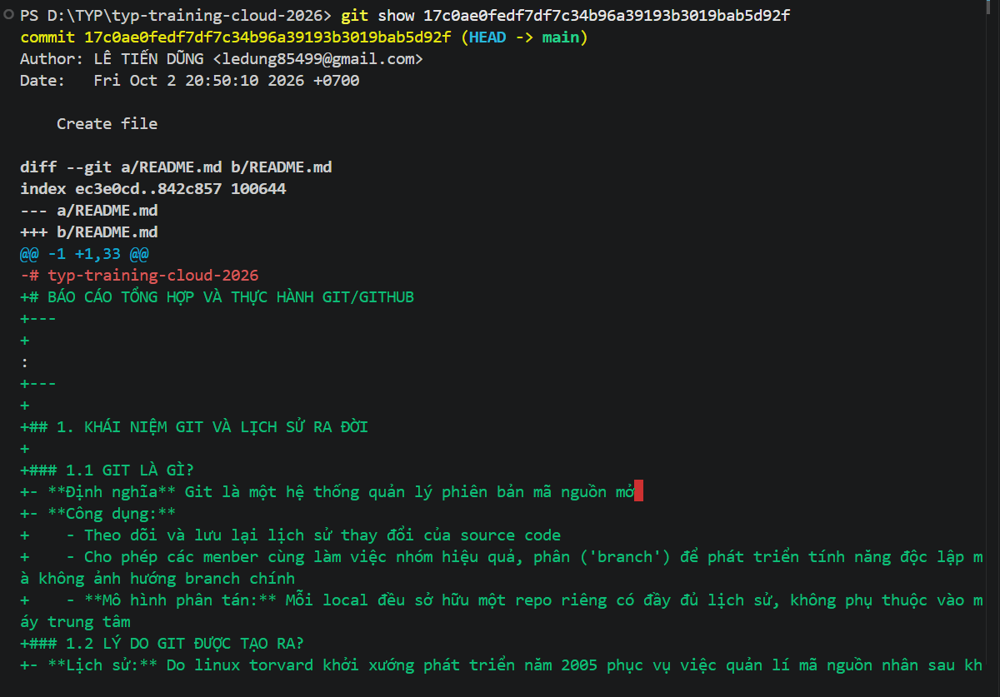


>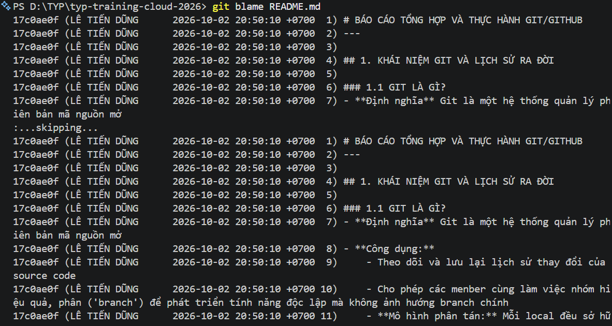


---

## 8. Hủy bỏ thay đổi (Undo Operations)

### 8.1. `git checkout` / `git restore`
- **`git checkout -- <file>`** hoặc **`git restore <file>`**: Dùng để loại bỏ các sửa đổi chưa staging ở Working Directory, đưa file quay về trạng thái sạch sẽ của commit gần nhất.
- **`git checkout <commit_id>`**: Chuyển con trỏ HEAD về xem lại trạng thái của toàn bộ dự án tại mốc commit trong quá khứ.
>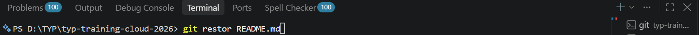


### 8.2. `git reset`
Xóa sạch hoặc tua ngược lịch sử commit đã làm trước đó, quay ngược thời gian về mốc chỉ định.
```bash
# Giữ lại các thay đổi ở môi trường làm việc
Di chuyển con trỏ branch quay lại một commit cũ:
- `git reset --soft <commit_id>`: Giữ lại tất cả thay đổi ở Staging Area.
- `git reset --mixed <commit_id>`: Giữ lại thay đổi ở mặc định.
- `git reset --hard <commit_id>`: Xóa sạch hoàn toàn mọi thay đổi sau mốc commit đó.
```
>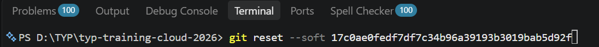
>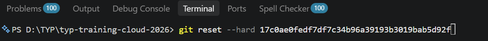

### 8.3. `git revert`
Tạo ra một commit mới có nội dung đảo ngược lại commit lỗi trước đó. Cách này giúp vô hiệu hóa lỗi nhưng vẫn giữ nguyên lịch sử commit cũ.
```bash
git revert <commit_id>:Tạo ra một commit mới có nội dung triệt tiêu/đảo ngược lại commit lỗi trước đó mà không làm mất lịch sử cũ.
```
>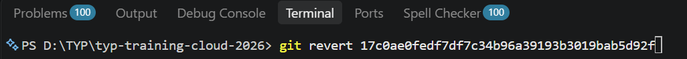

| Tiêu chí | `git reset` | `git revert` |
| :--- | :--- | :--- |
| **Bản chất** | Xóa/thay đổi lịch sử commit cũ. | Giữ nguyên lịch sử cũ, tạo thêm commit mới để đảo ngược. |
| **Môi trường sử dụng** | **Chỉ dùng ở Local Branch:** Khi code chưa được push lên remote server. | **Dùng cho Remote / Shared Branch:** Khi code lỗi đã push lên branch chung (`main`, `develop`). |
| **Độ an toàn làm việc nhóm** | **Nguy hiểm:** Nếu reset branch đã push sẽ gây lệch lịch sử đối với các thành viên khác. | **An toàn:** Không gây xung đột lịch sử code của dự án nhóm. |
---

## 9. Quản lý file rác với `.gitignore`

Trong quá trình phát triển, dự án sẽ sinh ra nhiều file rác, file cấu hình môi trường hoặc thư mục biên dịch 

File `.gitignore` được tạo ra để khai báo danh sách các file/thư mục mà Git sẽ hoàn toàn bỏ qua, không theo dõi lịch sử và không đưa lên kho chứa.

---

## 10. Quản lý Nhánh

### 10.1. Khái niệm Branch
- **Branch (Nhánh):** Là một bản sao độc lập của mã nguồn tại một thời điểm. Cho phép lập trình viên tách ra làm việc riêng biệt mà không làm ảnh hưởng đến nhánh chính (`main`).
- **Tại sao cần?**
  - Giúp nhiều thành viên cùng làm việc trên một dự án mà không dẫm chân lên nhau.
  - Thử nghiệm tính năng mới an toàn; nếu bị lỗi chỉ cần xóa nhánh đó đi mà không làm hỏng hệ thống chính.

### 11.1. Các câu lệnh làm việc với Branch
```bash
# Xem danh sách các nhánh hiện có:
git branch


# Tạo nhánh mới và chuyển sang nhánh đó ngay lập tức:
git checkout -b <tên_nhánh>


# Hoặc sử dụng lệnh cú pháp mới:
git switch -c <tên_nhánh>

# Chuyển đổi qua lại giữa các nhánh:
git switch <tên_nhánh>
```
>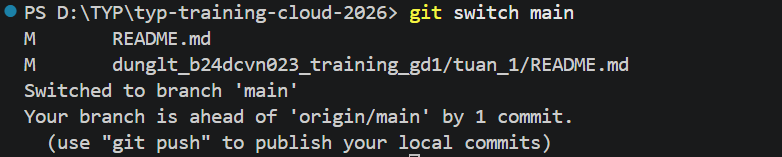
>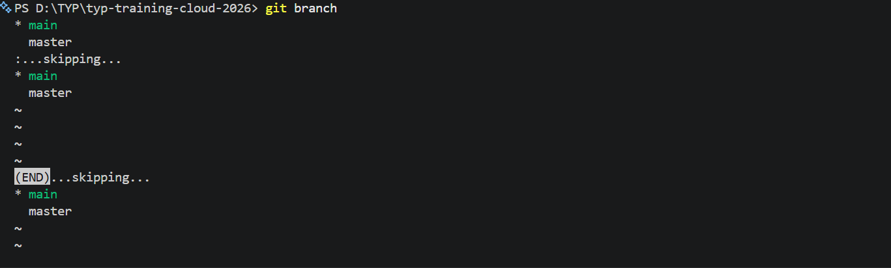


## 12. Gộp nhánh (Merge) và Xử lý Conflict

### 12.1. `git merge`
Dùng để gộp toàn bộ lịch sử và code từ một nhánh khác vào nhánh hiện tại đang đứng.
```bash
git switch main
git merge <tên_nhánh_cần_gộp>
```

>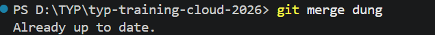
### 12.2. Xử lý xung đột (Merge Conflict)
- **Nguyên nhân:** Xảy ra khi hai nhánh cùng sửa đổi ở **chính xác một dòng code** nhưng lại có nội dung khác nhau. Khi merge, Git không thể tự quyết định nên lấy dòng code nào.
- **Cách xử lý:** Git sẽ đánh dấu đoạn bị xung đột trong file. Lập trình viên phải mở file ra, xem xét kỹ, chọn giữ lại code đúng, xóa các ký tự đánh dấu thừa (`<<<<<<<`, `=======`, `>>>>>>>`), sau đó thực hiện `git add` và `git commit` lại.

---

## 13. Chiến lược quản lý nhánh

Là tập hợp các quy tắc chuẩn khi làm việc nhóm để quản lý các nhánh một cách khoa học:
- **`main` / `master`:** Nhánh chính của dự án, luôn chứa code sạch, đã qua kiểm thử, hoạt động ổn định và sẵn sàng triển khai lên Production.
- **`develop`:** Nhánh phát triển chung, tích hợp các tính năng mới từ các dev trước khi đưa lên nhánh `main`.
- **`feature/*`:** Nhánh riêng do từng dev tạo ra để làm một tính năng cụ thể (ví dụ: `feature/login`, `feature/payment`).
- **`hotfix/*`:** Nhánh dùng để xử lý khẩn cấp các lỗi phát sinh trực tiếp trên môi trường Production.
Mô hình **Git Flow** tiêu chuẩn quản lý các nhánh dự án bao gồm:
-**`release/*`:** Nhánh chuẩn bị phát hành phiên bản mới, tách ra từ `develop` khi sắp đến hạn ra mắt. Dùng để tester kiểm thử cuối cùng và fix các bug nhỏ trước khi gộp song song vào cả `main` và `develop`.
---

## 14. Thao tác với Remote Repository

```bash
# Khai báo đường dẫn đến kho chứa trên remote (đặt tên gợi nhớ là origin):
git remote add origin <URL_REPOSITORY>

# Đẩy code từ máy local lên kho chứa remote:
git push -u origin <tên_nhánh>

# Kéo code mới nhất từ remote về máy local và tự động merge:
git pull origin <tên_nhánh>

# Tải dữ liệu mới từ remote về kiểm tra âm thầm (chưa merge vào code local):
git fetch origin
```
>
>
>
>
---

## 15. Quy trình Fork, Clone và Pull Request (PR)

1. **Fork:** Sao chép kho lưu trữ của người khác về tài khoản GitHub cá nhân để có toàn quyền sở hữu và chỉnh sửa.
2. **Clone:** Tải kho chứa đã Fork từ GitHub về máy cá nhân để bắt đầu lập trình.
3. **Pull Request (PR):** Sau khi hoàn thành công việc và push lên repo cá nhân, tạo một yêu cầu gửi tới repo gốc để owner review code và accept merge bài nộp vào dự án chung.

---

## 16. Giải quyết Conflict khi làm việc nhóm

### Quy trình thực hành giải quyết Conflict thực tế:
1. Khi push hoặc merge code bị báo lỗi Conflict, mở dự án trên VS Code.
2. VS Code sẽ hiển thị trực quan các lựa chọn:
   - *Accept Current Change* (Giữ lại code của bạn).
   - *Accept Incoming Change* (Giữ lại code của người khác).
   - *Accept Both Changes* (Giữ lại cả hai).
3. Sau khi chọn xong giải pháp đúng, lưu file lại.
4. Chạy lệnh:
   ```bash
   git add <file_xử_lý_conflict>
   git commit -m "Fix merge conflict"
   ```
>
>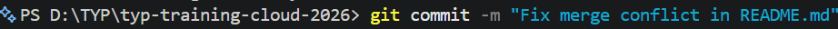
>

---

## 17. Đánh nhãn phiên bản với Git Tag

- **Mục đích:** Thay vì phải nhớ các chuỗi commit ID dài phức tạp, `tag` dùng để dán nhãn cho một mốc phiên bản phát hành cụ thể (ví dụ: `v1.0.0`, `v2.0.0`).
- **Các lệnh thao tác:**
  ```bash
  # Tạo tag cho commit hiện tại:
  git tag v1.0.0

  # Kiểm tra phiên bản hiện tại đang cách mốc tag gần nhất bao nhiêu commit:
  git describe
  ```
>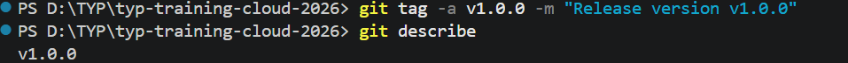
---

## 18. Cất tạm công việc với Git Stash

- **Khái niệm:** Lệnh `git stash` giống như một "túi thần kỳ". Khi bạn đang code dở dang một tính năng nhưng phải chuyển sang nhánh khác gấp để fix bug, lệnh này sẽ cất tạm toàn bộ code chưa commit vào bộ nhớ tạm, trả lại Working Directory sạch sẽ.
- **Cú pháp:**
  ```bash
  # Cất code dở dang vào stash:
  git stash

  # Lấy lại code từ stash ra để tiếp tục làm việc:
  git stash pop
  ```
>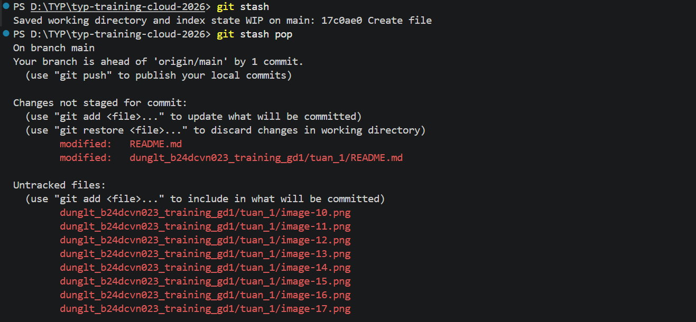
---

## 19. Tối ưu lịch sử Commit với Rebase và Squash

- **Mục đích:** Khi làm việc, bạn tạo ra quá nhiều commit nháp lẻ tẻ. Rebase và Squash giúp gộp nhiều commit nhỏ thành một commit duy nhất cho lịch sử đẹp đẽ và chuyên nghiệp.
- **Cú pháp:**
  ```bash
  # Mở giao diện tương tác để gộp n commit gần nhất,Khi làm bài tập hoặc tính năng, bạn hay commit lặt vặt (như "sửa lại logo", "fix lỗi typo", "test code"). Trước khi nộp bài hoặc push lên GitHub, bạn dùng lệnh này để gộp 3–4 commit rác đó thành 1 commit duy nhất
  git rebase -i HEAD~n

  # Rebase nhánh hiện tại lên đầu nhánh main,Khi làm việc nhóm, trong lúc bạn đang code nhánh riêng thì nhánh main đã có người khác cập nhật code mới. Bạn chạy lệnh này để kéo code mới từ main về nhánh mình.
  git rebase main
  ```
>
>
---

## 20. Tạo phím tắt lệnh với Git Alias

Thay vì phải gõ các câu lệnh dài, bạn có thể thiết lập phím tắt riêng (alias) để thao tác cực kỳ nhanh chóng.
```bash
# Tạo phím tắt 'st' cho 'status':
git config --global alias.st status

# Tạo phím tắt 'co' cho 'checkout':
git config --global alias.co checkout

# Tạo phím tắt hiển thị log đẹp:
git config --global alias.lg "log --oneline --graph --decorate"
```
>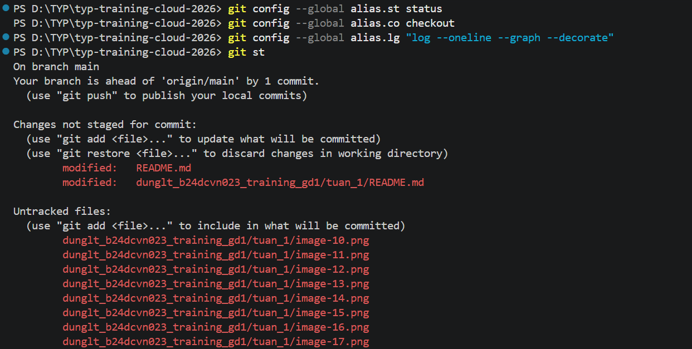
---

## 21. Khôi phục dữ liệu với Git Reflog

- **Công dụng:** `git reflog` ghi lại mọi hoạt động thao tác con trỏ HEAD từng diễn ra trên Git (bao gồm cả các commit đã bị `reset --hard` hoặc nhánh đã lỡ xóa nhầm).
- **Cách khôi phục:** Tra cứu tọa độ commit hash cũ trong reflog, sau đó dùng `git reset` hoặc `git checkout` về tọa độ đó để cứu lại dữ liệu.
git reflog giống như một nút "Undo" thần kỳ hay một cỗ máy thời gian của Git. Nó lưu lại mọi thao tác bạn từng làm trên máy local, ngay cả khi bạn lỡ tay xóa mất commit hay làm mất code.
git reflog: In ra toàn bộ lịch sử thao tác của con trỏ HEAD (vừa làm gì, chuyển nhánh nào, commit gì, reset lúc nào)

```bash
git reflog
git reset --hard HEAD@{1}
```


---

## 22. Tổng kết các tình huống áp dụng thực tế

### 22.1. Tình huống Merge Conflict
- **Hiện tượng:** Bạn và đồng nghiệp cùng sửa một dòng code, khi merge Git bị rối.
- **Giải pháp:** Mở file bị conflict, chọn giữ lại mã nguồn chính xác, xóa ký tự thừa, sau đó `git add` và `git commit` lại.

### 22.2. Revert Code Rollback Version
- **Hiện tượng:** Lỡ tay push một đoạn code bị lỗi nghiêm trọng làm sập hệ thống.
- **Giải pháp:** Sử dụng `git revert <commit_id_lỗi>` để tạo một commit bản vá ngược lại vô hiệu hóa lỗi mà vẫn bảo toàn lịch sử hệ thống.

### 22.3. Đóng gói & Bàn giao dự án (Release)
- **Hiện tượng:** Đã hoàn thành toàn bộ tính năng yêu cầu của đợt phát hành.
- **Giải pháp:** Gắn thẻ `git tag v1.0.0` và đẩy tag lên GitHub (`git push origin --tags`) để tạo bản Release chính thức bàn giao dự án.

### 22.4. Khi nào dùng Fetch và Pull?
- **Dùng `git fetch`:** Khi bạn muốn kiểm tra xem trên remote repository có ai vừa đẩy code mới lên hay không một cách âm thầm, chưa muốn gộp ngay vào máy local.
- **Dùng `git pull`:** Khi bạn chắc chắn muốn tải thẳng code mới nhất trên remote về và tự động merge ngay vào mã nguồn ở máy local để tiếp tục làm việc.


