# Phần 1: Giới thiệu tổng quan về Linux

## 1. Linux là gì?

* **Mã nguồn mở:** Khác Windows/macOS (mã nguồn đóng), ai cũng có quyền xem, sửa, đóng góp và phân phối lại mã nguồn Linux miễn phí.
* **Lịch sử:** Khởi xướng năm 1991 bởi Linus Torvalds, ban đầu là dự án cá nhân tạo lõi hệ điều hành miễn phí.
* **Kernel và bản phân phối:**
  * **Kernel:** lõi giao tiếp trực tiếp với phần cứng (CPU, RAM, ổ cứng).
  * **Bản phân phối (distro):** kernel + công cụ hệ thống + giao diện + phần mềm tiện ích, tạo thành hệ điều hành hoàn chỉnh. Ví dụ: Ubuntu, Debian, CentOS (server), Kali Linux (bảo mật).

## 2. Tại sao nên học Linux?

* **Phổ biến:** Hơn 90% server, các nền tảng cloud (AWS, GCP, Azure) và siêu máy tính chạy Linux. Bắt buộc với DevOps (Docker, Kubernetes), AI, lập trình nhúng.
* **Khác Windows/macOS:** không có ổ `C:`, `D:`, mà là một cây thư mục thống nhất từ gốc `/`; ưu tiên thao tác bằng terminal để nhanh và dễ tự động hóa.
* **Ưu điểm:** bảo mật (phân quyền chặt), miễn phí, tùy biến cao, nhẹ và ổn định nhiều năm không cần khởi động lại.

## 3. Kiến trúc hệ thống Linux

* **3 tầng:**
  * **Kernel:** quản lý bộ nhớ, tiến trình, phần cứng.
  * **Shell:** trung gian giữa người dùng và kernel (bash, zsh), dịch lệnh gõ vào cho kernel thực thi.
  * **Application:** phần mềm hằng ngày (trình duyệt, database).
* **Quá trình khởi động:** BIOS/UEFI kiểm tra phần cứng → MBR/GPT xác định phân vùng hệ điều hành → Bootloader nạp kernel → Kernel khởi động tiến trình đầu tiên (`systemd`) → tải dịch vụ và hiện màn hình đăng nhập.
* **Thư mục hệ thống chính:**

  | Thư mục | Nội dung |
  |---------|----------|
  | `/bin` | Lệnh cơ bản (`ls`, `cd`, `cp`) |
  | `/etc` | File cấu hình hệ thống và phần mềm |
  | `/home` | Dữ liệu cá nhân của người dùng |
  | `/usr` | Phần mềm, tiện ích, thư viện cài thêm |
  | `/var` | File thay đổi thường xuyên: log, database |

---

# Phần 2: Làm quen với Terminal và Shell

## 4. Terminal & Shell là gì

### Terminal
* **Khái niệm:** Giao diện dòng lệnh (CLI), cửa sổ văn bản để điều khiển máy bằng cách gõ lệnh thay vì click chuột.
* **Ví dụ:** Terminal trên Ubuntu, PowerShell trên Windows, PuTTY.

### Shell
* **Khái niệm:** Chương trình "phiên dịch" giữa người dùng và kernel: nhận lệnh, dịch cho kernel xử lý, trả kết quả lên terminal.
* **Ví dụ:** `bash`, `zsh`.

### Mở terminal
* **Ví dụ:** Trên Ubuntu, bấm `Ctrl + Alt + T`.

## 5. Lệnh cơ bản trong Linux

| Lệnh | Ý nghĩa | Ví dụ |
|------|---------|-------|
| `pwd` | Print Working Directory: in đường dẫn thư mục hiện tại | `pwd` → `/home/dung/Documents` |
| `ls` | List: liệt kê file/folder trong thư mục hiện tại | `ls` → `bai_tap_1.txt  thu_muc_code/` |
| `cd` | Change Directory: di chuyển sang thư mục khác | `cd thu_muc_code` |
| `clear` | Xóa sạch màn hình terminal | `clear` |
| `history` | Liệt kê các lệnh đã gõ | `history` → `1  pwd`, `2  ls` |
>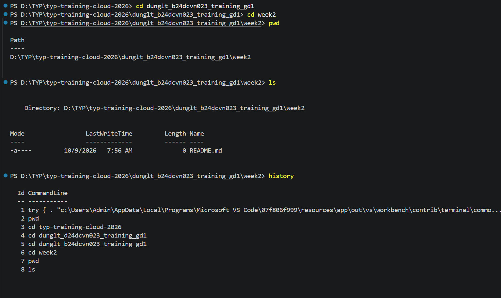
### Phím tắt
* **`Tab`:** tự hoàn thành tên lệnh/file/thư mục. Ví dụ: gõ `cd Dow` + `Tab` → `cd Downloads/`.
* **`Ctrl + C`:** dừng ngay tiến trình đang chạy. Ví dụ: dừng `ping google.com`.
* **`Ctrl + D`:** kết thúc nhập liệu / đóng terminal (như `exit`).

## 6. Hiểu cấu trúc đường dẫn

* **Tuyệt đối:** bắt đầu từ gốc `/`, dùng được ở bất kỳ đâu. Ví dụ: `/home/dung/Downloads/tai_lieu.pdf`.
* **Tương đối:** tính từ thư mục hiện tại, **không** bắt đầu bằng `/`. Ví dụ: đang ở `/home/dung` thì `cd Downloads`.

| Ký hiệu | Ý nghĩa | Ví dụ |
|---------|---------|-------|
| `~` | Thư mục home của người dùng | `cd ~` → về `/home/dung` từ bất kỳ đâu |
| `.` | Thư mục hiện tại | `./script.sh` chạy script ở thư mục hiện tại |
| `..` | Thư mục cha (lùi một cấp) | Đang ở `/home/dung/Downloads`, `cd ..` → `/home/dung` |
>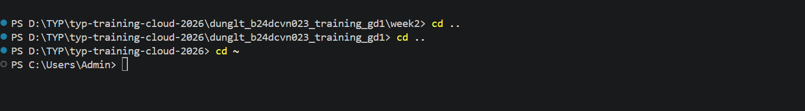
---

# Phần 3: Làm việc với file và thư mục

## 7. Tạo, xem, xóa và di chuyển file

### Chuẩn bị môi trường thực hành
* **Khái niệm:** Thư mục riêng để thử lệnh, tránh xóa nhầm file quan trọng.
* **Ví dụ:**
  ```bash
  mkdir -p ~/lab && cd ~/lab
  seq 1 20 | sed 's/^/dong /' > numbers.txt    
  ```

### Lệnh `touch`
* **Khái niệm:** Tạo file rỗng (0 byte); nếu file đã có thì chỉ cập nhật thời gian chỉnh sửa.
* **Ví dụ:**
  ```bash
  touch a.txt b.txt c.txt
  ls -l
  # -rw-r--r-- 1 dung dung 0 Oct  9 10:00 a.txt
  ```

### Lệnh `cat`
* **Khái niệm:** In toàn bộ nội dung file ra màn hình (hợp với file ngắn). `-n` hiện kèm số dòng.
* **Ví dụ:**
  ```bash
  cat -n numbers.txt
  #      1  dong 1
  #      ...
  #     20  dong 20
  ```

### Lệnh `less`
* **Khái niệm:** Xem file dài từng trang, không nạp hết vào bộ nhớ. Phím: `Space`/`b` (xuống/lên trang), `/từ_khóa` (tìm, `n` tìm tiếp), `g`/`G` (đầu/cuối), `q` (thoát).
* **Ví dụ:**
  ```bash
  less numbers.txt      # gõ /dong 15 rồi Enter để nhảy tới dòng đó, q để thoát
  ```

### Lệnh `head` và `tail`
* **Khái niệm:** `head` xem các dòng đầu, `tail` xem các dòng cuối (mặc định 10 dòng, `-n` để chọn số dòng). `tail -f` theo dõi file đang được ghi thêm (log realtime), thoát bằng `Ctrl + C`.
* **Ví dụ:**
  ```bash
  head -n 3 numbers.txt     # dong 1, dong 2, dong 3
  tail -n 3 numbers.txt     # dong 18, dong 19, dong 20
  tail -f app.log           # theo dõi log realtime
  ```

### Lệnh `mkdir`
* **Khái niệm:** Tạo thư mục. `-p` tạo cả chuỗi thư mục lồng nhau, không báo lỗi nếu đã tồn tại.
* **Ví dụ:**
  ```bash
  mkdir docs
  mkdir -p project/src/utils
  ```

### Lệnh `cp`
* **Khái niệm:** Sao chép file/thư mục theo cú pháp `cp nguồn đích`. Thư mục cần `-r`; `-i` hỏi trước khi ghi đè; `-v` in ra việc đã làm.
* **Ví dụ:**
  ```bash
  cp a.txt docs/                 # copy vào docs
  cp a.txt docs/a_backup.txt     # copy và đổi tên
  cp -r project project_copy     # copy cả thư mục
  ```

### Lệnh `mv`
* **Khái niệm:** Di chuyển (khác thư mục) hoặc đổi tên (cùng thư mục). File gốc không còn sau khi `mv`.
* **Ví dụ:**
  ```bash
  mv c.txt docs/                  # di chuyển
  # đổi tên
  ```
>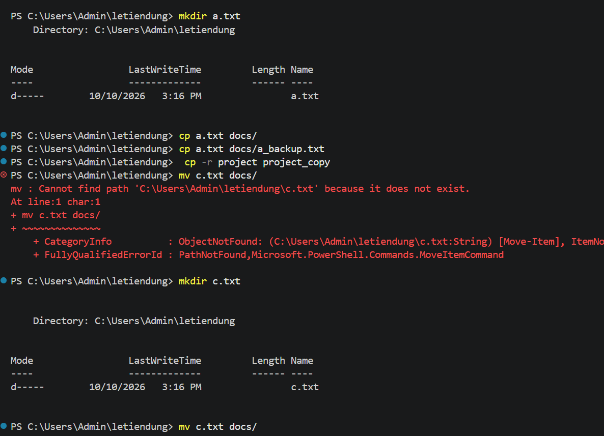
### Lệnh `rm`
* **Khái niệm:** Xóa file/thư mục, **không có thùng rác** nên mất vĩnh viễn. `-r` xóa thư mục và nội dung bên trong, `-i` hỏi xác nhận, `-f` ép xóa không hỏi. **Không** chạy `rm -rf /` hay `rm -rf *` khi chưa chắc vị trí (`pwd`).
* **Ví dụ:**
  ```bash
  rm docs/c_new.txt
  rm -i b.txt
  rm -r project_copy
  ```

### Lệnh `rmdir`
* **Khái niệm:** Chỉ xóa thư mục **rỗng**, an toàn hơn `rm -r`.
* **Ví dụ:**
  ```bash
  rmdir empty_dir
  rmdir docs
  # rmdir: failed to remove 'docs': Directory not empty
  ```
>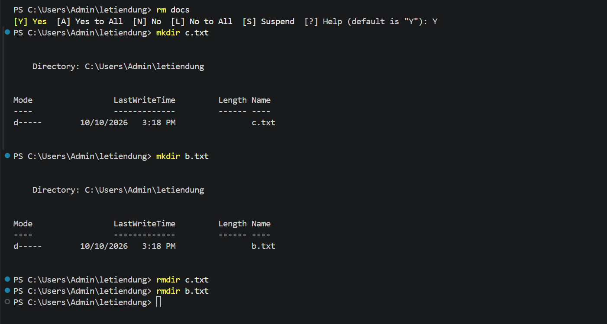
>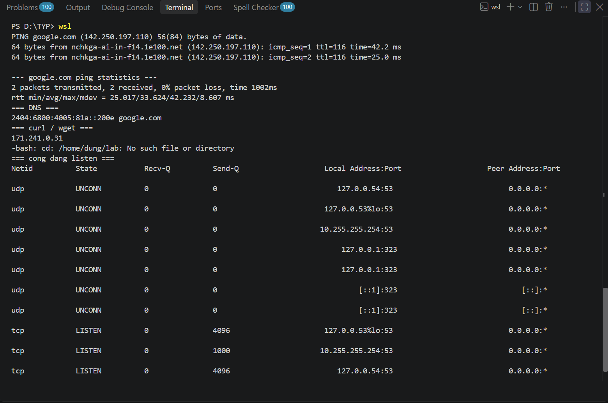
---
## 8. Sao chép và nén file

### Đóng gói và nén
* **Khái niệm:** *Đóng gói* gộp nhiều file thành một file, không giảm dung lượng. *Nén* (`gzip`, `zip`) giảm dung lượng. Thường kết hợp thành `.tar.gz`.

### Lệnh `tar`
* **Khái niệm:** Cờ chính: `-c` tạo, `-x` giải nén, `-t` liệt kê, `-v` chi tiết, `-f` tên file (đặt cuối cụm cờ), `-z` dùng gzip, `-C` giải nén vào thư mục khác. Mẹo nhớ: tạo = `czvf`, giải nén = `xzvf`.
* **Ví dụ:**
  ```bash
  tar -czvf data.tar.gz data/                  # đóng gói + nén
  tar -tzvf data.tar.gz                        # xem bên trong
  mkdir out && tar -xzvf data.tar.gz -C out/   # giải nén vào out/
  ```

### Lệnh `gzip`
* **Khái niệm:** Nén **một file** và thay thế file gốc bằng `.gz`. `-k` giữ file gốc, `gunzip` để giải nén. Không nén được thư mục (dùng kèm `tar`).
* **Ví dụ:**
  ```bash
  gzip n.txt          # còn n.txt.gz
  gunzip n.txt.gz     # trở lại n.txt
  ```

### Lệnh `zip` và `unzip`
* **Khái niệm:** Nén/giải nén định dạng `.zip` (tương thích Windows/macOS). `zip -r` nén thư mục; `unzip -l` xem nội dung; `unzip -d` chọn thư mục đích.
* **Ví dụ:**
  ```bash
  zip -r data.zip data/
  unzip -l data.zip
  unzip data.zip -d out_zip/
  ```

### Lệnh `scp`
* **Khái niệm:** Sao chép file giữa các máy qua SSH (mã hóa), dạng `scp nguồn đích`, máy từ xa viết `user@host:đường_dẫn`. `-r` cho thư mục, `-P` chọn cổng SSH khác 22.
* **Ví dụ:**
  ```bash
  scp data.tar.gz user@192.168.1.10:/home/user/backup/    # upload
  scp user@192.168.1.10:/var/log/app.log ./               # download
  ```

### Stream (`stdin`, `stdout`, `stderr`)
* **Khái niệm:** Mỗi chương trình có 3 luồng chuẩn: `stdin` (số 0, bàn phím), `stdout` (số 1, màn hình), `stderr` (số 2, lỗi, cũng hiện ra màn hình). `stdout` và `stderr` là **hai luồng riêng** nên chuyển hướng độc lập được.

  | Toán tử | Ý nghĩa |
  |---------|---------|
  | `>` / `>>` | Ghi đè / nối thêm stdout vào file |
  | `2>` | Ghi stderr vào file |
  | `2>&1` | Gộp stderr vào stdout |
  | `<` | Lấy stdin từ file |
  | `/dev/null` | Vứt bỏ output |

* **Ví dụ:**
  ```bash
  ls numbers.txt /khong_ton_tai > ok.txt           # chỉ stdout vào file, lỗi vẫn hiện
  ls numbers.txt /khong_ton_tai 2> err.txt         # chỉ stderr vào file
  ls numbers.txt /khong_ton_tai > all.txt 2>&1     # cả hai vào một file
  ls /khong_ton_tai 2> /dev/null                   # ẩn lỗi
  wc -l < numbers.txt                              # 20
  ```
>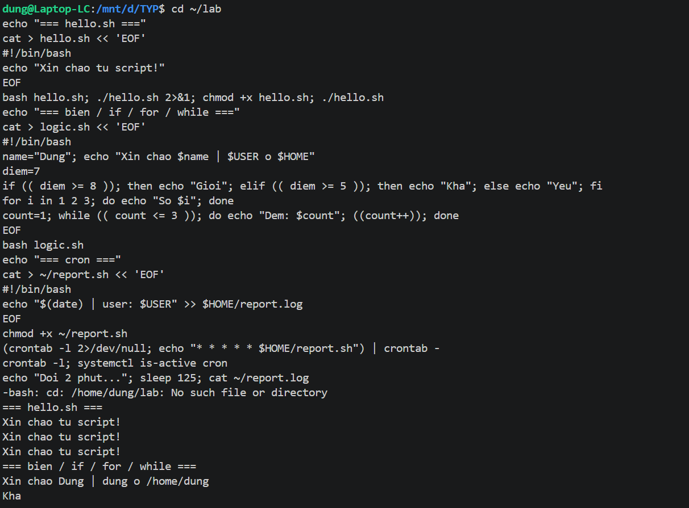
---

## 9. Tìm kiếm file

* **Chuẩn bị dữ liệu mẫu:**
  ```bash
  mkdir -p site/css site/js
  touch site/index.html site/about.html site/css/main.css site/js/app.js

  cat > app.log << 'EOF'
  2026-10-09 10:00:01 INFO  server started
  2026-10-09 10:01:12 ERROR db timeout
  2026-10-09 10:02:30 WARN  disk 85%
  2026-10-09 10:03:44 ERROR db timeout
  2026-10-09 10:05:00 ERROR payment failed
  EOF
  ```

### Lệnh `find`
* **Khái niệm:** Tìm file/thư mục theo điều kiện, quét trực tiếp ổ đĩa: `find [thư_mục] [điều_kiện] [hành_động]`. Điều kiện: `-name` (theo tên), `-iname` (không phân biệt hoa thường), `-type f`/`-type d`, `-size +1M`, `-mtime -1`. Hành động: `-exec lệnh {} \;`, `-delete` (nên chạy thử không có `-delete` trước).
* **Ví dụ:**
  ```bash
  find site -name "*.html"
  find site -type d
  ```

### Lệnh `locate`
* **Khái niệm:** Tìm theo tên cực nhanh nhờ cơ sở dữ liệu lập sẵn. File mới tạo có thể chưa thấy cho đến khi chạy `sudo updatedb`.
* **Ví dụ:**
  ```bash
  sudo updatedb
  locate nginx.conf
  ```

### Lệnh `grep`
* **Khái niệm:** Tìm các **dòng chứa chuỗi** trong nội dung file (`find`/`locate` tìm *tên file*). Tùy chọn: `-i` không phân biệt hoa thường, `-n` hiện số dòng, `-c` đếm dòng khớp, `-v` lấy dòng không khớp, `-r` tìm trong thư mục, `-l` chỉ in tên file, `-C n` hiện n dòng xung quanh, `-E` regex mở rộng (`A|B`).
* **Ví dụ:**
  ```bash
  grep "ERROR" app.log
  # 2026-10-09 10:01:12 ERROR db timeout
  # 2026-10-09 10:03:44 ERROR db timeout
  # 2026-10-09 10:05:00 ERROR payment failed

  grep -c "ERROR" app.log          # 3
  grep -v "INFO" app.log           # mọi dòng không phải INFO
  grep -E "ERROR|WARN" app.log
  grep -rn "console.log" site/     # tìm trong cả thư mục
  ```

### Kết hợp `grep` với pipe (`|`)
* **Khái niệm:** Pipe nối `stdout` của lệnh trái vào `stdin` của lệnh phải, cho phép xâu chuỗi lệnh. `grep` sau pipe lọc kết quả của bất kỳ lệnh nào.
* **Ví dụ:**
  ```bash
  ps | grep sleep                       # lọc tiến trình
  grep "ERROR" app.log | wc -l          # đếm lỗi: 3
  history | grep "tar"                  # lọc lịch sử lệnh

  # Lỗi nào xuất hiện nhiều nhất
  grep "ERROR" app.log | cut -d' ' -f4- | sort | uniq -c | sort -nr
  #       2 db timeout
  #       1 payment failed
  ```
>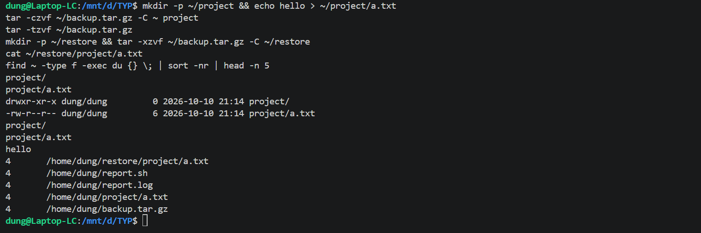
---

# Phần 4: Quyền truy cập và người dùng

## 10. Người dùng và nhóm (User & Group)

### Lệnh `whoami` và `id`
* **Khái niệm:** `whoami` cho biết đang đăng nhập tài khoản nào. `id` hiển thị UID, GID và các nhóm của tài khoản.
* **Ví dụ:**
  ```bash
  whoami
  # dung
  id
  # uid=1000(dung) gid=1000(dung) groups=1000(dung),27(sudo)
  ```

### Lệnh `adduser` và `deluser`
* **Khái niệm:** Tạo / xóa tài khoản (cần `sudo`). `adduser` tự tạo thư mục home và hỏi mật khẩu; `deluser` giữ lại thư mục home, cần xóa thủ công.
* **Ví dụ:**
  ```bash
  sudo adduser testuser
  id testuser
  # uid=1001(testuser) gid=1001(testuser) groups=1001(testuser)
  sudo deluser testuser
  ```

### Lệnh `su`
* **Khái niệm:** Chuyển hẳn sang tài khoản khác, cần mật khẩu của **tài khoản đích**. Gõ `exit` để quay lại.
* **Ví dụ:**
  ```bash
  su testuser
  whoami
  # testuser
  exit
  ```

### Lệnh `sudo`
* **Khái niệm:** Chạy **một lệnh** với quyền root, chỉ cần mật khẩu của chính bạn (user phải thuộc nhóm `sudo`). Quyền chỉ có hiệu lực cho đúng lệnh đó.
* **Ví dụ:**
  ```bash
  whoami        # dung
  sudo whoami   # root
  ```

### File `/etc/passwd`
* **Khái niệm:** Danh sách tài khoản, mỗi dòng 7 trường cách nhau bởi `:`. Mật khẩu **không** nằm ở đây (chỉ hiện `x`, bản thật ở `/etc/shadow`).
* **Ví dụ:**
  ```bash
  grep dung /etc/passwd
  # dung:x:1000:1000:Dung:/home/dung:/bin/bash
  # tên : mật khẩu : UID : GID : tên đầy đủ : thư mục home : shell
  ```
>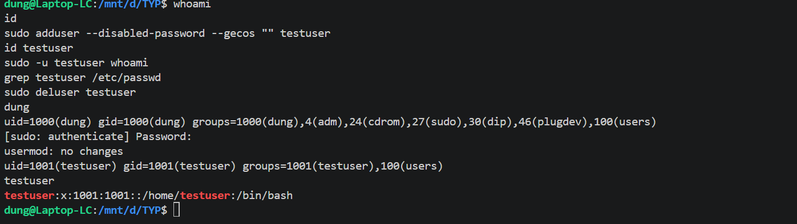
---

## 11. Phân quyền file

### `ls -l` và quyền `rwx`
* **Khái niệm:** `ls -l` hiện quyền truy cập. Quyền gồm `r` (đọc, 4), `w` (ghi, 2), `x` (thực thi, 1). Chuỗi 10 ký tự đầu = 1 ký tự loại (`-` file, `d` thư mục) + 3 nhóm quyền cho **chủ (u)**, **nhóm (g)**, **người khác (o)**.
* **Ví dụ:**
  ```bash
  ls -l demo.sh
  # -rw-r--r-- 1 dung dung 0 Oct  9 10:00 demo.sh
  # -  rw-   r--   r--    dung  dung
  # |  chủ   nhóm  khác   chủ   nhóm
  # loại      (đọc+ghi / chỉ đọc / chỉ đọc)

  # Quy đổi số: rw- = 4+2 = 6, r-x = 4+1 = 5, rwx = 4+2+1 = 7
  ```

### Lệnh `chmod`
* **Khái niệm:** Đổi quyền, viết dạng **chữ** (`u+x` thêm quyền chạy cho chủ, `g-w` bỏ quyền ghi của nhóm) hoặc dạng **số** (3 chữ số cho chủ, nhóm, khác).
* **Ví dụ:**
  ```bash
  ./demo.sh
  # bash: ./demo.sh: Permission denied     <- chưa có quyền x

  chmod u+x demo.sh     # dạng chữ
  chmod 755 demo.sh     # dạng số: rwx r-x r-x
  chmod 600 demo.sh     # rw- --- --- (chỉ chủ đọc/ghi)
  ```

### Lệnh `chown` và `chgrp`
* **Khái niệm:** `chown user:nhóm file` đổi chủ (và nhóm); `chgrp nhóm file` chỉ đổi nhóm. Thường cần `sudo`.
* **Ví dụ:**
  ```bash
  sudo chown testuser:testuser demo.sh
  sudo chgrp sudo demo.sh
  ls -l demo.sh
  # -rwxr-xr-x 1 testuser sudo 11 Oct  9 10:00 demo.sh
  ```
>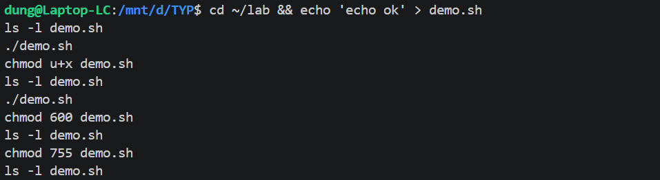
---

## 12. Quyền root và an toàn

### Tại sao không nên chạy mọi thứ bằng root
* **Khái niệm:** `root` có toàn quyền, không bị giới hạn. Dùng thường xuyên rất nguy hiểm: gõ nhầm là mất dữ liệu hệ thống, mã độc/chương trình lỗi chạy bằng root có thể phá cả hệ thống, và khó truy vết ai làm gì. **Nguyên tắc:** dùng tài khoản thường, chỉ `sudo` đúng lệnh cần quyền cao.
* **Ví dụ:**
  ```bash
  cat /etc/shadow
  # cat: /etc/shadow: Permission denied
  sudo cat /etc/shadow       # chỉ cấp quyền cho đúng lệnh này
  ```

### Phân biệt `sudo` và `su`

| | `sudo` | `su` |
|---|--------|------|
| Ý nghĩa | Chạy **một lệnh** với quyền root | **Chuyển hẳn** sang tài khoản khác |
| Mật khẩu | Của **bạn** | Của **tài khoản đích** |
| Phạm vi | Chỉ đúng lệnh đó | Đến khi gõ `exit` |
| Ghi log / an toàn | Có ghi log, an toàn hơn | Khó truy vết hơn |

---
>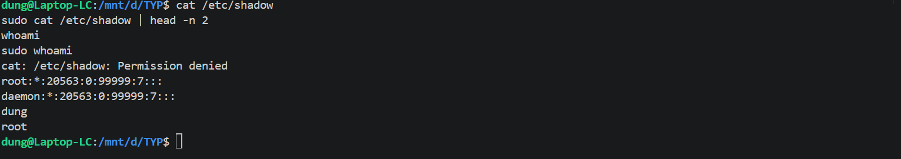
# Phần 5: Quản lý tiến trình và hệ thống

## 13. Quản lý tiến trình

### Lệnh `ps`
* **Khái niệm:** Liệt kê tiến trình đang chạy tại thời điểm gõ lệnh. Tiến trình là chương trình đang chạy, có mã số riêng **PID**. Cột: `PID`, `TTY`, `TIME`, `CMD`.
* **Ví dụ:**
  ```bash
  sleep 300 &
  ps
  #   PID TTY          TIME CMD
  #  1201 pts/0    00:00:00 bash
  #  1350 pts/0    00:00:00 sleep
  ps | grep sleep
  ```

### Lệnh `top` và `htop`
* **Khái niệm:** `top` hiện tiến trình **realtime** kèm CPU/RAM, tiến trình tốn nhất ở trên cùng, bấm `q` thoát. `htop` là bản đẹp và dễ dùng hơn (màu sắc, chọn bằng mũi tên, `F9` để kill), cần cài `sudo apt install htop`.
* **Ví dụ:**
  ```bash
  top
  #   PID USER      %CPU  %MEM  COMMAND
  #  1350 dung       5.0   1.2  node
  #   980 root       1.0   0.8  nginx
  ```

### Lệnh `kill` và `killall`
* **Khái niệm:** `kill PID` dừng tiến trình theo PID (lấy từ `ps`/`top`). `killall tên` dừng **tất cả** tiến trình cùng tên.
* **Ví dụ:**
  ```bash
  sleep 300 &
  # [1] 1350
  kill 1350
  # [1]+  Terminated   sleep 300

  killall sleep
  ```

### Foreground và background (`&`, `fg`, `bg`)
* **Khái niệm:** Foreground chiếm terminal; background chạy ngầm. `&` cuối lệnh chạy nền, `Ctrl + Z` tạm dừng, `bg` cho chạy tiếp ở nền, `fg` đưa về foreground, `jobs` liệt kê tiến trình nền.
* **Ví dụ:**
  ```bash
  sleep 100 &
  # [1] 1350                  <- chạy nền, vẫn gõ được lệnh khác
  jobs
  # [1]+  Running    sleep 100 &
  fg                          # đưa về foreground
  # (bấm Ctrl + Z)
  # [1]+  Stopped    sleep 100
  bg                          # chạy tiếp ở nền
  ```

---
>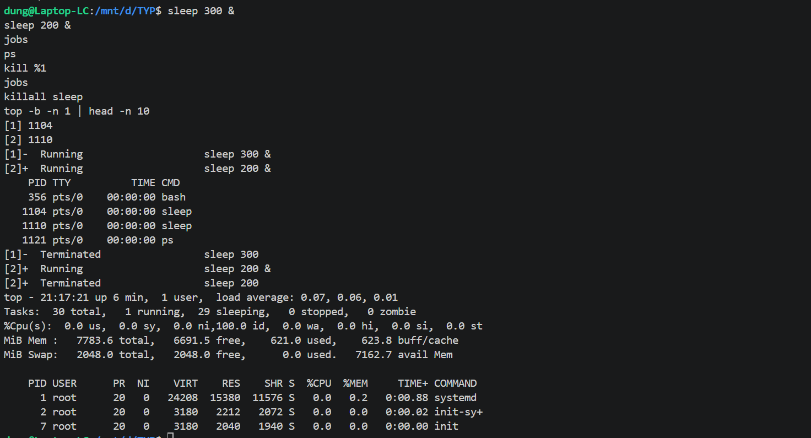
## 14. Kiểm tra tài nguyên hệ thống

### Lệnh `df` và `du`
* **Khái niệm:** `df` cho biết dung lượng ổ đĩa còn trống (cột `Use%` gần 100% là nguy hiểm). `du` cho biết **thư mục/file nào đang chiếm chỗ**, dùng để tìm thủ phạm khi ổ đầy.
* **Ví dụ:**
  ```bash
  df
  # Filesystem     1K-blocks     Used Available Use% Mounted on
  # /dev/sda1       61255492 20450000  37668000  36% /

  du /var/log
  # 8520    /var/log/nginx
  # 52340   /var/log
  ```

### Lệnh `free`
* **Khái niệm:** Hiển thị RAM và swap. Cột đáng quan tâm nhất là `available` (RAM có thể cấp cho chương trình mới).
* **Ví dụ:**
  ```bash
  free
  #                total        used        free      available
  # Mem:         3994000     1500000     1200000        2100000
  ```

### Lệnh `uptime`, `uname`, `lscpu`, `lsblk`
* **Khái niệm:** `uptime` cho biết hệ thống chạy bao lâu và tải (`load average` 1, 5, 15 phút, thấp hơn số nhân CPU là ổn). `uname` in tên nhân hệ điều hành. `lscpu` hiện thông tin CPU. `lsblk` liệt kê ổ đĩa/phân vùng dạng cây.
* **Ví dụ:**
  ```bash
  uptime
  # 10:30:00 up 2 days, 3:15,  1 user,  load average: 0.10, 0.08, 0.05
  uname
  # Linux
  lscpu | grep "Model name"
  # Model name:   Intel(R) Core(TM) i5-10210U CPU @ 1.60GHz
  lsblk
  # NAME   SIZE TYPE MOUNTPOINT
  # sda     60G disk
  # ├─sda1  59G part /
  # └─sda2   1G part [SWAP]
  ```
>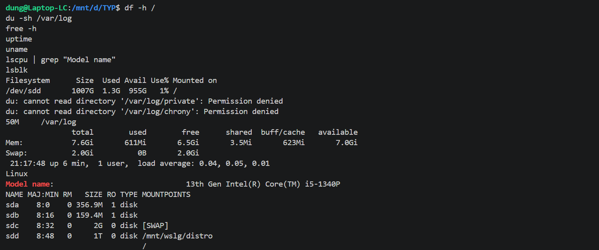
---

## 15. Dịch vụ và tiến trình nền (daemon)

### Khái niệm daemon và dịch vụ
* **Khái niệm:** **Daemon** là tiến trình chạy ngầm liên tục, không gắn với terminal, thường khởi động cùng hệ thống (tên thường kết thúc bằng `d`: `sshd`, `systemd`). **Dịch vụ (service)** là daemon được hệ thống quản lý (ví dụ `nginx`). Ta điều khiển chúng qua `systemctl`.

### Lệnh `systemctl` và `service`
* **Khái niệm:** `systemctl hành_động tên_dịch_vụ` là lệnh chính. Hành động: `start`, `stop`, `restart` (dùng sau khi sửa cấu hình), `status`, `enable` (tự chạy cùng hệ thống), `disable`. `service tên hành_động` là cách viết **cũ**, kết quả tương tự.
* **Ví dụ:**
  ```bash
  sudo systemctl start nginx
  sudo systemctl status nginx
  # Active: active (running) since Fri 2026-10-09 10:00:00 +07
  sudo systemctl restart nginx
  sudo systemctl enable nginx

  sudo service nginx restart      # cách cũ
  ```

### Lệnh `journalctl`
* **Khái niệm:** Xem log do `systemd` thu thập, nơi tìm nguyên nhân khi dịch vụ không khởi động được. Thường kết hợp `grep`, `tail`.
* **Ví dụ:**
  ```bash
  journalctl | grep nginx
  journalctl | tail
  ```

### Quy trình khi sửa cấu hình web server
* **Ví dụ:**
  ```bash
  sudo nano /etc/nginx/nginx.conf      # 1. sửa cấu hình
  sudo systemctl restart nginx         # 2. khởi động lại
  sudo systemctl status nginx          # 3. kiểm tra đã chạy chưa
  journalctl | grep nginx              # 4. nếu lỗi, xem log
  ```

---
>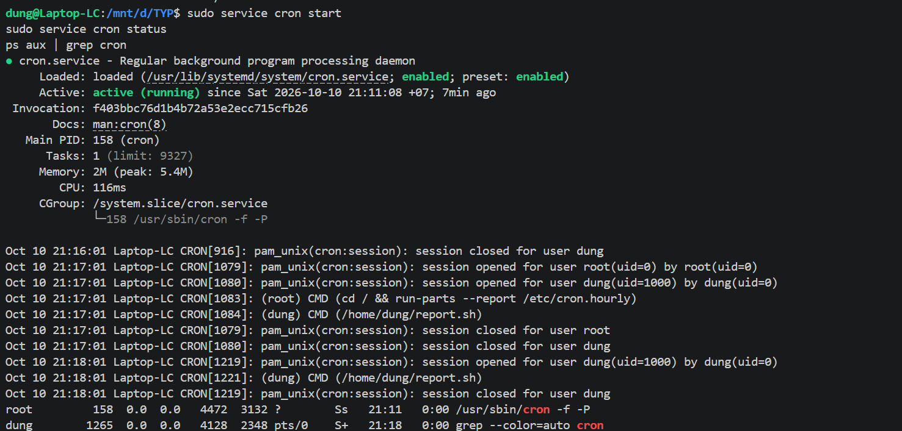
# Phần 6: Quản lý gói phần mềm

## 16. Trình quản lý gói (Package Manager)

* **Khái niệm:** Công cụ **cài đặt, cập nhật, gỡ bỏ** phần mềm. Chỉ cần gõ tên, nó tự tìm trên kho (repository), tải về và cài luôn các thư viện phụ thuộc.

| Họ | Hệ điều hành | Trình quản lý gói | Định dạng |
|----|--------------|-------------------|-----------|
| Debian | Debian, Ubuntu | `apt`, `apt-get` | `.deb` |
| RedHat | RHEL, CentOS, Fedora | `yum`, `dnf` | `.rpm` |

* **`apt` vs `apt-get`:** `apt` hiện đại, thân thiện, nên dùng khi gõ tay. `apt-get` đời cũ, đầu ra ổn định nên dùng trong script/Dockerfile.
* **`yum` vs `dnf`:** `dnf` là bản kế nhiệm `yum` (CentOS 8/RHEL 8/Fedora trở đi), nhanh hơn, cú pháp gần như giống hệt.

| Việc cần làm | Debian/Ubuntu | RedHat/CentOS |
|--------------|---------------|---------------|
| Cập nhật danh sách gói | `sudo apt update` | tự động khi chạy lệnh |
| Cài phần mềm | `sudo apt install tên` | `sudo dnf install tên` |
| Gỡ phần mềm | `sudo apt remove tên` | `sudo dnf remove tên` |
| Nâng cấp toàn bộ | `sudo apt upgrade` | `sudo dnf upgrade` |

---
>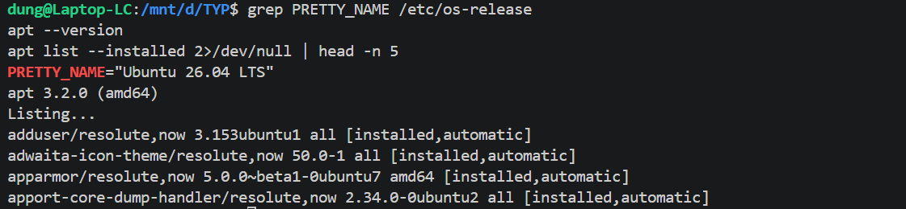

## 17. Cài đặt và gỡ bỏ phần mềm

### `apt update` và `apt upgrade`
* **Khái niệm:** `update` chỉ **làm mới danh sách** gói, không cài gì. `upgrade` mới thực sự **nâng cấp** phần mềm đã cài. Luôn chạy `update` trước rồi `upgrade`.
* **Ví dụ:**
  ```bash
  sudo apt update
  # 12 packages can be upgraded.
  sudo apt upgrade
  # Do you want to continue? [Y/n] y
  ```

### `apt install` và `apt remove`
* **Khái niệm:** `install` cài một hoặc nhiều gói (tự cài gói phụ thuộc). `remove` gỡ chương trình nhưng thường giữ file cấu hình.
* **Ví dụ:**
  ```bash
  sudo apt install tree htop
  which tree
  # /usr/bin/tree

  sudo apt remove tree
  which tree
  # (không in gì -> đã gỡ)
  ```

### Lệnh `dpkg -l`
* **Khái niệm:** Liệt kê **toàn bộ package đã cài** trên Ubuntu. Danh sách dài nên lọc bằng `grep`; cột đầu `ii` = đã cài thành công.
* **Ví dụ:**
  ```bash
  dpkg -l | grep tree
  # ii  tree   2.0.2-1   amd64   displays directory tree, in color
  ```

---

## 18. Tạo và sử dụng alias

* **Khái niệm:** Alias là **lệnh tắt** tự đặt, cú pháp `alias tên='lệnh đầy đủ'` (không có khoảng trắng quanh `=`). Alias gõ trực tiếp trên terminal chỉ có hiệu lực trong phiên hiện tại.
* **Ví dụ:**
  ```bash
  alias ll='ls -alF'     # a: hiện file ẩn, l: dạng chi tiết, F: thêm ký hiệu cuối tên (/ là thư mục)
  ll
  ```

### Alias vĩnh viễn trong `~/.bashrc`
* **Khái niệm:** `~/.bashrc` được bash đọc mỗi khi mở terminal mới. Ghi alias vào đây rồi nạp lại bằng `source ~/.bashrc`.
* **Ví dụ:**
  ```bash
  echo "alias ll='ls -alF'" >> ~/.bashrc     # >> nối thêm, không ghi đè
  source ~/.bashrc
  ll
  ```

### Lệnh `alias` và `unalias`
* **Khái niệm:** `alias` (không tham số) liệt kê alias đang có; `unalias tên` xóa một alias.
* **Ví dụ:**
  ```bash
  alias
  # alias ll='ls -alF'
  unalias ll
  ```

---
>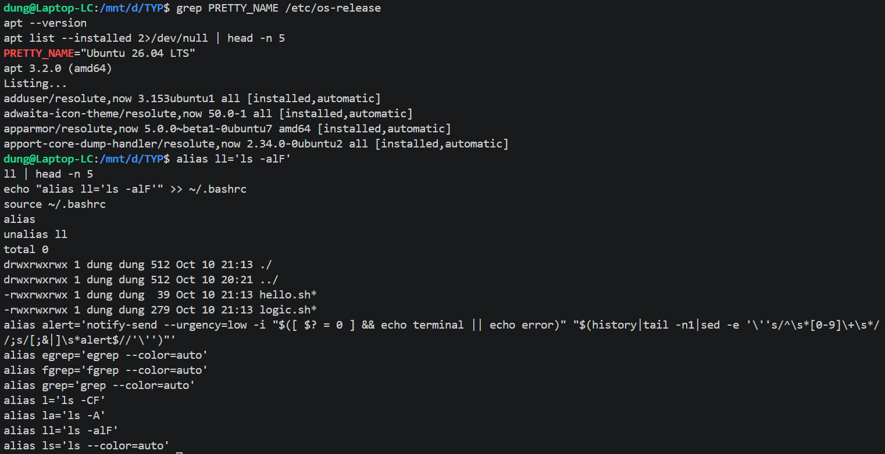
# Phần 7: Làm việc với mạng (Networking)

## 19. Mô hình TCP/IP, OSI

* **Khái niệm:** Mô hình mạng chia truyền dữ liệu thành các **tầng**, mỗi tầng một nhiệm vụ, nhờ đó biết lỗi nằm ở tầng nào.

| Tầng OSI | Tên | Nhiệm vụ | Ví dụ |
|:--------:|-----|----------|-------|
| 7 | Application | Giao tiếp ứng dụng | HTTP, SSH, DNS |
| 6 | Presentation | Mã hóa, nén, định dạng | TLS/SSL |
| 5 | Session | Mở/duy trì/đóng phiên | RPC |
| 4 | Transport | Chia dữ liệu, xác định **cổng** | TCP, UDP |
| 3 | Network | Định tuyến, địa chỉ **IP** | IP, ICMP (ping) |
| 2 | Data Link | Truyền giữa thiết bị kề nhau bằng **MAC** | Ethernet, Wi-Fi |
| 1 | Physical | Tín hiệu vật lý | Cáp, sóng Wi-Fi |

* **TCP/IP (4 tầng):** Application (OSI 5-7), Transport (4), Internet (3), Network Access (1-2).
* **TCP vs UDP:** TCP có kết nối, đảm bảo đủ và đúng thứ tự, chậm hơn (web, SSH, email). UDP không kết nối, không đảm bảo, nhanh hơn (DNS, video call, game).

---
>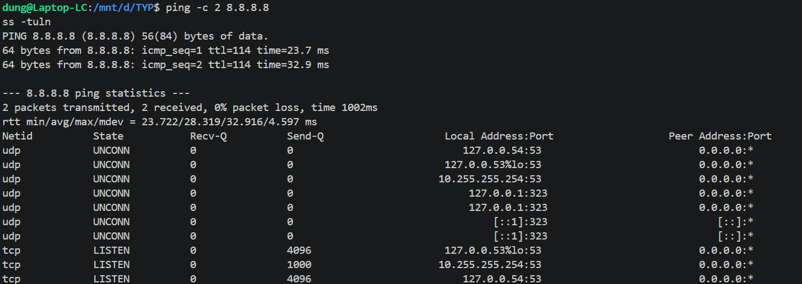
## 20. IP Address, Subnet và CIDR

* **IP Address:** "số nhà" của thiết bị. IPv4 gồm 4 nhóm số (0–255), chia thành **phần mạng** và **phần máy**.
* **IP private** (dùng nội bộ): `10.0.0.0/8`, `172.16.0.0/12`, `192.168.0.0/16`. Còn lại là public.
* **Subnet:** mạng con. **Subnet mask** cho biết bao nhiêu bit đầu là phần mạng. Hai máy chỉ liên lạc **trực tiếp** khi cùng subnet, khác subnet phải qua router.
* **CIDR:** cách viết gọn mask, `/24` = 24 bit đầu là phần mạng = `255.255.255.0`. Số máy dùng được = `2^(32 - số_bit) - 2`.

| CIDR | Subnet mask | Số máy |
|:----:|-------------|:------:|
| `/8` | 255.0.0.0 | 16.777.214 |
| `/16` | 255.255.0.0 | 65.534 |
| `/24` | 255.255.255.0 | 254 |
| `/30` | 255.255.255.252 | 2 |

* **Ví dụ với `192.168.1.0/24`:**
  ```text
  Địa chỉ mạng:       192.168.1.0
  Máy dùng được:      192.168.1.1 → 192.168.1.254  (254 máy)
  Broadcast:          192.168.1.255

  Máy A = 192.168.1.10/24, máy B = 192.168.2.10/24
  → khác subnet, phải đi qua router mới liên lạc được.
  ```

---
.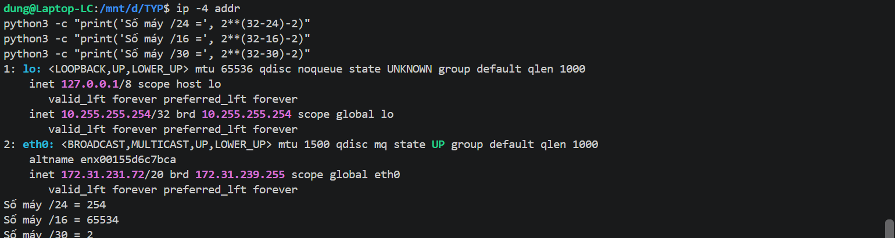
## 21. Gateway, Routing và DNS

* **Gateway:** thiết bị (thường là router) làm "cửa ra" để gửi dữ liệu tới mạng khác/Internet.
* **Routing:** chọn đường đi cho gói tin dựa vào **bảng định tuyến**. Dòng `default` là đường cho mọi đích không có trong bảng.
  ```bash
  ip route
  # default via 192.168.1.1 dev eth0               <- ra ngoài thì qua gateway
  # 192.168.1.0/24 dev eth0 src 192.168.1.10       <- cùng mạng thì gửi thẳng
  ```
* **DNS:** dịch **tên miền thành IP** (như danh bạ). `/etc/resolv.conf` cho biết đang hỏi DNS server nào.
  ```bash
  nslookup google.com
  # Address:  142.250.190.46
  cat /etc/resolv.conf
  # nameserver 8.8.8.8
  ```
* **Mẹo xác định lỗi mạng:**
  ```bash
  ping 192.168.1.1     # 1. thông -> mạng nội bộ và gateway ổn
  ping 8.8.8.8         # 2. thông -> có Internet
  ping google.com      # 3. không thông -> lỗi DNS
  ```

---
>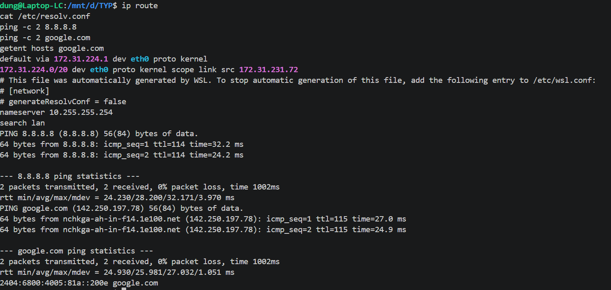

## 22. Lệnh kiểm tra mạng

### Lệnh `ping`
* **Khái niệm:** Kiểm tra kết nối tới máy khác bằng gói ICMP, đo độ trễ (`time`, ms) và tỉ lệ mất gói. Chạy liên tục đến khi bấm `Ctrl + C`.
* **Ví dụ:**
  ```bash
  ping google.com
  # 64 bytes from 142.250.190.46: icmp_seq=1 ttl=117 time=18.2 ms
  # ^C
  # 2 packets transmitted, 2 received, 0% packet loss
  ```

### Lệnh `ip addr` và `ifconfig`
* **Khái niệm:** Xem IP của card mạng. `ip addr` là cách hiện đại; `ifconfig` là kiểu cũ, thuộc gói `net-tools` (cài bằng `sudo apt install net-tools`). `inet` là IPv4 kèm CIDR, `lo` là card nội bộ (127.0.0.1).
* **Ví dụ:**
  ```bash
  ip addr
  # 2: eth0: <BROADCAST,MULTICAST,UP> ...
  #     inet 192.168.1.10/24 brd 192.168.1.255 scope global eth0
  ```

### Lệnh `netstat` và `ss`
* **Khái niệm:** Hiển thị kết nối mạng và cổng đang dùng. `netstat` là kiểu cũ, được thay bằng `ss` (nhanh hơn), cách dùng tương tự.
* **Ví dụ:**
  ```bash
  ss
  # Netid State  Local Address:Port    Peer Address:Port
  # tcp   ESTAB  192.168.1.10:ssh      192.168.1.5:52341
  ```

### Lệnh `curl` và `wget`
* **Khái niệm:** `curl` gửi yêu cầu HTTP và **in nội dung trả về** ra màn hình (kiểm tra website/API). `wget` **tải file** về và lưu thành file.
* **Ví dụ:**
  ```bash
  curl ifconfig.me
  # 203.0.113.25            <- IP public của bạn
  wget http://example.com/index.html
  # 'index.html' saved [1256/1256]
  ```

---
>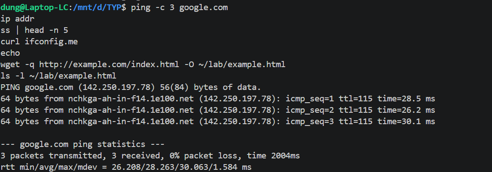
## 23. Kết nối SSH và truyền file

### Lệnh `ssh user@ip`
* **Khái niệm:** Đăng nhập và điều khiển máy từ xa an toàn (mã hóa), dùng cổng 22. Lần đầu sẽ hỏi xác nhận fingerprint, gõ `yes`. Gõ `exit` để thoát.
* **Ví dụ:**
  ```bash
  ssh dung@192.168.1.20
  # Are you sure you want to continue connecting (yes/no)? yes
  # dung@192.168.1.20's password: ****
  # dung@server:~$          <- đã ở trên máy từ xa
  ```

### Lệnh `scp` và `rsync`
* **Khái niệm:** `scp` sao chép file qua SSH (xem Phần 3). `rsync` **đồng bộ**, chỉ chép phần khác nhau nên nhanh hơn `scp` với dữ liệu lớn; đồng bộ thư mục cần thêm tùy chọn.
* **Ví dụ:**
  ```bash
  scp report.txt dung@192.168.1.20:/home/dung/
  rsync report.txt dung@192.168.1.20:/home/dung/
  ```

### SSH key (`ssh-keygen`, `ssh-copy-id`)
* **Khái niệm:** Cặp khóa **public** và **private** để đăng nhập không cần mật khẩu, an toàn hơn. Khóa private giữ kín trên máy bạn, **tuyệt đối không chia sẻ**; khóa public (`.pub`) đặt lên server.
* **Ví dụ:**
  ```bash
  ssh-keygen                          # 1. tạo cặp khóa (cứ Enter chọn mặc định)
  ssh-copy-id dung@192.168.1.20       # 2. đưa khóa public lên server
  ssh dung@192.168.1.20               # 3. đăng nhập, không hỏi mật khẩu
  ```

---
>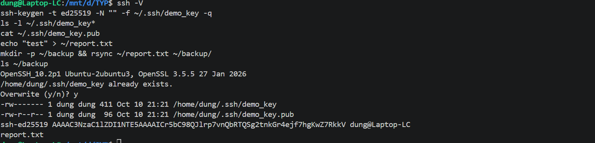
## 24. Kiểm tra cổng và firewall

* **Khái niệm:** **Cổng (port)** là "cửa" đánh số (0–65535), mỗi dịch vụ lắng nghe một cổng (IP chỉ ra "máy nào", cổng chỉ ra "dịch vụ nào"). **Firewall** cho phép/chặn lưu lượng theo quy tắc.
* **Cổng thông dụng:** 22 (SSH), 80 (HTTP), 443 (HTTPS), 53 (DNS), 3306 (MySQL).

### Lệnh `ss -tuln`
* **Khái niệm:** Liệt kê cổng **đang lắng nghe**: `t` TCP, `u` UDP, `l` chỉ cổng listen, `n` hiện số cổng. `0.0.0.0` là nhận từ mọi nơi, `127.0.0.1` là chỉ nhận từ chính máy đó.
* **Ví dụ:**
  ```bash
  ss -tuln
  # tcp   LISTEN 0.0.0.0:22           <- SSH, nhận từ mọi nơi
  # tcp   LISTEN 0.0.0.0:80           <- web server
  # tcp   LISTEN 127.0.0.1:3306       <- MySQL, chỉ nội bộ
  ```

### Lệnh `ufw`
* **Khái niệm:** Công cụ firewall **đơn giản** trên Ubuntu (lớp vỏ của `iptables`). **Cho phép cổng 22 trước khi bật** để không tự khóa mình khỏi SSH.
* **Ví dụ:**
  ```bash
  sudo ufw allow 22
  sudo ufw allow 80
  sudo ufw deny 3306
  sudo ufw enable
  sudo ufw status
  # 22     ALLOW   Anywhere
  # 80     ALLOW   Anywhere
  # 3306   DENY    Anywhere
  ```

### Lệnh `iptables`
* **Khái niệm:** Firewall **cấp thấp** của Linux, thao tác trực tiếp với luật lọc gói tin trong kernel. Luật chia thành 3 chain: `INPUT` (vào), `OUTPUT` (ra), `FORWARD` (đi xuyên qua); kết quả `ACCEPT` (cho qua) hoặc `DROP` (chặn). Linh hoạt nhưng khó dùng hơn `ufw`.
* **Ví dụ:**
  ```bash
  sudo iptables -L                                        # xem các luật
  sudo iptables -A INPUT -p tcp --dport 80 -j ACCEPT      # cho phép TCP vào cổng 80
  ```

### Quy trình khi không truy cập được dịch vụ
* **Ví dụ:**
  ```bash
  ss -tuln                   # 1. dịch vụ có đang lắng nghe cổng không?
  sudo ufw status            # 2. firewall có chặn không?
  ping 192.168.1.20          # 3. mạng tới server có thông không?
  curl http://192.168.1.20   # 4. dịch vụ có trả lời thật không?
  ```

---
>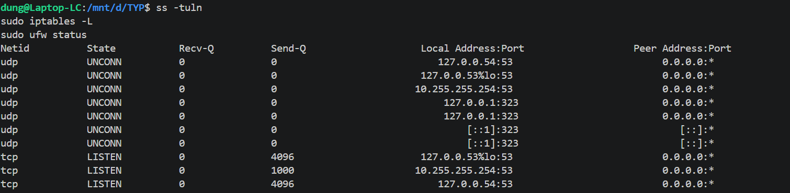
# Phần 8: Script & Automation cơ bản

## 25. Shell Script là gì

### File `.sh` và `#!/bin/bash`
* **Khái niệm:** Shell script là file văn bản chứa các lệnh, chạy lần lượt từ trên xuống. Dòng đầu `#!/bin/bash` (shebang) cho biết dùng `bash` để chạy.
* **Ví dụ:**
  ```bash
  cat > hello.sh << 'EOF'
  #!/bin/bash
  echo "Xin chao tu script!"
  EOF
  ```

### Cách chạy script
* **Khái niệm:** `bash script.sh` không cần quyền thực thi. Hoặc cấp quyền `x` bằng `chmod +x` rồi chạy `./script.sh`.
* **Ví dụ:**
  ```bash
  bash hello.sh
  # Xin chao tu script!

  ./hello.sh
  # bash: ./hello.sh: Permission denied
  chmod +x hello.sh
  ./hello.sh
  # Xin chao tu script!
  ```

---
>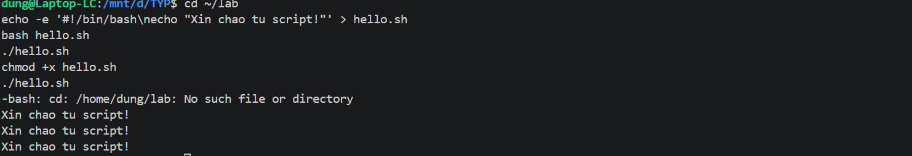
## 26. Biến, vòng lặp và điều kiện

### Biến và biến môi trường (`$USER`, `$HOME`)
* **Khái niệm:** Biến lưu giá trị, dùng bằng `$tên`, **không** có khoảng trắng quanh `=`. `$USER`, `$HOME` là biến có sẵn của hệ thống. `$(lệnh)` lưu kết quả lệnh vào biến.
* **Ví dụ:**
  ```bash
  name="Dung"
  echo "Xin chao $name"           # Xin chao Dung
  echo "$USER dang o $HOME"       # dung dang o /home/dung
  today=$(date)
  ```

### Câu điều kiện `if`
* **Khái niệm:** Chạy khối lệnh tùy điều kiện đúng/sai, kết thúc bằng `fi`.
* **Ví dụ:**
  ```bash
  diem=7
  if (( diem >= 8 )); then
    echo "Gioi"
  elif (( diem >= 5 )); then
    echo "Kha"
  else
    echo "Yeu"
  fi
  # Kha
  ```

### Vòng lặp `for` và `while`
* **Khái niệm:** `for` lặp qua từng phần tử của danh sách. `while` lặp khi điều kiện còn đúng.
* **Ví dụ:**
  ```bash
  for i in 1 2 3
  do
    echo "So $i"
  done
  # So 1, So 2, So 3

  count=1
  while (( count <= 3 ))
  do
    echo "Dem: $count"
    ((count++))
  done
  # Dem: 1, Dem: 2, Dem: 3
  ```

### Ví dụ tổng hợp: `report.sh`
* **Ví dụ:**
  ```bash
  cat > report.sh << 'EOF'
  #!/bin/bash
  echo "$(date) | user: $USER" >> $HOME/report.log
  EOF

  chmod +x report.sh
  ./report.sh
  cat ~/report.log
  # Fri Oct  9 10:00:00 +07 2026 | user: dung
  ```

---
>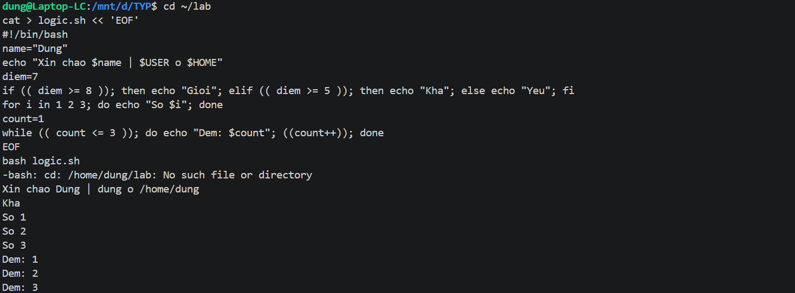
## 27. Tự động hóa tác vụ

### `cron` và `crontab -e`
* **Khái niệm:** `cron` là dịch vụ chạy nền, tự chạy lệnh/script theo lịch. `crontab -e` mở file lịch của bạn; mỗi dòng gồm **5 trường thời gian (phút, giờ, ngày, tháng, thứ) + lệnh**.
* **Ví dụ:**
  ```text
  # phút  giờ  ngày  tháng  thứ   lệnh
    *     *    *     *      *     /home/dung/report.sh     <- mỗi phút
    */5   *    *     *      *     /home/dung/report.sh     <- mỗi 5 phút
    0     2    *     *      *     /home/dung/report.sh     <- 2:00 sáng mỗi ngày
    30    8    *     *      1     /home/dung/report.sh     <- 8:30 sáng thứ Hai
  ```

### Lên lịch chạy script
* **Khái niệm:** Thêm script vào crontab, **dùng đường dẫn tuyệt đối**.
* **Ví dụ:**
  ```bash
  systemctl status cron            # kiểm tra cron đang chạy
  crontab -e                       # thêm dòng cuối file rồi lưu:
  * * * * * /home/dung/report.sh

  # Chờ 2-3 phút rồi kiểm tra:
  cat ~/report.log
  # Fri Oct  9 10:10:01 +07 2026 | user: dung
  # Fri Oct  9 10:11:01 +07 2026 | user: dung
  ```
  # Phần 9: Thực hành tổng hợp

## 28. Bài tập thực tế

### Bài 1: Tạo user mới, cấp quyền hạn chế
* **Mục tiêu:** Tạo tài khoản thường (không có `sudo`) và khóa thư mục home để user khác không đọc được.
* **Kiến thức dùng:** `adduser`, `id`, `su`, `chmod`.
* **Ví dụ:**
  ```bash
  # 1. Tạo user (không thêm vào nhóm sudo)
  sudo adduser devuser
  id devuser
  # uid=1001(devuser) gid=1001(devuser) groups=1001(devuser)    <- không có nhóm sudo

  # 2. Chỉ chủ mới được vào thư mục home
  sudo chmod 700 /home/devuser
  ls -ld /home/devuser
  # drwx------ 2 devuser devuser 4096 Oct  9 10:00 /home/devuser

  # 3. Kiểm tra quyền hạn chế
  su devuser
  sudo whoami
  # devuser is not in the sudoers file.  This incident will be reported.
  exit
  ```

### Bài 2: Tạo và nén backup thư mục
* **Mục tiêu:** Đóng gói thư mục thành file `.tar.gz` có ngày trong tên, rồi kiểm tra và thử khôi phục.
* **Kiến thức dùng:** `tar`, `$(date)`, `ls` (Phần 3, 8).
* **Ví dụ:**
  ```bash
  # 1. Dữ liệu mẫu
  mkdir -p ~/project && echo "hello" > ~/project/a.txt && echo "world" > ~/project/b.txt

  # 2. Nén backup, tên kèm ngày
  tar -czvf ~/backup_$(date +%Y-%m-%d).tar.gz -C ~ project
  # project/
  # project/a.txt
  # project/b.txt

  # 3. Kiểm tra nội dung và dung lượng
  tar -tzvf ~/backup_2026-10-09.tar.gz
  ls -l ~/backup_2026-10-09.tar.gz

  # 4. Thử khôi phục vào thư mục khác
  mkdir ~/restore_test
  tar -xzvf ~/backup_2026-10-09.tar.gz -C ~/restore_test
  cat ~/restore_test/project/a.txt
  # hello
  ```

### Bài 3: Script tự động sao lưu log hệ thống hàng ngày
* **Mục tiêu:** Viết script sao chép và nén log, ghi lại lịch sử, rồi đặt lịch chạy mỗi ngày bằng `cron`.
* **Kiến thức dùng:** script, biến, `cp`, `gzip`, `cron` (Phần 3, 8).
* **Ví dụ:**
  ```bash
  # 1. Viết script
  cat > ~/backup_log.sh << 'EOF'
  #!/bin/bash
  DATE=$(date +%Y-%m-%d)
  DEST=$HOME/log_backup

  mkdir -p $DEST
  cp /var/log/syslog $DEST/syslog_$DATE.log
  gzip $DEST/syslog_$DATE.log
  echo "$(date) | backup xong: syslog_$DATE.log.gz" >> $DEST/backup.log
  EOF

  # 2. Cấp quyền và chạy thử
  chmod +x ~/backup_log.sh
  ~/backup_log.sh
  ls ~/log_backup
  # backup.log  syslog_2026-10-09.log.gz
  cat ~/log_backup/backup.log
  # Fri Oct  9 10:00:00 +07 2026 | backup xong: syslog_2026-10-09.log.gz
  

  # 3. Đặt lịch 2:00 sáng mỗi ngày
  crontab -e
  # Thêm dòng cuối file:
  0 2 * * * /home/dung/backup_log.sh

  crontab -l
  # 0 2 * * * /home/dung/backup_log.sh
  ```

### Bài 4: Dò tìm file lớn nhất trong thư mục home
* **Mục tiêu:** Tìm ra 5 file chiếm nhiều dung lượng nhất để dọn ổ đĩa.
* **Kiến thức dùng:** `find`, `du`, `sort`, `head`, pipe (Phần 3, 5).
* **Ví dụ:**
  ```bash
  # Top 5 file lớn nhất (cột đầu là dung lượng, tính bằng KB)
  find ~ -type f -exec du {} \; | sort -nr | head -n 5
  # 204800   /home/dung/Downloads/ubuntu.iso
  # 51200    /home/dung/backup_2026-10-09.tar.gz
  # 20004    /home/dung/data/file1.txt
  # 8520     /home/dung/.cache/pip/http-v2/abc
  # 4096     /home/dung/log_backup/syslog_2026-10-09.log.gz

  # Top 5 thư mục chiếm nhiều chỗ nhất
  du ~ | sort -nr | head -n 5
  ```
  ```text
  find ~ -type f -exec du {} \;   → liệt kê dung lượng từng file
  sort -nr                        → sắp xếp số, lớn nhất lên đầu
  head -n 5                       → lấy 5 dòng đầu
  ```

### Bài 5: Cấu hình SSH và kiểm tra kết nối
* **Mục tiêu:** Cài SSH server, mở cổng 22, tạo SSH key và đăng nhập không cần mật khẩu.
* **Kiến thức dùng:** `apt`, `systemctl`, `ufw`, `ss`, `ssh-keygen`, `ssh-copy-id` (Phần 5, 6, 7).
* **Ví dụ:**
  ```bash
  # 1. Cài và bật SSH server
  sudo apt update
  sudo apt install openssh-server
  sudo systemctl start ssh
  sudo systemctl enable ssh
  sudo systemctl status ssh
  # Active: active (running)

  # 2. Kiểm tra cổng 22 đang lắng nghe
  ss -tuln | grep 22
  # tcp   LISTEN 0.0.0.0:22   0.0.0.0:*

  # 3. Mở cổng 22 trên firewall
  sudo ufw allow 22
  sudo ufw status
  # 22     ALLOW   Anywhere

  # 4. Xem IP của máy
  ip addr
  # inet 192.168.1.10/24 ...

  # 5. Tạo SSH key và gửi key lên server (thử trên chính máy mình)
  ssh-keygen
  ssh-copy-id dung@localhost

  # 6. Đăng nhập, lần này không hỏi mật khẩu
  ssh dung@localhost
  # dung@server:~$
  exit

  # 7. Từ máy khác trong mạng
  ssh dung@192.168.1.10
  ```

---

## Checklist tự kiểm tra

| Bài | Kết quả đúng |
|-----|--------------|
| 1 | `id devuser` không có nhóm `sudo`; `sudo` báo *not in the sudoers file* |
| 2 | `tar -tzvf` liệt kê đủ file; khôi phục xong `cat` đọc được nội dung |
| 3 | Có file `.gz` và `backup.log`; `crontab -l` hiện đúng dòng lịch |
| 4 | Danh sách 5 file sắp xếp từ lớn đến nhỏ |
| 5 | `ss` thấy cổng 22; `ssh` vào được mà không hỏi mật khẩu |