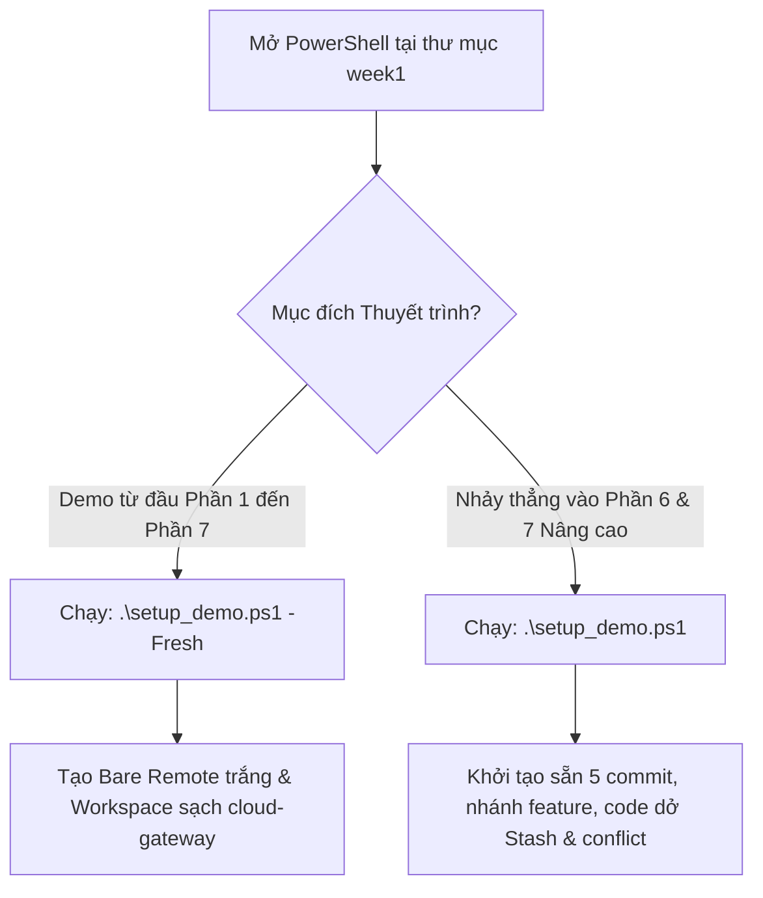

# KỊCH BẢN LIVE DEMO TOÀN DIỆN THỰC HÀNH GIT (TỪ PHẦN 1 ĐẾN PHẦN 7)
> **Báo cáo chuyên đề:** Quản lý Phiên bản Mã nguồn với Git & Nền tảng Đám mây  
> **Khóa đào tạo:** TYP Training Cloud 2026 - Tuần 1  
> **Kỹ sư thực hiện:** Nguyễn Vĩnh Tùng (Mã SV: B23DCKH130)  
> **Dự án thực nghiệm:** API Gateway Microservices (`cloud-gateway`)  
> **Môi trường lab:** `week1/demo-git/`

---

## 🧭 MỤC LỤC & LỘ TRÌNH THUYẾT TRÌNH

| Phần | Tên chuyên đề Demo | Trọng tâm kỹ thuật thực hành | Thời lượng dự kiến |
| :---: | :--- | :--- | :---: |
| **Phần 1** | [Cấu hình Ban đầu & Định danh Kỹ sư](#phần-1-cấu-hình-ban-đầu-kiểm-tra-phiên-bản--định-danh-kỹ-sư) | `git config` (3 cấp độ), defaultBranch, core.autocrlf, SSH check, Git Alias | 2 - 3 phút |
| **Phần 2** | [Làm việc với Repo & Vòng đời Tập tin](#phần-2-làm-việc-với-repository--vòng-đời-tập-tin-three-tree-architecture) | `git init`, giải phẫu `.git`, 3 Trees, `git status -s`, `git diff`, `git add`, Atomic Commit | 3 - 4 phút |
| **Phần 3** | [Lịch sử Commit, Undo An toàn & `.gitignore`](#phần-3-lịch-sử-phiên-bản-hoàn-tác-an-toàn--bảo-mật-với-gitignore) | `git log`, SHA-1 hash, `git blame`, `git restore`, Reset vs Revert, `git rm --cached` | 4 - 5 phút |
| **Phần 4** | [Chiến lược Phân nhánh & Hợp nhất](#phần-4-chiến-lược-phân-nhánh--hợp-nhất-nhánh-branching--merging) | Con trỏ nhánh $O(1)$, `git switch`, Fast-Forward, 3-Way Merge, Giải phẫu Conflict Marker | 4 - 5 phút |
| **Phần 5** | [Tương tác Remote & Quy trình Nhóm](#phần-5-tương-tác-với-remote-repository--mô-hình-cộng-tác-nhóm) | `git remote`, Upstream Tracking, Phân biệt `fetch` vs `pull`, Non-Fast-Forward Push | 3 - 4 phút |
| **Phần 6** | [Công cụ Nâng cao: Stash, Reflog & Rebase](#phần-6-công-cụ--kỹ-năng-nâng-cao-stash-reflog--rebase-squash) | `git stash -u`, Cứu hộ thảm họa với `git reflog`, Làm sạch lịch sử với `rebase -i` | 5 - 6 phút |
| **Phần 7** | [Vận hành Thực tế & Rollback Production](#phần-7-thực-hành-dự-án-thực-tế--vận-hành-enterprise) | Rebase đa nhánh từ xa, SemVer Release Tag `v1.0.0`, Rollback Forward-fix với `git revert` | 5 - 6 phút |

---

## 🎯 THIẾT LẬP MÔI TRƯỜNG LAB (SETUP TOOLKIT)

Hệ thống cung cấp sẵn công cụ tự động hóa PowerShell `setup_demo.ps1` đặt tại thư mục `week1/`. Bạn có thể lựa chọn 1 trong 2 chế độ tùy theo thời lượng báo cáo:



> [!TIP]
> **Nút Reset môi trường thần tốc:**  
> - Muốn thực hành tuần tự từ số 0 (Phần 1 ➔ Phần 5): Chạy `.\setup_demo.ps1 -Fresh`
> - Muốn nhảy cóc trình diễn ngay các tính năng cứu nạn hiểm hóc (Phần 6 ➔ Phần 7): Chạy `.\setup_demo.ps1`

---

# 🎬 GIAI ĐOẠN 1: NỀN TẢNG & VÒNG ĐỜI DỰ ÁN (PHẦN 1 - 3)

---

## 🟢 PHẦN 1: CẤU HÌNH BAN ĐẦU, KIỂM TRA PHIÊN BẢN & ĐỊNH DANH KỸ SƯ

### 1.1. Lời dẫn với Hội đồng / Giảng viên
> *"Kính thưa Thầy/Cô và Hội đồng, trước khi bắt đầu bất kỳ dòng code nào trong môi trường Cloud và DevOps chuyên nghiệp, bước tiên quyết là thiết lập môi trường và định danh kiểm toán (Audit Identity). Mọi commit trong Git đều gắn liền với tác giả và mã băm mật mã học vĩnh viễn. Em xin phép trình diễn quy trình chuẩn hóa cấu hình Git cục bộ trên máy trạm của một kỹ sư."*

### 1.2. Thao tác CLI trực tiếp
Mở PowerShell hoặc Windows Terminal:

```powershell
# 1. Kiểm tra phiên bản Git hiện hành trên hệ thống
git --version

# 2. Cấu hình định danh kỹ sư (Global Scope)
git config --global user.name "Nguyen Vinh Tung"
git config --global user.email "TUNGNV.B23KH130@stu.ptit.edu.vn"

# 3. Chuẩn hóa tên nhánh mặc định theo chuẩn hiện đại quốc tế
git config --global init.defaultBranch main

# 4. Chuẩn hóa ký tự xuống dòng đa nền tảng (Chống lỗi xung đột CRLF trên Windows và LF trên Linux/Container)
git config --global core.autocrlf true

# 5. Cấu hình Git Alias chuyên nghiệp để trực quan hóa lịch sử đồ thị commit
git config --global alias.st status
git config --global alias.lg "log --color --graph --pretty=format:'%Cred%h%Creset -%C(yellow)%d%Creset %s %Cgreen(%cr) %C(bold blue)<%an>%Creset' --abbrev-commit"

# 6. Kiểm tra toàn bộ cấu hình và nguồn tệp lưu trữ tương ứng
git config --list --show-origin

# 7. Kiểm tra xác thực khóa bất đối xứng SSH Key tới GitHub
ssh -T git@github.com
```

### 1.3. Điểm nhấn màn hình & Kết quả mong đợi
- Lệnh `git config --list --show-origin` sẽ hiển thị rõ nguồn lưu cấu hình tại `file:C:/Users/<Username>/.gitconfig`.
- Chỉ ra cho hội đồng thấy: Cấp độ cấu hình có độ ưu tiên: `Local (.git/config)` > `Global (~/.gitconfig)` > `System (/etc/gitconfig)`.
- Khi chạy `ssh -T git@github.com`, kết quả trả về:  
  `Hi VinhTungg! You've successfully authenticated, but GitHub does not provide shell access.` minh chứng khóa SSH đã hoạt động.

### 1.4. Bí kíp vấn đáp Hội đồng (Q&A Defense)
> **Hỏi:** *Tại sao trong môi trường doanh nghiệp luôn ưu tiên xác thực bằng SSH Key thay vì HTTPS kèm mật khẩu?*  
> **Đáp:** *Dạ thưa Thầy/Cô, SSH Key sử dụng cặp khóa mã hóa bất đối xứng (Ed25519 hoặc RSA 4096-bit). Private Key được bảo vệ an toàn trên máy lập trình viên, Public Key đặt trên Server. Điều này loại bỏ hoàn toàn nguy cơ lộ lọt mật khẩu dạng plain-text, không lo hết hạn token đột ngột trong CI/CD, và đáp ứng chuẩn kiểm định an ninh Zero-Trust.*

---

## 🔵 PHẦN 2: LÀM VIỆC VỚI REPOSITORY & VÒNG ĐỜI TẬP TIN (THREE-TREE ARCHITECTURE)

### 2.1. Lời dẫn với Hội đồng / Giảng viên
> *"Bây giờ em sẽ khởi tạo dự án API Gateway mang tên `cloud-gateway`. Em sẽ giải phẫu cấu trúc thư mục bí ẩn `.git/` và chứng minh kiến trúc Ba Vùng Làm Việc (Three Trees Architecture) – cơ chế độc nhất vô nhị giúp Git vượt trội hơn các VCS thế hệ cũ như SVN."*

### 2.2. Thao tác CLI trực tiếp

```powershell
# Chuyển vào thư mục lab
cd d:\typ-training-cloud-2026\tungnv_b23dckh130_training-gd1\week1\demo-git

# 1. Khởi tạo kho chứa mới với nhánh chính là 'main'
git init -b main cloud-gateway
cd cloud-gateway

# 2. Khám phá cấu trúc bên trong thư mục ẩn .git
Get-ChildItem -Force .git
```
*(Chỉ lên màn hình: file `HEAD`, file `config`, thư mục `objects/` - cơ sở dữ liệu đối tượng, thư mục `refs/` - nơi chứa con trỏ nhánh).*

```powershell
# 3. Tạo tập tin mã nguồn lõi server.py
@"
# Cloud Gateway Core Service v1.0
def handle_request(path, method):
    return {"status": 200, "path": path, "method": method}

if __name__ == "__main__":
    print("Cloud Gateway running on port 8080...")
"@ | Set-Content -Encoding UTF8 server.py

# 4. Kiểm tra trạng thái: Nhận diện tập tin Chưa được theo dõi (Untracked)
git status
git status -s
```
*(Chỉ cho hội đồng thấy ký hiệu `?? server.py` màu đỏ trong `git status -s`).*

```powershell
# 5. Đưa tập tin vào Vùng đệm chuẩn bị (Staging Area / Index)
git add server.py
git status -s
```
*(Ký hiệu đổi sang `A  server.py` màu xanh lục - Đã Staged).*

```powershell
# 6. Trình diễn trạng thái Modified và so sánh với git diff
# Thêm một dòng ghi chú vào cuối file server.py
Add-Content -Path server.py -Value "# Logging middleware ready" -Encoding UTF8

# So sánh Working Directory với Staging Area:
git diff

# So sánh Staging Area với Commit trước (hiện tại chưa có commit nào):
git diff --staged
```

```powershell
# 7. Đóng gói Atomic Commit đầu tiên theo chuẩn Conventional Commits
git add server.py
git commit -m "feat(core): initialize cloud gateway routing server"

# 8. Bổ sung tài liệu README.md và commit thứ hai
@"
# Cloud Gateway Service
Hệ thống API Gateway lõi phục vụ điều phối tải và bảo vệ microservices.
"@ | Set-Content -Encoding UTF8 README.md

git add README.md
git commit -m "docs: add project overview and deployment guide"
```

### 2.3. Điểm nhấn màn hình & Phân tích kỹ thuật
```text
  Working Directory        Staging Area (Index)       Local Repository
   [File sửa đổi]   ──git add──►  [Blob Object]  ──git commit──►  [Commit Object]
   (Chưa an toàn)                (Ảnh chụp tạm)                   (Bất biến vĩnh viễn)
```
- Phân tích bảng mã `git status -s`:
  - `??`: Untracked.
  - `A `: Tập tin mới đã đưa vào Stage.
  - ` M`: Tập tin bị sửa đổi ở Working Directory nhưng chưa đưa vào Stage.
  - `M `: Tập tin bị sửa đổi đã đưa vào Stage thành công.

### 2.4. Bí kíp vấn đáp Hội đồng (Q&A Defense)
> **Hỏi:** *Tại sao Git lại cần một vùng đệm Staging Area mà không commit thẳng từ Working Directory như SVN?*  
> **Đáp:** *Dạ thưa Thầy/Cô, Staging Area cho phép lập trình viên tạo ra các **Commit nguyên tử (Atomic Commits)**. Giả sử em sửa 5 file thuộc về 2 tính năng khác nhau, em có thể dùng `git add` để chọn lọc đúng 2 file của tính năng thứ nhất để commit riêng biệt, sau đó mới add 3 file còn lại cho commit thứ hai. Điều này giúp lịch sử dự án trong sáng, dễ review mã nguồn và dễ rollback khi có sự cố mà không làm ảnh hưởng tính năng khác.*

---

## 🟡 PHẦN 3: LỊCH SỬ PHIÊN BẢN, HOÀN TÁC AN TOÀN & BẢO MẬT VỚI `.gitignore`

### 3.1. Lời dẫn với Hội đồng / Giảng viên
> *"Một kỹ sư Cloud giỏi không chỉ biết viết mã mà phải biết quản trị dòng thời gian và làm chủ các kỹ thuật khôi phục sự cố. Trong phần này, em sẽ giải phẫu mã băm SHA-1, phân tích vết kiểm toán với `git blame`, trình diễn 3 cấp độ Undo an toàn và xử lý tình huống thực tế: vô tình commit file mật rồi mới thêm vào `.gitignore`."*

### 3.2. Thao tác CLI trực tiếp

#### A. Truy vết lịch sử và Audit Trail
```powershell
# 1. Xem lịch sử commit dạng rút gọn và đồ thị nhánh
git log --oneline --graph --decorate

# 2. Xem chi tiết commit mới nhất (Metadata, Tác giả, và mã Diff)
git show HEAD

# 3. Phân tích vết kiểm toán từng dòng code với git blame (Xem ai viết dòng nào, vào lúc nào)
git blame server.py
```

#### B. Hoàn tác cục bộ (Local Undo) với `git restore`
```powershell
# 4. Giả lập lập trình viên lỡ tay xóa nhầm code trong file server.py
Set-Content -Path server.py -Value "# CODE BI XOA HONG HOAN TOAN" -Encoding UTF8
git status -s

# Phục hồi nguyên trạng tệp từ Staging Area trong 1 giây:
git restore server.py
git status -s
```
*(Mở file `server.py` ra kiểm tra: Toàn bộ code gốc đã quay trở lại nguyên vẹn).*

```powershell
# 5. Giả lập lỡ tay đưa một file vào Stage nhưng muốn rút lại (Un-stage)
Add-Content -Path server.py -Value "# Temporary test line" -Encoding UTF8
git add server.py
git status -s    # Hiển thị 'M ' xanh lá cây

# Rút file ra khỏi Staging Area mà KHÔNG làm mất dòng code đang viết:
git restore --staged server.py
git status -s    # Quay lại ' M' đỏ ở Working Directory
git restore server.py
```

#### C. Thiết lập `.gitignore` & Cứu sự cố lộ lọt Secret
```powershell
# 6. Thiết lập file .gitignore chuẩn Enterprise
@"
# Environment & Secrets
*.env
config/credentials.json

# Python cache & logs
__pycache__/
*.py[cod]
logs/
*.log

# OS temporary files
Thumbs.db
.DS_Store
"@ | Set-Content -Encoding UTF8 .gitignore

git add .gitignore
git commit -m "chore: setup enterprise gitignore policy"
```

```powershell
# 7. TÌNH HUỐNG THỰC TẾ: File bí mật credentials.json ĐÃ BỊ COMMIT TRƯỚC ĐÓ
# Giả sử file này đã nằm trong repo:
New-Item -ItemType Directory -Path "config" -Force | Out-Null
@"
{"db_user": "admin", "db_password": "super_secret_password_2026"}
"@ | Set-Content -Encoding UTF8 config\credentials.json

# Nếu commit file này vào Git:
git add config\credentials.json
git commit -m "feat(config): add database credentials"

# Phát hiện nguy hiểm! Ta muốn bỏ theo dõi nhưng VẪN GIỮ FILE TRÊN Ổ CỨNG:
git rm --cached config\credentials.json
git status -s

# Commit thao tác gỡ bỏ này:
git commit -m "security: untrack sensitive credentials file from repository"
```
*(Chỉ cho hội đồng thấy: File `config/credentials.json` vẫn tồn tại nguyên vẹn trên máy nhưng Git hoàn toàn phớt lờ không theo dõi nữa).*

### 3.3. Điểm nhấn màn hình & Bảng so sánh 3 chế độ `git reset`
```text
┌─────────────┬──────────────────────────┬──────────────────────────┬──────────────────────────┐
│ Chế độ      │ Con trỏ HEAD & Branch    │ Staging Area (Index)     │ Working Directory        │
├─────────────┼──────────────────────────┼──────────────────────────┼──────────────────────────┤
│ --soft      │ Kéo lùi về target        │ GIỮ NGUYÊN (Staged)      │ GIỮ NGUYÊN trên đĩa      │
│ --mixed     │ Kéo lùi về target        │ XÓA STAGED theo target   │ GIỮ NGUYÊN (Un-staged)   │
│ --hard      │ Kéo lùi về target        │ XÓA BỎ theo target       │ XÓA SẠCH VĨNH VIỄN       │
└─────────────┴──────────────────────────┴──────────────────────────┴──────────────────────────┘
```

### 3.4. Bí kíp vấn đáp Hội đồng (Q&A Defense)
> **Hỏi:** *Tại sao khi thêm file vào `.gitignore` rồi nhưng Git vẫn báo file bị thay đổi mỗi khi ta chỉnh sửa?*  
> **Đáp:** *Dạ thưa Thầy/Cô, quy tắc trong `.gitignore` chỉ áp dụng cho các tệp **Untracked**. Nếu một tệp đã từng được `git add` hoặc `commit` trong quá khứ, nó đã được đánh dấu vào Git Index (Tracked). Muốn `.gitignore` có hiệu lực, ta bắt buộc phải dùng lệnh `git rm --cached <file>` để xóa tệp khỏi Index trước rồi mới commit.*

---

# 🎬 GIAI ĐOẠN 2: CỘNG TÁC, PHÂN NHÁNH & ĐỒNG BỘ MẠNG (PHẦN 4 - 5)

---

## 🟠 PHẦN 4: CHIẾN LƯỢC PHÂN NHÁNH & HỢP NHẤT NHÁNH (BRANCHING & MERGING)

### 4.1. Lời dẫn với Hội đồng / Giảng viên
> *"Trong Git, phân nhánh là một thao tác cực kỳ nhẹ nhàng với độ phức tạp $O(1)$ vì một nhánh thực chất chỉ là một con trỏ 41 bytes chứa mã SHA-1. Em xin trình diễn quy trình phân nhánh chuẩn theo GitHub Flow: tạo nhánh tính năng bằng `git switch`, thực hiện Fast-Forward Merge, và chủ động tạo ra một xung đột 3-Way Merge để giải quyết trực tiếp trên màn hình."*

### 4.2. Thao tác CLI trực tiếp

#### A. Khám phá bản chất con trỏ nhánh & Con trỏ HEAD
```powershell
# 1. Soi nội dung con trỏ HEAD và con trỏ nhánh main trên ổ đĩa
Get-Content .git\HEAD
Get-Content .git\refs\heads\main
```
*(Giải thích: `HEAD` trỏ tới `refs/heads/main`, và `main` trỏ tới mã SHA-1 commit mới nhất).*

#### B. Phân nhánh & Fast-Forward Merge
```powershell
# 2. Tạo và chuyển ngay sang nhánh tính năng mới bằng lệnh hiện đại git switch
git switch -c feature/auth-service

# 3. Phát triển tính năng xác thực trong auth.py
@"
# Authentication & JWT Token Validator
def verify_token(token):
    return token == "Bearer secret-token-2026"
"@ | Set-Content -Encoding UTF8 auth.py

git add auth.py
git commit -m "feat(auth): add JWT bearer token authentication logic"

# 4. Chuyển về nhánh main và thực hiện Fast-Forward Merge
git switch main
git merge feature/auth-service
git log --oneline -n 3
```
*(Chỉ cho hội đồng thấy thông báo `Fast-forward` – con trỏ `main` chỉ tịnh tiến tiến lên).*

#### C. Tái hiện & Giải quyết Xung đột Nhánh Cục bộ (3-Way Merge Conflict)
```powershell
# 5. Tạo file cấu hình config.yaml trên main
@"
app:
  name: cloud-gateway
  timeout: 30
"@ | Set-Content -Encoding UTF8 config.yaml
git add config.yaml
git commit -m "feat(config): set initial request timeout to 30s"

# 6. Tạo nhánh feature/high-timeout và sửa timeout thành 120s
git switch -c feature/high-timeout
@"
app:
  name: cloud-gateway
  timeout: 120
"@ | Set-Content -Encoding UTF8 config.yaml
git commit -am "feat(config): increase request timeout to 120s for long polling"

# 7. Quay lại main và sửa cùng dòng timeout đó thành 60s
git switch main
@"
app:
  name: cloud-gateway
  timeout: 60
"@ | Set-Content -Encoding UTF8 config.yaml
git commit -am "feat(config): adjust standard request timeout to 60s"

# 8. Thực hiện Merge và ĐÓN NHẬN CONFLICT:
git merge feature/high-timeout
```
*(Git lập tức dừng lại và báo đỏ: `CONFLICT (content): Merge conflict in config.yaml`).*

```powershell
# 9. Giải phẫu dấu vết Conflict Marker:
Get-Content config.yaml
```
*(Chỉ lên màn hình phân tích cấu trúc 3 phần):*
```yaml
<<<<<<< HEAD (Mã nguồn trên nhánh main hiện tại)
  timeout: 60
=======
  timeout: 120
>>>>>>> feature/high-timeout (Mã nguồn từ nhánh tính năng gộp vào)
```

```powershell
# 10. Giải quyết xung đột bằng cách thống nhất cấu hình tối ưu (90s):
@"
app:
  name: cloud-gateway
  timeout: 90
"@ | Set-Content -Encoding UTF8 config.yaml

# Đánh dấu đã giải quyết và hoàn tất Merge:
git add config.yaml
git commit -m "merge: resolve timeout conflict between main and high-timeout branch"

# Xem lại cây lịch sử rẽ nhánh và hợp nhất:
git log --graph --oneline -n 5
```

### 4.3. Điểm nhấn màn hình & Đồ thị Merge
```text
*   d4a1b2c (HEAD -> main) merge: resolve timeout conflict between main and high-timeout branch
|\  
| * e3c2a1b (feature/high-timeout) feat(config): increase request timeout to 120s
* | f2b1c0a feat(config): adjust standard request timeout to 60s
|/  
* 8a7b6c5 feat(config): set initial request timeout to 30s
```

### 4.4. Bí kíp vấn đáp Hội đồng (Q&A Defense)
> **Hỏi:** *Tại sao khi merge một số công ty lại bắt buộc dùng cờ `git merge --no-ff` (No Fast-Forward)?*  
> **Đáp:** *Dạ thưa Thầy/Cô, mặc dù Fast-Forward giúp lịch sử thẳng đẹp, nhưng nó làm mất đi dấu mốc tích hợp tính năng. Khi dùng `--no-ff`, Git luôn sinh ra một Merge Commit thực thể, giúp lưu trữ metadata: ai là người duyệt merge, merge vào ngày giờ nào, và nếu sau này tính năng đó bị lỗi, ta có thể `git revert <merge-commit-sha>` để loại bỏ toàn bộ tính năng đó chỉ bằng một lệnh duy nhất.*

---

## 🟣 PHẦN 5: TƯƠNG TÁC VỚI REMOTE REPOSITORY & MÔ HÌNH CỘNG TÁC NHÓM

### 5.1. Lời dẫn với Hội đồng / Giảng viên
> *"Trong thực tế, lập trình viên không làm việc đơn lẻ trên máy cá nhân mà phải liên tục đồng bộ qua mạng với Git Server (GitHub, GitLab, bare-server). Em sẽ trình diễn quy trình kết nối Remote, thiết lập Upstream Tracking, và đặc biệt là làm rõ sự khác biệt bản chất giữa `git fetch` và `git pull` – một kiến thức nền tảng thường xuyên bị hiểu sai."*

### 5.2. Thao tác CLI trực tiếp

#### A. Kết nối Remote & Đẩy code lần đầu (Upstream Tracking)
```powershell
# 1. Thêm Bare Repository nội bộ (đóng vai trò là Git Server từ xa của công ty)
git remote add origin ../remote-server.git

# 2. Kiểm tra danh sách remote và địa chỉ URL
git remote -v

# 3. Đẩy nhánh main lên remote lần đầu với cờ -u (--set-upstream)
git push -u origin main

# 4. Kiểm tra thông tin đồng bộ chi tiết của remote
git remote show origin
```
*(Chỉ cho hội đồng thấy dòng: `main pushes to main (up to date)` và `Local branch configured for 'git pull'`).*

#### B. Phân biệt chuyên sâu: `git fetch` vs `git pull`
```powershell
# 5. Giả lập một lập trình viên khác (hoặc CI/CD bot) đẩy một commit mới lên Server:
# (Ta đứng từ xa tạo nhanh 1 commit trực tiếp trên remote-server)
git clone ../remote-server.git ../temp-teammate | Out-Null
Set-Location ../temp-teammate
Add-Content README.md -Value "`n### Production Status: Healthy" -Encoding UTF8
git commit -am "chore(docs): teammate update production health check" | Out-Null
git push origin main | Out-Null
Set-Location ../cloud-gateway
Remove-Item -Recurse -Force ../temp-teammate

# 6. THAO TÁC KỸ SƯ CHUẨN: Dùng git fetch để kiểm tra an toàn (KHÔNG ảnh hưởng file đang mở)
git fetch origin

# Soi commit mới trên remote mà local chưa có:
git log main..origin/main --oneline

# Soi sự khác biệt dòng mã giữa local và remote:
git diff main origin/main

# 7. Đồng bộ chính thức vào nhánh local:
git pull --rebase origin main
git log --oneline -n 3
```

### 5.3. Điểm nhấn màn hình & Luồng kỹ thuật
```text
       [REMOTE SERVER] (GitHub/GitLab)
              │
              │  git fetch (Cực kỳ an toàn, chỉ cập nhật origin/main)
              ▼
    [REMOTE TRACKING BRANCH] (origin/main)
              │
              │  git merge / git rebase
              ▼
      [LOCAL BRANCH] (refs/heads/main & Working Directory)
```

### 5.4. Bí kíp vấn đáp Hội đồng (Q&A Defense)
> **Hỏi:** *Tại sao trong môi trường làm việc nhóm, lệnh `git pull --rebase` lại được khuyến nghị nhiều hơn `git pull` thông thường?*  
> **Đáp:** *Dạ thưa Thầy/Cô, `git pull` mặc định sẽ thực hiện `git fetch` + `git merge`. Nếu cả hai bên đều có commit mới, nó sẽ tự động sinh ra một commit hợp nhất dạng "Merge branch 'main' of remote..." gây rối rắm cây lịch sử. Trong khi đó, `git pull --rebase` sẽ bốc các commit cá nhân của em đặt tạm sang một bên, cập nhật code mới nhất từ remote về, rồi đặt commit của em lên trên đỉnh. Kết quả là cây lịch sử hoàn toàn tuyến tính, sạch đẹp và chuẩn Enterprise.*

---

# 🎬 GIAI ĐOẠN 3: KỸ NĂNG ĐỈNH CAO & VẬN HÀNH ENTERPRISE (PHẦN 6 - 7)

> [!IMPORTANT]
> **TIẾP NỐI LIỀN MẠCH:**  
> Bạn có thể tiếp tục demo ngay trên workspace hiện tại, HOẶC nếu bước vào phòng thi bị giới hạn thời gian (chỉ có 10 phút), hãy mở PowerShell tại `week1` và chạy:
> ```powershell
> .\setup_demo.ps1
> cd demo-git\cloud-gateway
> ```
> Môi trường sẽ lập tức có sẵn đầy đủ 5 commit chuẩn bị, 1 nhánh `feature/rate-limiter`, file bí mật untracked và code dở dang cho các hồi kịch tính dưới đây!

---

## 🔴 PHẦN 6: CÔNG CỤ & KỸ NĂNG NÂNG CAO (STASH, REFLOG & REBASE SQUASH)

### 🟢 HỒI 1: LƯU TẠM THAY ĐỔI DỞ DANG VỚI `git stash`
**Lời dẫn với Hội đồng:**  
*"Em đang ở nhánh `feature/rate-limiter` để phát triển module giới hạn tần suất. Trong thư mục làm việc, em đang viết dở thuật toán trong `limiter.py` và vừa tạo thêm file cấu hình bí mật `config/redis_secret.env`. Code đang dở chưa thể commit, nhưng Trưởng nhóm yêu cầu em chuyển gấp sang nhánh `main` để kiểm tra. Nếu em chuyển nhánh ngay, Git sẽ cảnh báo hoặc gây xung đột. Em sẽ dùng `git stash` với cờ `-u` để đóng gói an toàn cả file untracked."*

* **Bước 1: Kiểm tra trạng thái dở dang:**
  ```powershell
  git status
  ```
  *(Chỉ cho hội đồng thấy: 1 file modified `limiter.py` và 1 thư mục untracked `config/`)*

* **Bước 2: Cất giữ an toàn vào ngăn xếp:**
  ```powershell
  git stash push -u -m "WIP: dang viet do thuat toan sliding window"
  ```

* **Bước 3: Chứng minh không gian làm việc sạch sẽ:**
  ```powershell
  git status
  git stash list
  ```

* **Bước 4: Chuyển nhánh thực hiện việc khác rồi quay lại phục hồi:**
  ```powershell
  git switch main
  # (Giả sử kiểm tra xong trên main)
  git switch feature/rate-limiter
  git stash pop
  git status
  ```
  *(Dữ liệu đang viết dở và file bí mật đã quay trở lại nguyên vẹn 100%).*

---

### 🔴 HỒI 2: THẢM HỌA LỠ TAY XÓA CODE & CỨU NẠN BẰNG `git reflog`
**Lời dẫn với Hội đồng:**  
*"Sau khi hoàn thiện code, em commit nốt phần dở dang. Nhưng trong quá trình thao tác, giả sử lập trình viên lỡ tay gõ nhầm lệnh hủy diệt `git reset --hard HEAD~2`. Hai commit quan trọng biến mất hoàn toàn khỏi `git log`. Rất nhiều bạn nghĩ rằng code đã bị mất vĩnh viễn, nhưng Git có cơ chế an toàn tối cao là `git reflog`."*

* **Bước 1: Đóng gói nốt code dở thành commit:**
  ```powershell
  git add .
  git commit -m "feat(limiter): finalize token bucket limiter logic"
  git log --oneline -n 3
  ```

* **Bước 2: Tái hiện thảm họa (Lỡ tay reset nhầm):**
  ```powershell
  git reset --hard HEAD~2
  git log --oneline -n 3
  ```
  *(Chỉ cho hội đồng thấy: 2 commit vừa xong đã biến mất hoàn toàn khỏi cây `git log`).*

* **Bước 3: Mở cuốn "hộp đen máy bay" `git reflog`:**
  ```powershell
  git reflog -n 5
  ```
  *(Giải thích: Reflog ghi nhận mọi bước chân di chuyển của con trỏ HEAD. Dòng `HEAD@{1}` chính là commit đỉnh ngay trước khi bị reset).*

* **Bước 4: Cứu sống toàn bộ mã nguồn trong 5 giây:**
  ```powershell
  # Cách 1: Dùng HEAD@{1} (Trên PowerShell bắt buộc bọc nháy kép):
  git reset --hard "HEAD@{1}"

  # Kiểm tra lại lịch sử:
  git log --oneline -n 4
  ```
  *(Toàn bộ mã nguồn và commit đã sống lại kỳ diệu ngay trước mắt người xem).*

---

### 🟡 HỒI 3: LÀM SẠCH LỊCH SỬ TRƯỚC KHI MỞ PULL REQUEST (`rebase -i`)
**Lời dẫn với Hội đồng:**  
*"Trước khi đẩy code lên mở PR, em kiểm tra lịch sử commit thì thấy có các commit vụn vặt như 'fix typo', 'test debug prints'. Để tuân thủ văn hóa kỹ sư chuyên nghiệp và giữ cây commit sạch sẽ, em sẽ dùng `git rebase -i` để Squash chúng lại."*

* **Bước 1: Xem cây commit hiện tại:**
  ```powershell
  git log --oneline -n 5
  ```

* **Bước 2: Kích hoạt Interactive Rebase:**
  *(Lưu ý: Git sẽ mở trình soạn thảo như Notepad hoặc Vim)*
  ```powershell
  git rebase -i HEAD~4
  ```
  *(Trong file mở ra, đổi chữ `pick` của các commit 'fix: typo...' và 'wip: test debug...' thành `fixup` hoặc `squash`, sau đó lưu và đóng file).*
  * *Mẹo:* Nếu dùng command line tự động không cần mở editor, có thể giải thích nguyên lý gộp commit cho hội đồng.

---

## 🛡️ PHẦN 7: THỰC HÀNH DỰ ÁN THỰC TẾ & VẬN HÀNH ENTERPRISE

### 🟠 HỒI 4: ĐỒNG BỘ TỪ XA, ĐỤNG ĐỘ CONFLICT & REBASE CHUYÊN NGHIỆP
**Lời dẫn với Hội đồng:**  
*"Trong lúc em phát triển nhánh `feature`, đồng nghiệp trên nhánh `main` đã cập nhật cấu hình timeout và đẩy lên server từ xa. Em sẽ không dùng `git pull` theo quán tính mà tuân thủ quy trình chuẩn: Fetch về kiểm tra, sau đó Rebase trên đỉnh `origin/main` để giữ lịch sử tuyến tính."*

* **Bước 1: Tải dữ liệu từ xa và soi độ lệch nhánh:**
  ```powershell
  git fetch origin
  git log HEAD..origin/main --oneline
  ```
  *(Thấy commit của đồng nghiệp: `feat(config): teammate update routing and timeout`).*

* **Bước 2: Tái cơ sở (Rebase) và đón nhận Conflict:**
  ```powershell
  git rebase origin/main
  ```
  *(Git lập tức dừng lại và báo: `CONFLICT (content): Merge conflict in config.yaml`).*

* **Bước 3: Giải phẫu dấu vết Conflict Marker:**
  ```powershell
  git status
  Get-Content config.yaml
  ```
  *(Chỉ rõ cho hội đồng: `<<<<<<< HEAD` là code của đồng nghiệp từ main; `>>>>>>>` là code rate limit của bạn).*

* **Bước 4: Giải quyết xung đột kết hợp:**
  Chỉnh sửa file `config.yaml` thành cấu hình đầy đủ của cả 2 bên (xóa sạch các marker):
  ```yaml
  app:
    name: cloud-gateway
    port: 8080
    env: production
    timeout: 60
    routing_mode: dynamic
    rate_limit_enabled: true
  ```

* **Bước 5: Tiếp tục quy trình Rebase:**
  ```powershell
  git add config.yaml
  git rebase --continue
  ```

* **Bước 6: Đẩy lên Server từ xa với cờ an toàn:**
  ```powershell
  git push --force-with-lease origin feature/rate-limiter
  ```
  *(Giải thích tại sao dùng `--force-with-lease` thay vì `--force`: để bảo vệ không ghi đè nếu có ai khác vừa push vào nhánh).*

---

### 🟣 HỒI 5: ĐÓNG GÓI RELEASE (SEMVER) & ROLLBACK PRODUCTION KHẨN CẤP
**Lời dẫn với Hội đồng:**  
*"Tính năng đã được merge vào `main`. Nhóm tiến hành đóng gói phiên bản chính thức đầu tiên `v1.0.0` bằng Annotated Tag tuân thủ Semantic Versioning. Tuy nhiên, sau khi deploy lên Production, hệ thống gặp sự cố khẩn cấp. Em sẽ trình diễn chiến lược Rollback chuẩn Enterprise (Forward-fix Rollback) bằng `git revert` và phát hành bản vá `v1.0.1`."*

* **Bước 1: Hợp nhất vào nhánh chính và Đóng gói Release:**
  ```powershell
  git switch main
  git merge feature/rate-limiter
  git tag -a v1.0.0 -m "Release v1.0.0: First stable release with Rate Limiting engine"
  git describe --tags
  git push origin main v1.0.0
  ```

* **Bước 2: Sự cố Production - Rollback bằng `git revert`:**
  *(Tuyệt đối không dùng `git reset --hard` trên `main` vì sẽ phá vỡ lịch sử công khai)*
  ```powershell
  git revert HEAD --no-edit
  ```
  *(Một commit mới được tạo ra: `Revert "feat(config): enable rate limiting config"`).*

* **Bước 3: Phát hành bản vá nóng khẩn cấp (Hotfix v1.0.1):**
  ```powershell
  git tag -a v1.0.1 -m "Release v1.0.1: Emergency revert rate limiting logic to stabilize production"
  git push origin main v1.0.1
  ```

* **Bước 4: Chiêm ngưỡng cây lịch sử hoàn mỹ:**
  ```powershell
  git log --graph --oneline --decorate -n 6
  ```
  *(Cây lịch sử thẳng tắp, có đầy đủ tag phiên bản `v1.0.0`, `v1.0.1`, lưu vết kiểm toán audit trail 100% minh bạch).*

---

## 🏆 KẾT LUẬN & MA TRẬN RA QUYẾT ĐỊNH KỸ THUẬT

### Lời kết thuyết trình khẳng định năng lực
> *"Kính thưa Thầy/Cô và Hội đồng, qua toàn bộ 7 phần thực hành vừa rồi, em đã chứng minh năng lực làm chủ Git ở cấp độ kỹ sư: từ cấu hình chuẩn hóa, quản trị vòng đời tập tin, xử lý các tình huống bảo mật rò rỉ secret, phân nhánh và giải quyết xung đột đa môi trường, cho đến kỹ thuật cứu hộ thảm họa với Reflog và chiến lược Rollback an toàn chuẩn Semantic Versioning trên môi trường Production. Em xin chân thành cảm ơn Thầy/Cô và sẵn sàng đón nhận câu hỏi phản biện!"*

### 📊 Ma trận Ra quyết định Kỹ thuật (Engineering Decision Matrix)
Bảng tra cứu phản xạ nhanh khi xử lý sự cố trong môi trường làm việc thực tế:

| Tình huống thực tế | Lệnh khuyến nghị | Lý do kỹ thuật | Cấm sử dụng |
| :--- | :--- | :--- | :--- |
| Đang code dở, cần chuyển nhánh gấp | `git stash push -u` | Cất giữ cả file untracked an toàn | `git checkout -f` (mất code) |
| Lỡ tay gõ `reset --hard` mất commit | `git reflog` + `reset --hard HEAD@{n}` | Reflog ghi nhận mọi bước nhảy con trỏ | Bỏ cuộc làm lại từ đầu |
| Lỡ commit file `.env` chứa mật khẩu | `git rm --cached <file>` + commit | Gỡ khỏi tracking, giữ nguyên file trên đĩa | `rm -rf <file>` (mất file trên đĩa) |
| Cần dọn commit rác trước khi mở PR | `git rebase -i HEAD~n` (squash) | Giữ cây commit thẳng và nguyên tử | Commit thêm commit rác "fix fix" |
| Nhánh cá nhân bị lệch commit sau rebase | `git push --force-with-lease` | Chỉ ghi đè nếu remote chưa ai push thêm | `git push --force` (ghi đè mù quáng) |
| Code lỗi nghiêm trọng trên Production | `git revert <commit-sha>` | Tạo commit đảo ngược, bảo toàn lịch sử audit | `git reset --hard` trên production |
