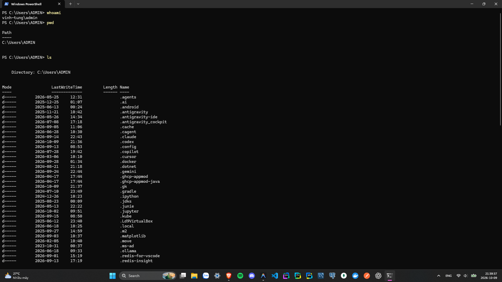

# BÁO CÁO THỰC HÀNH TUẦN 2: LINUX CƠ BẢN VÀ BẢN CHẤT HỆ THỐNG

- **Họ và tên:** Nguyễn Vĩnh Tùng
- **Mã sinh viên:** B23DCKH130
- **Chương trình:** TYP Cloud Training 2026
- **Giai đoạn:** Giai đoạn 1
- **Nội dung:** Báo cáo chi tiết và bài thực hành Tuần 2 - Linux cơ bản và bản chất hệ thống
- **Ngày thực hiện:** 07/10/2026

---

## MỤC LỤC
- [Phần 1: Giới thiệu tổng quan về Linux](#phần-1-giới-thiệu-tổng-quan-về-linux)
- [Phần 2: Làm quen với Terminal và Shell](#phần-2-làm-quen-với-terminal-và-shell)
- [Phần 3: Làm việc với file và thư mục](#phần-3-làm-việc-với-file-và-thư-mục)
- [Phần 4: Quyền truy cập và người dùng](#phần-4-quyền-truy-cập-và-người-dùng)
- [Phần 5: Quản lý tiến trình và hệ thống](#phần-5-quản-lý-tiến-trình-và-hệ-thống)
- [Phần 6: Quản lý gói phần mềm](#phần-6-quản-lý-gói-phần-mềm)
- [Phần 7: Làm việc với mạng](#phần-7-làm-việc-với-mạng)
- [Phần 8: Script & Automation cơ bản](#phần-8-script--automation-cơ-bản)
- [Phần 9: Thực hành tổng hợp](#phần-9-thực-hành-tổng-hợp)

---

## Phần 1: Giới thiệu tổng quan về Linux

### 1. Linux là gì?

#### 1.1. Khái niệm hệ điều hành mã nguồn mở
Hệ điều hành mã nguồn mở nghĩa là mã nguồn gốc của phần mềm được công bố công khai. Bất kỳ kỹ sư nào trên thế giới cũng có thể tải về, đọc hiểu cách thức hoạt động bên trong, tìm kiếm lỗ hổng, sửa lỗi và phát triển thêm tính năng mới. Khác với Windows hay macOS là các hệ điều hành mã nguồn đóng độc quyền, Linux phát triển dựa trên trí tuệ của hàng triệu lập trình viên toàn cầu. Điều này giúp Linux đạt độ minh bạch cao, loại bỏ nguy cơ cài cắm mã độc ngầm và có tốc độ vá lỗi bảo mật hàng đầu thế giới.

#### 1.2. Lịch sử phát triển của Linux
Năm 1991, Linus Torvalds, sinh viên đại học người Phần Lan, đã tự tay viết phần nhân hệ điều hành lấy cảm hứng từ UNIX, thiết kế để chạy trên máy tính cá nhân vi xử lý 386 và đăng tải lên mạng để cộng đồng dùng thử miễn phí. Lời kêu gọi đóng góp của Linus Torvalds đã khởi đầu cho cuộc cách mạng phần mềm lớn nhất lịch sử. Từ một dự án cá nhân, Linux đã phát triển mạnh mẽ và trở thành nền tảng vận hành phần lớn hạ tầng Internet và các siêu máy tính hiện nay.

#### 1.3. Phân biệt giữa Linux kernel và các bản phân phối
Trong thực tế, người dùng thường gọi chung là hệ điều hành Linux, nhưng về mặt kiến trúc cần phân biệt rõ hai khái niệm:
- **Linux Kernel:** Là phần nhân trung tâm của hệ điều hành, chịu trách nhiệm điều khiển phần cứng như giao tiếp với CPU, cấp phát RAM và quản lý ổ đĩa. Kernel không cung cấp giao diện người dùng trực tiếp mà đóng vai trò như khối động cơ của một cỗ máy.
- **Bản phân phối:** Các tổ chức và doanh nghiệp như Canonical hay Red Hat sử dụng nhân Linux Kernel kết hợp với các thành phần hoàn chỉnh gồm hệ thống đồ họa, trình quản lý gói phần mềm, các tiện ích dòng lệnh và ứng dụng người dùng. Sản phẩm hoàn chỉnh này là một bản phân phối, tiêu biểu như Ubuntu, CentOS hay Debian.

### 2. Tại sao nên học Linux

#### 2.1. Ứng dụng rộng rãi trong server, cloud, DevOps, AI, lập trình hệ thống
Toàn bộ hạ tầng công nghệ hiện đại được xây dựng trên nền tảng Linux. Tất cả 500 siêu máy tính mạnh nhất thế giới đều sử dụng Linux. Hạ tầng đám mây như AWS, Google Cloud, Azure, các công nghệ DevOps như Docker, Kubernetes cùng môi trường huấn luyện trí tuệ nhân tạo đều vận hành mặc định trên Linux. Do đó, làm chủ Linux là yêu cầu bắt buộc đối với kỹ sư hạ tầng, quản trị hệ thống và lập trình viên.

#### 2.2. Sự khác biệt giữa Linux và Windows/macOS
- **Windows:** Hướng tới người dùng phổ thông với giao diện đồ họa trực quan. Dễ tiếp cận nhưng khi xảy ra sự cố tầng sâu, việc can thiệp và tinh chỉnh hệ thống gặp nhiều hạn chế do mã nguồn đóng và registry phức tạp.
- **macOS:** Hướng tới người dùng sáng tạo và nhà phát triển. Hệ thống xây dựng trên nền tảng UNIX nên rất ổn định, tuy nhiên bị ràng buộc chặt chẽ vào phần cứng độc quyền của Apple.
- **Linux:** Hướng tới môi trường máy chủ và tự động hóa. Toàn bộ cấu hình hệ thống được lưu trữ dưới dạng các tệp văn bản thuần, cho phép quản trị hoàn toàn qua giao diện dòng lệnh và dễ dàng tự động hóa quy mô lớn bằng kịch bản lệnh.

#### 2.3. Ưu điểm: bảo mật, miễn phí, tùy biến, hiệu suất cao
- **Hiệu suất:** Máy chủ Linux không cần nạp giao diện đồ họa có thể vận hành ổn định các dịch vụ mạng với mức tiêu thụ tài nguyên cực thấp, chỉ từ vài trăm megabyte RAM, tiết kiệm tài nguyên đáng kể so với môi trường Windows Server.
- **Bảo mật:** Kiến trúc phân quyền chặt chẽ theo chuẩn POSIX và mô hình cô lập tiến trình giúp ngăn chặn mã độc lây lan hoặc phá hoại toàn bộ hệ thống.
- **Miễn phí và Tùy biến:** Tiết kiệm tối đa chi phí bản quyền hệ điều hành cho doanh nghiệp, đồng thời cho phép tự do tùy biến sâu từ cấp độ nhân đến các gói dịch vụ theo nhu cầu thực tế.

### 3. Kiến trúc hệ thống Linux

#### 3.1. Kernel, Shell, Application layer
Hệ thống Linux phân chia bộ nhớ thành hai không gian độc lập nhằm đảm bảo an toàn tuyệt đối cho hệ thống:
- **Không gian nhân Kernel Space:** Vận hành ở cấp độ đặc quyền cao nhất Ring 0 của bộ vi xử lý. Kernel có toàn quyền điều khiển phần cứng, quản lý bộ nhớ vật lý và thực thi các chỉ lệnh nhạy cảm của CPU.
- **Không gian người dùng User Space:** Vận hành ở cấp độ đặc quyền Ring 3. Toàn bộ các tiến trình ứng dụng như trình duyệt, máy chủ web và các chương trình Shell đều chạy trong vùng nhớ này và bị hạn chế, không được truy cập trực tiếp vào phần cứng.
- **Bản chất của lời gọi hệ thống System Call:** Khi một tiến trình trong không gian người dùng cần thực hiện các thao tác phần cứng như đọc ghi tệp trên đĩa hay truyền dữ liệu qua card mạng, tiến trình đó phải gửi yêu cầu System Call tới Kernel. Kernel kiểm tra quyền hạn hợp lệ trước khi thực hiện thao tác thay cho ứng dụng và trả về kết quả. Nhờ kiến trúc này, khi một ứng dụng gặp sự cố và dừng hoạt động, Kernel và toàn bộ hệ điều hành vẫn vận hành an toàn.

#### 3.2. Quá trình khởi động cơ bản

Quá trình khởi động Linux là chuỗi chuyển giao quyền điều khiển từ phần cứng thô sơ lên các tầng phần mềm hoàn chỉnh:

```text
[1. Firmware: BIOS / UEFI]
        │ Kiểm tra phần cứng POST, tìm thiết bị khởi động
        ▼
[2. Trình khởi động: GRUB]
        │ Nạp nhân vmlinuz và ảnh đĩa initramfs vào RAM
        ▼
[3. Hạt nhân: Linux Kernel]
        │ Tự giải nén, thiết lập CPU 64-bit và bộ nhớ ảo
        ▼
[4. Hệ thống tệp tạm: initramfs]
        │ Nạp driver lưu trữ, gắn thư mục gốc thật /
        ▼
[5. Tiến trình gốc: systemd (PID 1)]
        │ Chuyển sang không gian người dùng, sinh cây tiến trình
        ▼
[6. Mục tiêu vận hành: Targets & Services]
          Khởi chạy dịch vụ song song, sẵn sàng phục vụ
```

##### 1. Firmware (BIOS hoặc UEFI)
- Là phần mềm cấp thấp được ghi sẵn trên vi mạch ROM của bo mạch chủ, chạy đầu tiên ngay khi bấm nút nguồn.
- Thực hiện kiểm tra phần cứng POST để xác nhận CPU, RAM, ổ đĩa hoạt động bình thường, sau đó định vị thiết bị lưu trữ chứa hệ điều hành theo thứ tự ưu tiên.
- Đảm bảo nền tảng phần cứng ổn định và chuyển quyền điều khiển đầu tiên cho trình khởi động.

##### 2. Trình khởi động (GRUB)
- Là chương trình nạp hệ điều hành trung gian nằm ở đầu ổ đĩa hoặc phân vùng khởi động.
- Hiển thị menu chọn phiên bản hệ điều hành, sau đó nạp tệp nhân nén vmlinuz và ảnh đĩa tạm thời initramfs từ ổ đĩa vào bộ nhớ RAM.
- Đóng vai trò cầu nối giúp định vị nhân trên ổ cứng và chuyển giao quyền thực thi cho Kernel.

##### 3. Hạt nhân (Linux Kernel)
- Là trái tim của hệ điều hành, trực tiếp quản lý và trừu tượng hóa toàn bộ phần cứng.
- Tự giải nén trên bộ nhớ RAM, kích hoạt chế độ bảo vệ 64-bit của vi xử lý, khởi tạo bộ nhớ ảo, ngắt phần cứng và bộ lập lịch tiến trình.
- Thiết lập môi trường vận hành cơ sở ở cấp độ nhân để chuẩn bị chạy các tiến trình ứng dụng.

##### 4. Hệ thống tệp tạm thời (initramfs)
- Là hệ thống tệp gốc tối giản được nạp sẵn trên bộ nhớ RAM.
- Tải các trình điều khiển lưu trữ thiết yếu (như NVMe, LVM, RAID) để Kernel nhận diện ổ cứng, kiểm tra an toàn và gắn thư mục gốc thật `/` ở ổ cứng vật lý.
- Giải quyết nghịch lý khi Kernel cần driver để đọc ổ cứng nhưng driver lại nằm trên chính ổ cứng đó, giúp gắn kết an toàn hệ thống tệp gốc thực sự.

##### 5. Tiến trình khởi tạo gốc (systemd)
- Là tiến trình đầu tiên được khởi chạy trong không gian người dùng, luôn mang mã định danh PID bằng 1.
- Đọc cấu hình hệ thống, quản lý toàn bộ vòng đời các dịch vụ nền và làm tiến trình cha quản lý toàn bộ cây tiến trình trong máy.
- Đưa hệ thống từ tầng nhân chuyển sang môi trường người dùng hoàn chỉnh và điều phối nạp toàn bộ các thành phần ứng dụng.

##### 6. Mục tiêu vận hành (Targets và Services)
- Là trạng thái đích của hệ thống do systemd quản lý, đại diện cho chế độ làm việc như dòng lệnh máy chủ hay giao diện đồ họa.
- Kích hoạt song song các dịch vụ mạng, tường lửa, dịch vụ truy cập từ xa và hiển thị màn hình đăng nhập.
- Hoàn tất chu kỳ khởi động, đưa hệ điều hành vào trạng thái sẵn sàng phục vụ người dùng và ứng dụng.

#### 3.3. Các thư mục hệ thống chính
Hệ thống Linux tổ chức toàn bộ dữ liệu dưới dạng một cây phân cấp duy nhất bắt nguồn từ thư mục gốc `/`. Các thư mục cốt lõi gồm:
- `/bin`: Chứa các tệp nhị phân thực thi cơ bản của hệ thống như `ls`, `cp`, `cat` mà mọi người dùng đều có thể sử dụng.
- `/etc`: Chứa toàn bộ các tệp cấu hình hệ thống và dịch vụ dưới dạng văn bản thuần, bao gồm cấu hình mạng, tài khoản và tường lửa.
- `/home`: Thư mục lưu trữ dữ liệu cá nhân của người dùng thông thường, mỗi tài khoản được cấp một thư mục riêng biệt như `/home/tungnv`.
- `/usr`: Chứa các ứng dụng, thư viện liên kết và tài nguyên dùng chung của người dùng được cài đặt trên hệ thống.
- `/var`: Chứa dữ liệu có dung lượng biến đổi liên tục trong quá trình vận hành, tiêu biểu là thư mục lưu trữ nhật ký hệ thống tại `/var/log`.

---

## Phần 2: Làm quen với Terminal và Shell

### 4. Terminal & Shell là gì

#### 4.1. Terminal: giao diện dòng lệnh
Terminal đóng vai trò là giao diện hiển thị và nhận tín hiệu đầu vào từ bàn phím, chuyển dữ liệu cho chương trình xử lý phía sau và hiển thị kết quả trả về ra màn hình.

#### 4.2. Shell: chương trình trung gian giữa người dùng và kernel
Shell là chương trình thông dịch dòng lệnh. Khi người dùng nhập lệnh qua Terminal, các chương trình Shell như `bash` hoặc `zsh` tiến hành phân tích cú pháp, định vị chương trình thực thi tương ứng và chuyển đổi thành lời gọi hệ thống System Call để Kernel xử lý.

#### 4.3. Mở terminal, chạy lệnh cơ bản


### 5. Lệnh cơ bản trong Linux

#### 5.1. pwd, ls, cd, clear, history
Các lệnh điều hướng cơ bản gồm:
- `pwd`: Hiển thị đường dẫn đầy đủ của thư mục làm việc hiện tại.
- `ls`: Liệt kê danh sách tệp và thư mục con trong thư mục làm việc. Các tệp có tiền tố dấu chấm là tệp ẩn, có thể xem toàn bộ bằng tùy chọn `ls -la`.
- `cd`: Di chuyển vị trí làm việc sang thư mục chỉ định.
- `clear`: Xóa sạch nội dung đang hiển thị trên màn hình Terminal.
- `history`: Hiển thị danh sách lịch sử các câu lệnh đã thực thi trước đó.

#### 5.2. Sử dụng phím tắt: Tab, Ctrl + C, Ctrl + D
- **Phím `Tab`:** Tự động hoàn thành câu lệnh hoặc tên tệp đường dẫn. Nhấn hai lần liên tiếp để hiển thị danh sách gợi ý khi có nhiều tên trùng tiền tố.
- **Tổ hợp `Ctrl + C`:** Gửi tín hiệu ngắt SIGINT để dừng ngay lập tức tiến trình đang thực thi trên cửa sổ dòng lệnh.
- **Tổ hợp `Ctrl + D`:** Gửi tín hiệu kết thúc tệp dữ liệu đầu vào hoặc dùng để đăng xuất an toàn khỏi phiên làm việc Shell.

### 6. Hiểu cấu trúc đường dẫn

#### 6.1. Đường dẫn tuyệt đối vs tương đối
- **Đường dẫn tuyệt đối:** Xác định vị trí tệp tính từ thư mục gốc `/`. Đường dẫn này luôn trỏ chính xác đến đích bất kể thư mục làm việc hiện tại đang ở đâu, ví dụ `/var/log/syslog`.
- **Đường dẫn tương đối:** Xác định vị trí tệp tính từ thư mục làm việc hiện tại. Ví dụ khi đang đứng tại `/var`, chỉ cần chỉ định `log` để truy cập vào `/var/log`.

#### 6.2. Dấu `~`, `.`, `..` ý nghĩa và cách dùng
- Ký tự `~`: Đại diện cho thư mục cá nhân của người dùng hiện tại, lệnh `cd ~` đưa vị trí làm việc về lại thư mục cá nhân.
- Ký tự `.`: Đại diện cho chính thư mục làm việc hiện tại, dùng khi thực thi tệp kịch bản tại chỗ như `./script.sh`.
- Ký tự `..`: Đại diện cho thư mục cha chứa thư mục hiện tại, ví dụ lệnh `cd ..` để chuyển vị trí ra ngoài một cấp thư mục.

---

## Phần 3: Làm việc với file và thư mục

### 7. Tạo, xem, xóa và di chuyển file
Theo triết lý thiết kế của hệ điều hành Linux, mọi thành phần trong hệ thống đều được trừu tượng hóa dưới dạng tệp tin thông qua hệ thống tệp ảo. Từ thư mục, thiết bị ổ đĩa vật lý như `/dev/sda` cho đến thông tin phần cứng như `/proc/cpuinfo` đều có thể thao tác bằng các lệnh xử lý tệp tiêu chuẩn.

#### 7.1. touch, cat, less, head, tail
- `touch`: Tạo tệp tin rỗng mới hoặc cập nhật thời gian truy cập của tệp tin đã tồn tại.
- `cat`: Hiển thị toàn bộ nội dung tệp tin ra màn hình, phù hợp với các tệp có dung lượng nhỏ.
- `less`: Xem nội dung tệp tin theo từng trang hiển thị, hỗ trợ cuộn nội dung mà không cần tải toàn bộ tệp vào bộ nhớ.
- `head` và `tail`: Trích xuất các dòng đầu tiên hoặc các dòng cuối cùng của tệp tin. Tùy chọn `tail -f /var/log/syslog` cho phép theo dõi dòng nhật ký mới phát sinh theo thời gian thực.

#### 7.2. cp, mv, rm, mkdir, rmdir
- `cp`: Sao chép tệp hoặc thư mục. Sử dụng tùy chọn đệ quy `-r` khi cần sao chép toàn bộ thư mục con.
- `mv`: Di chuyển tệp tin hoặc đổi tên tệp tin trong hệ thống.
- `rm`: Xóa tệp tin. Tùy chọn `-rf` dùng để xóa đệ quy toàn bộ thư mục và bỏ qua các cảnh báo xác nhận.
- `mkdir` và `rmdir`: Lệnh `mkdir` dùng để tạo thư mục mới, còn `rmdir` dùng để xóa thư mục rỗng.

### 8. Sao chép và nén file

#### 8.1. tar, gzip, zip, unzip, scp
Việc đóng gói và nén tệp giúp tối ưu dung lượng lưu trữ và tăng tốc độ truyền tải dữ liệu qua mạng.
- `tar`: Đóng gói nhiều tệp tin thành một tệp duy nhất và thường kết hợp với thuật toán nén `gzip`.
  - Cú pháp đóng gói và nén: `tar -czvf backup.tar.gz /du_lieu`
  - Cú pháp giải nén: `tar -xzvf backup.tar.gz`
- `zip` và `unzip`: Công cụ đóng gói và giải nén theo định dạng zip tiêu chuẩn.
- `scp`: Truyền tệp an toàn giữa các máy chủ qua giao thức mạng mã hóa SSH.

#### 8.2. Giải thích khái niệm stream: stdin, stdout, stderr
Khi một tiến trình khởi chạy, Linux tự động gắn ba luồng dữ liệu tiêu chuẩn:
1. **`stdin` mã bộ mô tả 0:** Luồng đầu vào tiêu chuẩn, nhận dữ liệu mặc định từ bàn phím.
2. **`stdout` mã bộ mô tả 1:** Luồng đầu ra tiêu chuẩn, xuất dữ liệu kết quả thành công ra màn hình.
3. **`stderr` mã bộ mô tả 2:** Luồng thông báo lỗi tiêu chuẩn, xuất các thông báo lỗi và cảnh báo.

Cơ chế chuyển hướng luồng dữ liệu:
- Chuyển hướng kết quả thành công vào tệp: `echo "Hello" > file.txt`
- Chuyển hướng luồng lỗi vào thiết bị rỗng: `lệnh_tìm_kiếm 2> /dev/null`. Số 2 đại diện cho luồng `stderr`, toàn bộ thông báo lỗi sẽ được ghi vào tệp thiết bị đặc biệt `/dev/null` để lọc sạch kết quả hiển thị.

### 9. Tìm kiếm file

#### 9.1. find, locate, grep
- **`find`**: Quét trực tiếp trên hệ thống tệp tại thời điểm thực thi để tìm kiếm tệp theo tên, thời gian sửa đổi hoặc kích thước, ví dụ `find / -name "*.conf" -size +10M`.
- **`locate`**: Tìm kiếm tệp dựa trên cơ sở dữ liệu chỉ mục được lập sẵn, tốc độ phản hồi nhanh chóng đối với các tệp đã được đánh chỉ mục.
- **`grep`**: Tìm kiếm các chuỗi văn bản khớp với mẫu quy định bên trong nội dung của các tệp tin, công cụ thiết yếu để phân tích nhật ký hoạt động.

#### 9.2. Kết hợp grep với pipe
Ký tự đường ống `|` chuyển toàn bộ đầu ra tiêu chuẩn `stdout` của lệnh phía trước làm đầu vào tiêu chuẩn `stdin` cho lệnh phía sau.
- Ví dụ: `cat /var/log/syslog | grep "ERROR" | tail -n 5`
- Cơ chế xử lý: Lệnh `cat` đọc nội dung tệp nhật ký, chuyển qua bộ lọc của `grep` để chỉ giữ lại các dòng chứa từ khóa ERROR, sau đó chuyển tiếp qua `tail` để hiển thị 5 dòng cuối cùng ra màn hình.

---

## Phần 4: Quyền truy cập và người dùng

### 10. Người dùng và nhóm

#### 10.1. whoami, id, adduser, deluser
- **`whoami`:**
  - Hiển thị tên tài khoản người dùng đang đăng nhập trong phiên làm việc hiện tại.
  ```bash
  whoami
  # Kết quả ví dụ: tungnv
  ```
- **`id`:**
  - Hiển thị thông tin định danh chi tiết của người dùng gồm UID, GID chính và danh sách các nhóm phụ.
  ```bash
  id
  # Kết quả ví dụ: uid=1000(tungnv) gid=1000(tungnv) groups=1000(tungnv),27(sudo),998(docker)
  ```
  - Quy ước phân chia mã định danh trong Linux:
    - `UID = 0`: Dành riêng cho tài khoản root, có toàn quyền cao nhất trên hệ thống.
    - `UID từ 1 đến 999`: Dành cho các tài khoản dịch vụ hệ thống như nginx, sshd (thường bị vô hiệu hóa shell đăng nhập tương tác để đảm bảo an toàn).
    - `UID từ 1000 trở lên`: Dành cho tài khoản người dùng thông thường do người quản trị tạo.
    - `GID`: Mã định danh nhóm, dùng để cấp phát quyền chung cho một tập hợp người dùng.
- **`adduser`:**
  - Lệnh tạo người dùng mới qua kịch bản tương tác từng bước: tự động tạo thư mục cá nhân `/home/<tên_người_dùng>`, sao chép cấu hình mẫu từ `/etc/skel/` và yêu cầu đặt mật khẩu.
  ```bash
  sudo adduser trainee
  ```
  - So sánh với `useradd`: `useradd` là lệnh cấp thấp chỉ tạo bản ghi thô, không tự động tạo thư mục cá nhân hay đặt mật khẩu nếu không truyền thêm cờ tham số.
- **`deluser`:**
  - Lệnh xóa tài khoản người dùng khỏi hệ thống.
  ```bash
  sudo deluser --remove-home trainee   # Xóa tài khoản đồng thời dọn sạch thư mục cá nhân
  ```
- **Quản lý nhóm bổ trợ:**
  - Tạo nhóm: `sudo groupadd developers`
  - Thêm người dùng vào nhóm phụ: `sudo usermod -aG developers tungnv` (cờ `-aG` thêm người dùng vào nhóm mới mà vẫn giữ nguyên các nhóm cũ).

#### 10.2. su, sudo, /etc/passwd
- **`su`:**
  - Chuyển đổi phiên làm việc sang tài khoản người dùng khác hoặc sang tài khoản root.
  - Cú pháp: `su - <tên_người_dùng>` (cờ `-` giúp nạp toàn bộ biến môi trường của người dùng đích; nếu không nhập tên thì mặc định chuyển sang root).
  - Yêu cầu xác thực bằng mật khẩu của chính tài khoản đích cần chuyển tới.
- **`sudo`:**
  - Chạy một lệnh cụ thể với quyền quản trị root mà không cần chuyển hẳn sang tài khoản root.
  - Yêu cầu xác thực bằng mật khẩu của chính tài khoản người dùng đang đăng nhập.
  - Quản lý quyền hạn thông qua tệp cấu hình `/etc/sudoers` (chỉnh sửa an toàn bằng lệnh `visudo`), ghi lại nhật ký kiểm toán vào tệp `/var/log/auth.log`.
- **`/etc/passwd`:**
  - Tệp văn bản lưu trữ thông tin của toàn bộ tài khoản người dùng trên hệ thống, cho phép mọi người dùng đọc để đối chiếu tên tài khoản và mã UID.
  - Cấu trúc gồm 7 trường dữ liệu phân tách bằng dấu hai chấm:
  ```text
  tungnv:x:1000:1000:Nguyen Vinh Tung,,,:/home/tungnv:/bin/bash
    [1]  [2] [3]  [4]            [5]             [6]        [7]
  ```
  - Ý nghĩa của 7 trường:
    - Trường 1: Tên đăng nhập của tài khoản.
    - Trường 2: Ký tự `x` báo hiệu mật khẩu đã được mã hóa và lưu tại tệp bảo mật `/etc/shadow` (chỉ root có quyền đọc).
    - Trường 3: Mã định danh người dùng UID.
    - Trường 4: Mã định danh nhóm chính GID.
    - Trường 5: Thông tin mô tả người dùng như họ tên, phòng ban.
    - Trường 6: Đường dẫn thư mục cá nhân mặc định khi đăng nhập.
    - Trường 7: Trình thông dịch shell mặc định khi đăng nhập (ví dụ `/bin/bash`; nếu là `/usr/sbin/nologin` thì tài khoản không được phép đăng nhập tương tác).

---

### 11. Phân quyền file

#### 11.1. ls -l, quyền đọc, ghi, thực thi
- **Cấu trúc chuỗi quyền khi kiểm tra bằng `ls -l`:**
  ```text
  -  r w x  r - x  r - -    1  tungnv  developers  4096  Oct 10 08:30  script.sh
  │  └──┬──┘ └──┬──┘ └──┬──┘
  │     │      │      └── Quyền của người khác
  │     │      └───────── Quyền của nhóm sở hữu
  │     └──────────────── Quyền của chủ sở hữu
  └────────────────────── Loại tệp: tệp thông thường
  ```
  - Ký tự đầu tiên quy định loại đối tượng: `-` (tệp thường), `d` (thư mục), `l` (liên kết), `c`/`b` (thiết bị), `s` (socket mạng nội bộ).
  - 9 ký tự tiếp theo chia làm 3 nhóm quyền lần lượt cho: Chủ sở hữu, Nhóm sở hữu, Người dùng khác.
- **Ý nghĩa quyền đọc, ghi, thực thi đối với Tệp tin và Thư mục:**

| Quyền | Đối với tệp tin | Đối với thư mục |
| :--- | :--- | :--- |
| **r - Đọc** | Mở và xem nội dung bên trong tệp bằng lệnh `cat`, `less`. | Liệt kê danh sách các tệp và thư mục con bên trong bằng lệnh `ls`. |
| **w - Ghi** | Sửa đổi, ghi đè hoặc thêm nội dung vào tệp. | Tạo mới, xóa bỏ hoặc đổi tên tệp con bên trong thư mục. |
| **x - Thực thi** | Chạy tệp như một chương trình nhị phân hoặc kịch bản shell. | Truy cập vào thư mục bằng lệnh `cd` và duyệt các tệp bên trong. |

- **Cách tính quyền theo hệ bát phân:**
  - Mỗi quyền tương ứng một giá trị số theo hệ nhị phân: quyền `r` có giá trị 4, quyền `w` có giá trị 2, quyền `x` có giá trị 1, không có quyền `-` có giá trị 0.
  - Giá trị của mỗi nhóm quyền là tổng của 3 quyền thành phần:
    - `7` = 4 + 2 + 1 (`rwx`): Toàn quyền đọc, ghi, thực thi.
    - `6` = 4 + 2 + 0 (`rw-`): Quyền đọc và ghi.
    - `5` = 4 + 0 + 1 (`r-x`): Quyền đọc và thực thi.
    - `4` = 4 + 0 + 0 (`r--`): Quyền chỉ đọc.
    - `0` = 0 + 0 + 0 (`---`): Không có quyền truy cập.
  - Các bộ quyền phổ biến:
    - `755`: Chủ sở hữu có toàn quyền; nhóm và người khác chỉ đọc và thực thi. Thường dùng cho thư mục và tệp thực thi.
    - `644`: Chủ sở hữu đọc và ghi; nhóm và người khác chỉ đọc. Thường dùng cho tệp văn bản và mã nguồn.
    - `600`: Chỉ chủ sở hữu được đọc và ghi; cấm toàn bộ truy cập từ bên ngoài. Thường dùng cho khóa bí mật SSH hoặc tệp chứa mật khẩu.
    - `700`: Chỉ chủ sở hữu có toàn quyền truy cập thư mục cá nhân.

#### 11.2. chmod, chown, chgrp
- **`chmod`:**
  - Thay đổi quyền truy cập cho tệp hoặc thư mục.
  - Thiết lập theo số bát phân:
    ```bash
    chmod 755 script.sh      # Cấp quyền đọc và thực thi cho nhóm và người khác
    chmod 600 id_rsa         # Chỉ cho phép chủ sở hữu đọc và ghi
    chmod -R 750 /opt/app    # Áp dụng đệ quy cho thư mục và toàn bộ tệp con
    ```
  - Thiết lập theo ký hiệu đại số:
    - Đối tượng: `u` cho chủ sở hữu, `g` cho nhóm, `o` cho người khác, `a` cho tất cả đối tượng.
    - Toán tử: `+` thêm quyền, `-` thu hồi quyền, `=` gán cố định quyền.
    ```bash
    chmod u+x run.sh         # Thêm quyền thực thi cho chủ sở hữu
    chmod go-w test.txt      # Bỏ quyền ghi của nhóm và người khác
    ```
  - Các quyền đặc biệt:
    - `SUID` có giá trị 4000: Tiến trình thực thi với quyền của chủ sở hữu tệp, ví dụ lệnh `passwd`.
    - `SGID` có giá trị 2000: Tệp mới tạo trong thư mục tự động kế thừa nhóm sở hữu của thư mục cha.
    - `Sticky Bit` có giá trị 1000: Chỉ chủ sở hữu tệp hoặc tài khoản root mới có quyền xóa tệp trong thư mục dùng chung như `/tmp`.
- **`chown`:**
  - Thay đổi chủ sở hữu và nhóm sở hữu của tệp hoặc thư mục:
  ```bash
  sudo chown www-data index.html                 # Đổi chủ sở hữu sang www-data
  sudo chown www-data:www-data index.html        # Đổi cả chủ sở hữu và nhóm sở hữu
  sudo chown -R deploy:developers /var/www/app   # Áp dụng đệ quy cho cả thư mục
  ```
- **`chgrp`:**
  - Chỉ thay đổi nhóm sở hữu của tệp hoặc thư mục:
  ```bash
  sudo chgrp developers /opt/shared_folder
  sudo chgrp -R developers /opt/shared_folder    # Áp dụng đệ quy
  ```

---

### 12. Quyền root và an toàn

#### 12.1. Tại sao không nên chạy mọi thứ bằng root
- **Bỏ qua cơ chế kiểm tra quyền:** Nhân Linux không áp dụng cơ chế kiểm tra quyền đối với tài khoản root mang UID 0. Mọi tệp tin hệ thống đều có thể bị ghi đè hoặc xóa sạch, khiến một câu lệnh sai sót nhỏ có thể phá hủy toàn bộ hệ điều hành.
- **Mở rộng phạm vi thiệt hại khi bị tấn công:** Nếu một dịch vụ mạng như Nginx hoặc ứng dụng cơ sở dữ liệu chạy bằng root bị khai thác lỗ hổng bảo mật, kẻ tấn công sẽ ngay lập tức nắm toàn quyền kiểm soát máy chủ.
- **Tuân thủ nguyên tắc đặc quyền tối thiểu:** Mọi tiến trình và người dùng chỉ nên được cấp đúng các quyền hạn tối thiểu cần thiết để thực thi tác vụ.

#### 12.2. Phân biệt sudo và su
- **Bản chất lệnh `su`:** Dùng để chuyển hoàn toàn phiên làm việc sang tài khoản khác hoặc tài khoản root. Khi chuyển sang root, người dùng phải nhập mật khẩu của root, dẫn đến nguy cơ lộ mật khẩu quản trị nếu phải chia sẻ cho nhiều kỹ sư.
- **Bản chất lệnh `sudo`:** Cho phép chạy một câu lệnh cụ thể với quyền quản trị bằng mật khẩu của chính người dùng hiện tại, không cần chia sẻ mật khẩu của root.
- **So sánh đối chiếu giữa `su` và `sudo`:**

| Tiêu chí | `su` | `sudo` |
| :--- | :--- | :--- |
| **Xác thực** | Nhập mật khẩu của tài khoản đích cần chuyển tới. | Nhập mật khẩu của chính tài khoản người dùng đang thao tác. |
| **Thời gian duy trì quyền** | Duy trì quyền liên tục trong suốt phiên làm việc cho đến khi thoát bằng lệnh `exit`. | Chỉ cấp quyền tạm thời cho một câu lệnh cụ thể được chỉ định. |
| **Kiểm soát quyền hạn** | Cấp toàn quyền quản trị, không thể giới hạn từng lệnh. | Phân quyền chi tiết từng lệnh cụ thể qua tệp cấu hình `/etc/sudoers`. |
| **Kiểm toán và truy vết** | Khó truy vết vì sau khi chuyển sang root, mọi hành vi đều mang danh nghĩa root. | Ghi lại chi tiết từng câu lệnh kèm tên người dùng thực thi vào tệp `/var/log/auth.log`. |

---

## Phần 5: Quản lý tiến trình và hệ thống

### 13. Quản lý tiến trình

#### 13.1. ps, top, htop, kill, killall
- **`ps`:**
  - Chụp lại trạng thái tức thời của các tiến trình đang hoạt động trong hệ thống tại thời điểm kiểm tra.
  - Cú pháp `ps aux` hiển thị toàn bộ tiến trình của mọi người dùng:
    - Cột `USER`: Tên tài khoản sở hữu tiến trình.
    - Cột `PID`: Mã số định danh của tiến trình.
    - Cột `%CPU` và `%MEM`: Tỷ lệ phần trăm tài nguyên vi xử lý và bộ nhớ RAM tiến trình đang chiếm dụng.
    - Cột `STAT`: Trạng thái hoạt động của tiến trình, gồm `R` đang chạy, `S` đang ngủ ngắt được, `D` đang ngủ không ngắt được do chờ thao tác đĩa, `Z` tiến trình thây ma đã kết thúc nhưng chưa được tiến trình cha thu dọn, `T` bị tạm dừng.
    - Cột `COMMAND`: Câu lệnh thực thi khởi chạy tiến trình.
  - Cú pháp `ps -ef`: Hiển thị tiến trình chuẩn kèm cột `PPID` biểu thị mã định danh của tiến trình cha.
  - Tìm nhanh tiến trình: `ps aux | grep nginx`.
- **`top`:**
  - Công cụ giám sát tiến trình và tài nguyên hệ thống theo thời gian thực với tần suất làm mới định kỳ.
  - Hàng thông tin tổng quan hiển thị thời gian hoạt động của máy, chỉ số phụ tải trung bình, số lượng tiến trình và tình trạng sử dụng bộ nhớ RAM cùng phân vùng hoán đổi Swap.
  - Các phím thao tác nhanh trong giao diện:
    - Phím `M`: Sắp xếp danh sách tiến trình giảm dần theo mức tiêu thụ RAM.
    - Phím `P`: Sắp xếp danh sách tiến trình giảm dần theo mức tiêu thụ CPU.
    - Phím `k`: Nhập mã PID để gửi tín hiệu dừng tiến trình trực tiếp.
    - Phím `q`: Thoát giao diện giám sát.
- **`htop`:**
  - Bản nâng cấp trực quan của `top`, hỗ trợ giao diện màu, cuộn danh sách bằng chuột và thanh đo tài nguyên trực quan cho từng lõi CPU và bộ nhớ RAM.
  - Các phím chức năng điều khiển: `F3` tìm kiếm tiến trình, `F4` lọc danh sách, `F5` xem dạng cây quan hệ tiến trình cha con, `F9` gửi tín hiệu dừng tiến trình.
- **`kill`:**
  - Gửi tín hiệu điều khiển trực tiếp tới tiến trình thông qua mã số PID.
  - Cú pháp: `kill -<mã_tín_hiệu> <PID>`
  - Ba tín hiệu quan trọng nhất:
    - Tín hiệu `kill -15 <PID>` hoặc `kill <PID>`: Gửi tín hiệu SIGTERM yêu cầu tiến trình dừng an toàn, cho phép tiến trình kịp thời giải phóng bộ nhớ, đóng kết nối mạng và ghi dữ liệu ra đĩa trước khi thoát.
    - Tín hiệu `kill -9 <PID>`: Gửi tín hiệu SIGKILL buộc nhân Linux dừng ngay lập tức tiến trình ở cấp độ Kernel, áp dụng khi tiến trình bị treo cứng và không phản hồi tín hiệu dừng an toàn.
    - Tín hiệu `kill -1 <PID>`: Gửi tín hiệu SIGHUP yêu cầu tiến trình nạp lại tệp cấu hình mà không cần khởi động lại toàn bộ dịch vụ.
- **`killall`:**
  - Gửi tín hiệu dừng tới tất cả các tiến trình theo tên chương trình thay vì phải tìm từng mã PID.
  - Cú pháp: `sudo killall nginx`.

#### 13.2. Foreground và background process
- **Tiến trình tiền cảnh:**
  - Chạy trực tiếp trên cửa sổ dòng lệnh và chiếm dụng phiên làm việc của Terminal. Người dùng phải đợi lệnh thực thi xong hoặc bấm tổ hợp phím `Ctrl + C` để hủy lệnh thì mới có thể nhập lệnh tiếp theo.
- **Tiến trình hậu cảnh:**
  - Chạy ngầm phía sau, giải phóng ngay cửa sổ dòng lệnh để người dùng tiếp tục thao tác các công việc khác.
  - Thêm ký tự `&` ở cuối câu lệnh để đưa tác vụ xuống chạy ngầm ngay từ thời điểm khởi chạy:
    ```bash
    tar -czvf backup.tar.gz /var/log &
    ```
- **Chuyển đổi trạng thái tiến trình:**
  - Tổ hợp phím `Ctrl + Z`: Tạm dừng tiến trình đang chạy ở tiền cảnh và chuyển xuống hậu cảnh ở trạng thái đóng băng.
  - Lệnh `jobs`: Liệt kê danh sách các tác vụ đang chạy ngầm hoặc tạm dừng trong phiên làm việc hiện tại kèm số hiệu tác vụ.
  - Lệnh `bg %1`: Chuyển tác vụ số 1 đang tạm dừng tiếp tục chạy ở chế độ ngầm.
  - Lệnh `fg %1`: Đưa tác vụ số 1 từ chế độ ngầm trở lại chạy ở tiền cảnh của màn hình dòng lệnh.
- **Duy trì tiến trình khi đóng kết nối:**
  - Lệnh `nohup <câu_lệnh> &`: Giúp tiến trình tiếp tục chạy ngầm kể cả khi phiên đăng nhập từ xa bị ngắt kết nối, toàn bộ kết quả xuất ra được lưu tại tệp `nohup.out`.
  - Sử dụng các trình ghép kênh phiên làm việc như `screen` hoặc `tmux` để duy trì phiên làm việc độc lập với đường truyền mạng.

### 14. Kiểm tra tài nguyên hệ thống

#### 14.1. df, du, free, uptime, uname, lscpu, lsblk
- **`df`:**
  - Kiểm tra dung lượng và không gian lưu trữ trống của các hệ thống tệp và phân vùng đĩa cứng đang được gắn kết.
  - Cú pháp thông dụng:
    - `df -h`: Hiển thị dung lượng theo định dạng dễ đọc với các đơn vị dung lượng như MB, GB.
    - `df -i`: Kiểm tra tỷ lệ sử dụng bảng ghi chỉ mục inode, tránh trường hợp phân vùng bị báo đầy do hết inode dù dung lượng đĩa vẫn còn trống.
- **`du`:**
  - Thống kê dung lượng thực tế bị chiếm dụng bởi một tệp tin hoặc thư mục cụ thể trên ổ đĩa.
  - Cú pháp thông dụng:
    - `du -sh /var/log`: Tính tổng dung lượng của toàn bộ thư mục ở định dạng dễ đọc.
    - `du -h --max-depth=1 /var`: Liệt kê dung lượng chi tiết của từng thư mục con ở cấp độ 1 để xác định thư mục chiếm nhiều dung lượng nhất.
- **`free`:**
  - Kiểm tra trạng thái bộ nhớ RAM vật lý và phân vùng hoán đổi Swap của hệ thống.
  - Cú pháp: `free -h`
  - Ý nghĩa các cột dữ liệu:
    - Cột `total`: Tổng dung lượng bộ nhớ vật lý của máy.
    - Cột `used`: Dung lượng bộ nhớ thực tế các tiến trình đang chiếm dụng.
    - Cột `free`: Dung lượng bộ nhớ hoàn toàn chưa được sử dụng.
    - Cột `buff/cache`: Dung lượng bộ nhớ được nhân Linux tận dụng làm vùng đệm trang để tăng tốc độ truy xuất dữ liệu đĩa. Khi ứng dụng cần thêm RAM, nhân Linux sẽ tự động thu hồi ngay lập tức vùng đệm này.
    - Cột `available`: Dung lượng bộ nhớ thực tế còn lại có thể cấp phát cho các tiến trình mới mà không cần đẩy dữ liệu vào Swap, là chỉ số chuẩn xác nhất để đánh giá tài nguyên RAM khả dụng.
- **`uptime`:**
  - Hiển thị thời gian hệ thống hoạt động liên tục từ lần khởi động gần nhất, số lượng người dùng đang kết nối và chỉ số phụ tải trung bình của hệ thống.
  - Chỉ số phụ tải trung bình gồm ba mốc thời gian: 1 phút, 5 phút và 15 phút. Nếu giá trị này vượt quá tổng số lõi CPU của máy chủ, hệ thống đang bị quá tải và các tiến trình phải xếp hàng chờ xử lý.
- **`uname`:**
  - Trích xuất thông tin cơ bản về hệ điều hành và phiên bản nhân Linux.
  - Cú pháp:
    - `uname -r`: Xem số hiệu phiên bản của nhân Linux đang chạy.
    - `uname -a`: Xem toàn bộ thông tin chi tiết gồm tên nhân, tên máy chủ, phiên bản nhân, kiến trúc phần cứng và ngày biên dịch nhân.
- **`lscpu`:**
  - Hiển thị thông số kỹ thuật chi tiết của vi xử lý CPU: kiến trúc tập lệnh, số lượng vi xử lý vật lý, số lõi trên từng vi xử lý, số luồng xử lý và kích thước các tầng bộ nhớ đệm L1, L2, L3.
- **`lsblk`:**
  - Liệt kê toàn bộ các thiết bị lưu trữ dạng khối như ổ đĩa HDD, SSD và các phân vùng logic dưới dạng sơ đồ cây, hiển thị rõ tên thiết bị, kích thước dung lượng, loại thiết bị và điểm gắn kết vào hệ thống tệp.

### 15. Dịch vụ và tiến trình nền

#### 15.1. systemctl, service, journalctl
- **Dịch vụ hệ thống và trình quản lý `systemd`:**
  - Dịch vụ nền là các chương trình chạy ngầm liên tục để phục vụ các yêu cầu mạng hoặc tác vụ nền của hệ điều hành, thường có tên kết thúc bằng ký tự `d` như `sshd`, `nginx` hoặc `cron`.
  - `systemd` là hệ thống khởi tạo và quản lý dịch vụ tiêu chuẩn trên các bản phân phối Linux hiện đại, quản lý dịch vụ thông qua các tệp đơn vị dịch vụ có đuôi mở rộng `.service` nằm trong thư mục `/etc/systemd/system/` và `/lib/systemd/system/`.
- **`systemctl` so với lệnh truyền thống `service`:**
  - `systemctl`: Lệnh quản trị trung tâm của `systemd`, cung cấp cơ chế kiểm soát toàn diện trạng thái, vòng đời và cấu hình tự khởi động của dịch vụ.
  - `service`: Lệnh điều khiển dịch vụ theo chuẩn cũ. Trên các hệ điều hành hiện nay, lệnh `service <tên_dịch_vụ> <hành_động>` sẽ tự động chuyển hướng sang cú pháp `systemctl <hành_động> <tên_dịch_vụ>`.
- **`journalctl`:**
  - Công cụ truy xuất và phân tích nhật ký tập trung của hệ thống do dịch vụ `systemd-journald` thu thập.
  - Các câu lệnh truy xuất nhật ký phổ biến:
    - `journalctl -u nginx`: Xem toàn bộ nhật ký ghi nhận của riêng dịch vụ `nginx`.
    - `journalctl -u nginx -f`: Theo dõi nhật ký phát sinh theo thời gian thực tương tự lệnh `tail -f`.
    - `journalctl -xe`: Xem nhật ký mở rộng tại thời điểm xảy ra sự cố kèm giải thích chi tiết nguyên nhân lỗi.
    - `journalctl --since "1 hour ago"`: Lọc nhật ký phát sinh trong vòng 1 giờ gần nhất.

#### 15.2. Start, stop, restart dịch vụ
- **Các lệnh điều khiển vòng đời dịch vụ với `systemctl`:**
  - Khởi động dịch vụ: `sudo systemctl start nginx`
  - Dừng dịch vụ: `sudo systemctl stop nginx`
  - Khởi động lại dịch vụ: `sudo systemctl restart nginx`, dừng hẳn tiến trình rồi chạy lại từ đầu.
  - Nạp lại cấu hình: `sudo systemctl reload nginx`, giữ nguyên tiến trình đang phục vụ, chỉ đọc lại tệp cấu hình mới mà không làm gián đoạn kết nối.
  - Kiểm tra trạng thái hoạt động: `systemctl status nginx`, hiển thị trạng thái đang chạy hay đã dừng, mã PID chính, tài nguyên tiêu thụ và những dòng nhật ký mới nhất.
- **Cấu hình tự khởi động cùng hệ thống:**
  - Cho phép tự khởi chạy khi bật máy: `sudo systemctl enable nginx`, tạo liên kết mềm từ tệp dịch vụ vào thư mục mục tiêu khởi động.
  - Tắt tự khởi chạy cùng máy: `sudo systemctl disable nginx`, xóa liên kết mềm khởi động.
  - Kiểm tra trạng thái tự khởi động: `systemctl is-enabled nginx`.
  - Kiểm tra nhanh trạng thái đang hoạt động: `systemctl is-active nginx`.

---

## Phần 6: Quản lý gói phần mềm

### 16. Trình quản lý gói

#### 16.1. Debian và Ubuntu: apt, apt-get
- **Bản chất của quản lý gói và định dạng tệp `.deb`:**
  - Phần mềm trên Linux được biên dịch sẵn và đóng gói thành tệp lưu trữ `.deb`, chứa mã nhị phân thực thi, thư mục cấu hình và các tệp siêu dữ liệu mô tả phần phụ thuộc.
  - Phân tầng quản lý gói trong Debian và Ubuntu:
    - Lệnh cấp thấp `dpkg`: Trực tiếp giải nén, ghi bản ghi vào cơ sở dữ liệu `/var/lib/dpkg/status` và cài đặt tệp `.deb` cục bộ, nhưng không tự tải qua mạng và không tự giải quyết các gói phụ thuộc.
    - Lệnh cấp cao `apt` và `apt-get`: Đóng vai trò lớp vỏ thông minh bên trên, tự động kết nối kho lưu trữ mạng, phân tích đồ thị phụ thuộc, tải các gói còn thiếu về máy rồi mới gọi `dpkg` để cài đặt.
- **Cơ chế kho lưu trữ phần mềm:**
  - Danh mục các máy chủ kho lưu trữ được khai báo trong tệp `/etc/apt/sources.list` và các tệp phụ trợ tại thư mục `/etc/apt/sources.list.d/`.
  - Cấu trúc một dòng khai báo kho:
    ```text
    deb http://archive.ubuntu.com/ubuntu/ jammy main restricted universe multiverse
    ```
    - `deb`: Loại kho chứa các gói nhị phân đã biên dịch sẵn.
    - Địa chỉ máy chủ: Đường dẫn liên kết tải dữ liệu từ kho chính thức hoặc máy chủ bản sao.
    - `jammy`: Tên mã phiên bản của hệ điều hành.
    - Các nhánh thành phần: `main` là phần mềm nguồn mở được hỗ trợ chính thức, `restricted` là các trình điều khiển phần cứng độc quyền, `universe` là phần mềm do cộng đồng duy trì, `multiverse` là phần mềm có giới hạn bản quyền.
  - Khóa xác thực GPG: Hệ thống sử dụng chữ ký điện tử GPG để kiểm tra tính toàn vẹn và nguồn gốc của gói dữ liệu, ngăn ngừa nguy cơ bị giả mạo gói trên đường truyền mạng.
- **Phân biệt `apt` và `apt-get`:**
  - `apt-get`: Công cụ truyền thống lâu đời, có đầu ra văn bản chuẩn hóa, ổn định tuyệt đối và không thay đổi theo thời gian, được khuyến nghị sử dụng trong các kịch bản tự động hóa hoặc tệp kịch bản shell.
  - `apt`: Công cụ hiện đại được thiết kế riêng cho người dùng tương tác trực tiếp trên dòng lệnh, kết hợp các chức năng thường dùng từ `apt-get` và `apt-cache`, bổ sung thanh tiến trình phần trăm cài đặt và định dạng màu sắc dễ nhìn.
- **Bảng đối chiếu các câu lệnh tương đương:**

| Chức năng | Lệnh hiện đại `apt` | Lệnh truyền thống `apt-get` hoặc `apt-cache` |
| :--- | :--- | :--- |
| Làm mới danh mục gói từ kho | `sudo apt update` | `sudo apt-get update` |
| Nâng cấp toàn bộ phần mềm | `sudo apt upgrade` | `sudo apt-get upgrade` |
| Cài đặt gói mới | `sudo apt install <tên_gói>` | `sudo apt-get install <tên_gói>` |
| Gỡ bỏ gói phần mềm | `sudo apt remove <tên_gói>` | `sudo apt-get remove <tên_gói>` |
| Gỡ bỏ gói kèm tệp cấu hình | `sudo apt purge <tên_gói>` | `sudo apt-get purge <tên_gói>` |
| Tìm kiếm gói trong kho lưu trữ | `apt search <từ_khóa>` | `apt-cache search <từ_khóa>` |
| Xem thông tin chi tiết của gói | `apt show <tên_gói>` | `apt-cache show <tên_gói>` |

#### 16.2. RedHat và CentOS: yum, dnf
- **Bản chất của quản lý gói và định dạng tệp `.rpm`:**
  - Họ hệ điều hành Red Hat bao gồm RHEL, CentOS, Fedora, Rocky Linux quản lý phần mềm đóng gói theo định dạng `.rpm`.
  - Phân tầng quản lý tương ứng:
    - Lệnh cấp thấp `rpm`: Tương tự như `dpkg`, chỉ cài đặt hoặc gỡ bỏ tệp `.rpm` cục bộ mà không tự động giải quyết phụ thuộc.
    - Lệnh cấp cao `yum` và `dnf`: Kết nối kho lưu trữ mạng để tải và tự động xử lý toàn bộ các gói phụ thuộc liên quan.
- **Cấu hình kho lưu trữ trên Red Hat:**
  - Các kho lưu trữ được cấu hình trong các tệp có phần mở rộng `.repo` nằm tại thư mục `/etc/yum.repos.d/`.
- **Lệnh `yum`:**
  - Là trình quản lý gói thế hệ cũ trên CentOS 7 và các bản Red Hat trước đây, tự động tính toán và tải các gói phụ thuộc để hoàn tất cài đặt phần mềm.
- **Lệnh `dnf`:**
  - Là thế hệ kế nhiệm của `yum`, được áp dụng mặc định từ Fedora 22 và RHEL 8 trở về sau.
  - Các cải tiến vượt trội của `dnf` so với `yum`:
    - Sử dụng thuật toán giải quyết đồ thị phụ thuộc SAT solver thông qua thư viện ngoài, giúp tốc độ tính toán phụ thuộc nhanh hơn rõ rệt.
    - Tiêu thụ ít dung lượng bộ nhớ RAM hơn trong quá trình xử lý.
    - Quản lý bộ đệm thông minh hơn, hỗ trợ kiểm tra cập nhật mà không cần tải lại toàn bộ siêu dữ liệu.
    - Cung cấp giao diện lập trình mở rộng mạnh mẽ cho việc tích hợp vào các hệ thống tự động hóa.
- **Đối chiếu nhanh giữa hai họ hệ điều hành:**

| Thao tác | Hệ điều hành Debian hoặc Ubuntu | Hệ điều hành Red Hat hoặc CentOS |
| :--- | :--- | :--- |
| Định dạng gói | `.deb` | `.rpm` |
| Lệnh thao tác cấp thấp | `dpkg` | `rpm` |
| Lệnh quản lý cấp cao | `apt` | `dnf` hoặc `yum` |
| Thư mục cấu hình kho | `/etc/apt/sources.list.d/` | `/etc/yum.repos.d/` |
| Làm mới danh mục | `sudo apt update` | `sudo dnf check-update` |
| Cài đặt phần mềm | `sudo apt install <gói>` | `sudo dnf install <gói>` |
| Gỡ bỏ phần mềm | `sudo apt remove <gói>` | `sudo dnf remove <gói>` |

### 17. Cài đặt và gỡ bỏ phần mềm

#### 17.1. sudo apt install, sudo apt remove, apt update, apt upgrade
- **`apt update`:**
  - Bản chất: Đọc các địa chỉ kho trong danh mục nguồn, tải các tệp chỉ mục siêu dữ liệu mới nhất về lưu cục bộ tại thư mục `/var/lib/apt/lists/`.
  - Lệnh này hoàn toàn không tải mã nguồn hay nâng cấp bất kỳ phần mềm nào trên máy, mà chỉ cập nhật danh bạ để hệ thống biết phiên bản mới nhất hiện có là gì.
- **`apt upgrade`:**
  - Bản chất: So sánh danh bạ phiên bản vừa cập nhật với các gói hiện đang cài trên hệ điều hành, sau đó tải các gói mới về thư mục bộ nhớ tạm `/var/cache/apt/archives/` và gọi `dpkg` để nâng cấp.
  - Phân biệt với `apt full-upgrade`: Lệnh `upgrade` an toàn chỉ nâng cấp các gói sẵn có và không bao giờ tự ý xóa các gói hiện tại; trong khi `full-upgrade` có thể tự động gỡ bỏ các gói cũ nếu phát sinh xung đột phụ thuộc phức tạp.
- **`sudo apt install <tên_gói>`:**
  - Quy trình xử lý:
    1. Kiểm tra cơ sở dữ liệu cục bộ để xác định phiên bản và kích thước gói.
    2. Phân tích cây phụ thuộc và tìm danh sách tất cả các thư viện cần thiết đi kèm.
    3. Tải các tệp `.deb` tương ứng từ kho lưu trữ về máy.
    4. Kiểm tra chữ ký số GPG để xác minh tính an toàn.
    5. Gọi `dpkg` để giải nén tệp, đặt các tệp vào vị trí tương ứng và chạy các kịch bản cấu hình sau cài đặt.
  - Các tùy chọn thường dùng:
    - Thêm cờ `-y`: Tự động đồng ý xác nhận trong quá trình cài đặt, thích hợp cho kịch bản tự động.
    - Cài đặt nhiều gói cùng lúc: `sudo apt install curl git htop build-essential`.
    - Cài đặt lại gói bị lỗi: `sudo apt install --reinstall <tên_gói>`.
- **`sudo apt remove <tên_gói>`:**
  - Gỡ bỏ toàn bộ các tệp thực thi nhị phân của phần mềm khỏi hệ thống, nhưng cố tình giữ lại các tệp cấu hình của phần mềm đó trong thư mục `/etc/` để người dùng không bị mất thiết lập khi cài đặt lại sau này.
- **Các thao tác dọn dẹp chuyên sâu:**
  - `sudo apt purge <tên_gói>`: Gỡ bỏ triệt để toàn bộ phần mềm bao gồm cả các tệp cấu hình cá nhân và thư mục dữ liệu đi kèm trong `/etc/`.
  - `sudo apt autoremove`: Quét và gỡ bỏ các thư viện phụ thuộc mồ côi từng được tự động kéo theo khi cài đặt các phần mềm trước đây, nhưng hiện tại không còn bất kỳ phần mềm nào trong hệ thống cần tới.
  - `sudo apt clean`: Xóa sạch toàn bộ các tệp `.deb` đã tải về nằm trong bộ nhớ tạm `/var/cache/apt/archives/` để giải phóng không gian ổ đĩa.

#### 17.2. Kiểm tra package đang cài đặt: dpkg -l
- **Lệnh `dpkg -l`:**
  - Liệt kê toàn bộ danh sách các gói phần mềm `.deb` đang có trong cơ sở dữ liệu hệ thống kèm phiên bản, kiến trúc và mô tả ngắn gọn.
  - Cấu trúc hai ký tự trạng thái ở đầu mỗi dòng:
    - Ký tự thứ nhất là trạng thái mong muốn của hệ thống: `i` là mong muốn cài đặt.
    - Ký tự thứ hai là trạng thái thực tế của gói: `i` là đã cài đặt hoàn tất, `c` là chỉ còn lại tệp cấu hình do đã chạy lệnh remove.
    - Cặp ký tự chuẩn `ii` biểu thị gói đã được cài đặt hoàn chỉnh và hoạt động bình thường.
  - Tìm kiếm gói cụ thể đã cài đặt:
    ```bash
    dpkg -l | grep nginx
    ```
- **Cài đặt tệp `.deb` thủ công và sửa lỗi phụ thuộc:**
  - Cài đặt tệp `.deb` tải về từ bên ngoài: `sudo dpkg -i package.deb`.
  - Nếu gặp lỗi thiếu thư viện phụ thuộc, chạy ngay lệnh sửa lỗi: `sudo apt install -f`, hệ thống sẽ tự động phân tích và tải thêm các gói còn thiếu từ kho để hoàn tất việc cài đặt.
- **Các lệnh tra cứu tệp tin và gói phần mềm:**
  - `dpkg -L <tên_gói>`: Liệt kê danh sách toàn bộ các tệp tin và đường dẫn thư mục mà gói phần mềm đó đã tạo ra trên hệ thống.
  - `dpkg -S <đường_dẫn_tệp>`: Truy vấn ngược để biết một tệp tin cụ thể trên ổ đĩa do gói phần mềm nào cung cấp, ví dụ lệnh `dpkg -S /etc/nginx/nginx.conf`.
  - `apt list --installed`: Liệt kê các gói đã cài đặt theo định dạng ngắn gọn của trình quản lý `apt`.

### 18. Tạo và sử dụng alias

#### 18.1. Tạo lệnh tắt trong file ~/.bashrc
- **Bản chất của bí danh trong shell:**
  - Bí danh là tính năng thay thế chuỗi văn bản của trình thông dịch lệnh. Khi người dùng nhập một bí danh, shell sẽ tự động mở rộng chuỗi ký tự đó thành câu lệnh đầy đủ trước khi tiến hành phân tích cú pháp và thực thi.
- **Phân biệt bí danh tạm thời và vĩnh viễn:**
  - Bí danh tạm thời: Thiết lập trực tiếp trên màn hình dòng lệnh, ví dụ `alias c='clear'`. Bí danh này chỉ tồn tại trong bộ nhớ của phiên làm việc hiện tại và sẽ tự động biến mất khi đóng Terminal.
  - Bí danh vĩnh viễn: Khai báo vào tệp cấu hình cá nhân `~/.bashrc`.
- **Cơ chế nạp của tệp `~/.bashrc`:**
  - Tệp `~/.bashrc` nằm trong thư mục cá nhân của người dùng, được shell tự động đọc và thực thi mỗi khi mở một cửa sổ dòng lệnh tương tác mới.
  - Để lưu bí danh vĩnh viễn, mở tệp và thêm định nghĩa vào cuối:
    ```bash
    alias c='clear'
    alias update='sudo apt update && sudo apt upgrade -y'
    alias myip='curl ifconfig.me'
    ```
  - Áp dụng cấu hình ngay lập tức vào phiên làm việc hiện tại mà không cần đăng xuất hoặc mở cửa sổ mới:
    ```bash
    source ~/.bashrc
    ```
    hoặc sử dụng cú pháp dấu chấm tương đương là `. ~/.bashrc`.

#### 18.2. alias ll='ls -alF'
- **Phân tích chi tiết câu lệnh mẫu `alias ll='ls -alF'`:**
  - Cú pháp thiết lập gán chuỗi lệnh `ls -alF` cho bí danh ngắn gọn `ll`.
  - Ý nghĩa chi tiết của từng cờ tham số kết hợp:
    - Cờ `-a`: Hiển thị tất cả các tệp và thư mục, bao gồm cả các tệp ẩn bắt đầu bằng ký tự dấu chấm.
    - Cờ `-l`: Định dạng hiển thị danh sách chi tiết nhiều cột, cung cấp đầy đủ chuỗi thuộc tính quyền, số liên kết, người sở hữu, nhóm sở hữu, kích thước tệp và thời gian chỉnh sửa lần cuối.
    - Cờ `-F`: Thêm một ký tự đánh dấu trực quan vào cuối tên tệp để nhận diện loại đối tượng: dấu gạch chéo `/` cho thư mục, dấu sao `*` cho tệp thực thi, dấu `@` cho liên kết mềm, dấu `=` cho ổ cắm mạng socket.
- **Các ví dụ bí danh thông dụng trong quản trị:**
  - `alias grep='grep --color=auto'`: Luôn bật tô màu từ khóa khi tìm kiếm chuỗi văn bản.
  - `alias df='df -h'`: Mặc định hiển thị dung lượng đĩa cứng dạng dễ đọc.
  - `alias ports='ss -tulpn'`: Lệnh tắt kiểm tra nhanh danh sách các cổng mạng đang mở.
- **Quản trị và sử dụng bí danh:**
  - Kiểm tra toàn bộ danh sách các bí danh đang có hiệu lực trong phiên: thực thi lệnh `alias`.
  - Hủy bỏ một bí danh trong phiên hiện tại: `unalias ll`.
  - Chạy câu lệnh nguyên bản mà không bị áp dụng bí danh: thêm dấu gạch chéo ngược ở đầu câu lệnh, ví dụ `\ls`.

---

## Phần 7: Làm việc với mạng

### 19. Mô hình TCP/IP, OSI

#### 19.1. Phân tích Mô hình TCP/IP, OSI
- **Bản chất của các mô hình tham chiếu mạng:**
  - Mô hình mạng chuẩn hóa quy trình truyền thông và đóng gói dữ liệu giữa các thiết bị, chia nhỏ quá trình phức tạp thành các tầng độc lập có chức năng riêng biệt.
  - Mỗi tầng chỉ giao tiếp với tầng ngay trên và ngay dưới nó thông qua giao diện chuẩn hóa, giúp việc phát triển phần cứng và phần mềm mạng không bị phụ thuộc lẫn nhau.
- **Mô hình tham chiếu OSI 7 tầng:**
  - Tầng 7 - Ứng dụng: Giao tiếp trực tiếp với người dùng và phần mềm ứng dụng, cung cấp các giao thức dịch vụ mạng như HTTP, HTTPS, SSH, DNS, DHCP, FTP, SMTP.
  - Tầng 6 - Trình diễn: Đảm nhiệm việc định dạng, mã hóa dữ liệu và nén thông tin trước khi truyền, ví dụ định dạng JSON, XML, mã hóa TLS/SSL.
  - Tầng 5 - Phiên: Thiết lập, duy trì và đồng bộ hóa các phiên kết nối trao đổi dữ liệu giữa hai đầu mối ứng dụng.
  - Tầng 4 - Giao vận: Đảm bảo việc truyền dữ liệu giữa hai tiến trình ứng dụng thông qua số hiệu cổng, kiểm soát luồng dữ liệu và sửa lỗi nếu có. Đơn vị dữ liệu là Segment đối với giao thức TCP hoặc Datagram đối với giao thức UDP.
  - Tầng 3 - Mạng: Định tuyến và chuyển tiếp các gói tin xuyên qua nhiều mạng trung gian dựa trên địa chỉ logic của thiết bị như IP, ICMP, ARP. Đơn vị dữ liệu là Packet.
  - Tầng 2 - Liên kết dữ liệu: Đóng gói dữ liệu thành các khung truyền trên cùng một đường truyền vật lý, kiểm tra lỗi khung và sử dụng địa chỉ phần cứng MAC, giao thức Ethernet. Đơn vị dữ liệu là Frame.
  - Tầng 1 - Vật lý: Chuyển đổi khung dữ liệu thành các tín hiệu điện áp, xung ánh sáng hoặc sóng vô tuyến để truyền qua môi trường truyền dẫn như cáp đồng, cáp quang, sóng không dây. Đơn vị dữ liệu là Bit.
- **Mô hình kiến trúc TCP/IP 4 tầng:**
  - Được thiết kế dựa trên thực tiễn vận hành của mạng Internet toàn cầu, tinh gọn hơn mô hình OSI:
    - Tầng ứng dụng: Gộp toàn bộ chức năng của tầng 7, 6, 5 của mô hình OSI thành một khối ứng dụng duy nhất.
    - Tầng giao vận: Tương đương tầng 4 của OSI, điều phối luồng dữ liệu giữa các tiến trình thông qua cổng dịch vụ.
    - Tầng Internet: Tương đương tầng 3 của OSI, định tuyến gói tin theo địa chỉ IP.
    - Tầng truy cập mạng: Gộp cả tầng 2 và tầng 1 của OSI, quản lý việc truyền dữ liệu trên môi trường vật lý cục bộ.
- **Bảng đối chiếu giữa mô hình OSI và TCP/IP:**

| Tầng OSI | Tầng TCP/IP | Đơn vị dữ liệu | Giao thức và thiết bị tiêu biểu |
| :--- | :--- | :--- | :--- |
| Tầng 7: Ứng dụng <br> Tầng 6: Trình diễn <br> Tầng 5: Phiên | Tầng Ứng dụng | Dữ liệu ứng dụng | HTTP, HTTPS, SSH, DNS, DHCP, FTP, SMTP |
| Tầng 4: Giao vận | Tầng Giao vận | Segment hoặc Datagram | TCP kiểm soát kết nối tin cậy, UDP truyền tải nhanh không kết nối |
| Tầng 3: Mạng | Tầng Internet | Packet | Giao thức IP, ICMP, thiết bị định tuyến Router |
| Tầng 2: Liên kết dữ liệu | Tầng Truy cập mạng | Frame | Ethernet, địa chỉ MAC, thiết bị chuyển mạch Switch |
| Tầng 1: Vật lý | Tầng Truy cập mạng | Bit | Cáp mạng RJ45, cáp quang, card mạng, thiết bị Hub |

- **Quy trình đóng gói và mở gói dữ liệu:**
  - Quy trình đóng gói khi gửi: Dữ liệu đi từ tầng ứng dụng xuống tầng vật lý, mỗi tầng gắn thêm phần tiêu đề tương ứng chứa thông tin điều khiển của tầng đó trước khi chuyển xuống tầng dưới.
  - Quy trình mở gói khi nhận: Thiết bị nhận xử lý dữ liệu từ tầng vật lý lên tầng ứng dụng, mỗi tầng đọc và bóc tách tiêu đề tương ứng rồi chuyển tiếp phần dữ liệu thuần lên tầng trên.

### 20. IP Address, Subnet và CIDR

#### 20.1. Phân tích IP Address, Subnet và CIDR
- **Địa chỉ IPv4:**
  - Là mã định danh số học duy nhất gồm 32 bit nhị phân được gán cho mỗi thiết bị tham gia vào mạng.
  - Được chia thành 4 nhóm octet, mỗi nhóm gồm 8 bit hiển thị dưới dạng số thập phân từ 0 đến 255 và phân tách bởi dấu chấm, ví dụ `192.168.1.100`.
  - Phân loại địa chỉ IP:
    - Địa chỉ công khai: Được cấp phát bởi tổ chức quốc tế, có thể định tuyến trực tiếp trên mạng Internet toàn cầu.
    - Địa chỉ nội bộ: Sử dụng riêng trong mạng nội bộ của gia đình hoặc doanh nghiệp theo quy chuẩn RFC 1918, không được định tuyến trực tiếp ra Internet:
      - Dải mạng lớp A: `10.0.0.0/8` (từ `10.0.0.0` đến `10.255.255.255`).
      - Dải mạng lớp B: `172.16.0.0/12` (từ `172.16.0.0` đến `172.31.255.255`).
      - Dải mạng lớp C: `192.168.0.0/16` (từ `192.168.0.0` đến `192.168.255.255`).
    - Địa chỉ lặp nội bộ: `127.0.0.1` đại diện cho chính máy chủ cục bộ.
- **Mặt nạ mạng Subnet Mask:**
  - Chuỗi 32 bit nhị phân dùng để phân chia địa chỉ IP thành hai phần rõ rệt:
    - Phần định danh mạng: Gồm chuỗi các bit 1 liên tục ở phía trước.
    - Phần định danh máy trạm: Gồm chuỗi các bit 0 liên tục ở phía sau.
  - Thiết bị mạng thực hiện phép tính logic AND giữa địa chỉ IP và Subnet Mask để xác định địa chỉ dải mạng gốc. Nếu hai máy trạm có cùng địa chỉ mạng gốc thì có thể truyền dữ liệu trực tiếp trong mạng LAN qua thiết bị Switch mà không cần định tuyến.
- **Ký hiệu định tuyến không phân lớp CIDR:**
  - Thay vì ghi dạng thập phân cồng kềnh `255.255.255.0`, định dạng CIDR ghi dấu gạch chéo kèm số lượng bit 1 của mặt nạ mạng, ví dụ `/24`.
  - Công thức tính toán tài nguyên dải mạng với mặt nạ `/n`:
    - Số bit dành cho máy trạm: $32 - n$.
    - Tổng số địa chỉ IP trong dải: $2^{(32 - n)}$.
    - Số lượng địa chỉ IP khả dụng gán cho thiết bị: $2^{(32 - n)} - 2$, trừ đi 2 địa chỉ đặc biệt gồm địa chỉ mạng đầu tiên và địa chỉ quảng bá broadcast cuối cùng của dải.
- **Bảng tra cứu các mặt nạ mạng phổ biến:**

| Ký hiệu CIDR | Mặt nạ mạng thập phân | Tổng số IP | Số IP khả dụng | Mục đích sử dụng điển hình |
| :--- | :--- | :--- | :--- | :--- |
| `/24` | `255.255.255.0` | 256 | 254 | Mạng LAN văn phòng, dải mạng con cloud tiêu chuẩn |
| `/26` | `255.255.255.192` | 64 | 62 | Phân đoạn mạng phòng ban |
| `/28` | `255.255.255.240` | 16 | 14 | Cụm máy chủ quy mô nhỏ |
| `/30` | `255.255.255.252` | 4 | 2 | Kết nối điểm tới điểm giữa hai thiết bị định tuyến |
| `/32` | `255.255.255.255` | 1 | 1 | Chỉ định chính xác một máy chủ duy nhất trong tường lửa |

### 21. Gateway, Routing và DNS

#### 21.1. Phân tích Gateway, Routing và DNS
- **Cổng mặc định Default Gateway:**
  - Là địa chỉ IP của thiết bị định tuyến cục bộ kết nối mạng LAN của máy chủ với các mạng khác hoặc với mạng Internet.
  - Khi máy chủ cần gửi gói tin tới một IP đích nằm ngoài dải mạng cục bộ của mình, hệ điều hành sẽ tự động đóng gói và chuyển toàn bộ dữ liệu tới địa chỉ Default Gateway để thiết bị này xử lý tìm đường đi tiếp theo.
- **Cơ chế định tuyến Routing:**
  - Quá trình chuyển tiếp gói tin từ mạng nguồn qua chuỗi các bộ định tuyến trung gian cho tới khi đến đúng mạng đích.
  - Bảng định tuyến trên Linux:
    - Kiểm tra bảng định tuyến bằng lệnh: `ip route` hoặc `route -n`.
    - Dòng định tuyến mặc định:
      ```text
      default via 192.168.1.1 dev eth0 proto dhcp metric 100
      ```
      Dòng này chỉ thị rằng mọi lưu lượng mạng không khớp với các dải mạng cụ thể khác đều được đẩy qua địa chỉ cổng `192.168.1.1` trên card mạng `eth0`.
    - Thêm tuyến đường tĩnh thủ công: `sudo ip route add 10.0.0.0/16 via 192.168.1.254 dev eth0`.
- **Hệ thống phân giải tên miền DNS:**
  - Chuyển đổi tên miền dạng chữ dễ nhớ như `google.com` thành địa chỉ IP số học như `142.250.190.46` để máy tính thiết lập kết nối mạng.
  - Quy trình 6 bước phân giải tên miền:
    1. Thiết bị kiểm tra bộ nhớ đệm cục bộ và tệp `/etc/hosts` trên máy.
    2. Nếu không có, gửi truy vấn tới máy chủ phân giải DNS cấu hình trên máy chủ trạm, ví dụ `8.8.8.8`.
    3. Máy chủ phân giải gửi truy vấn tới máy chủ gốc Root Server quản lý đỉnh cây tên miền.
    4. Máy chủ gốc chỉ dẫn tới máy chủ tên miền cấp cao nhất quản lý phần đuôi như `.com`, `.vn`, `.org`.
    5. Máy chủ tên miền cấp cao chỉ dẫn tới máy chủ tên miền có thẩm quyền trực tiếp quản lý bản ghi của tên miền đó.
    6. Máy chủ có thẩm quyền trả về địa chỉ IP thực tế của tên miền, kết quả được lưu vào bộ nhớ đệm và chuyển về cho thiết bị trạm.
  - Các tệp cấu hình DNS quan trọng trên Linux:
    - `/etc/hosts`: Tệp phân giải tên miền cục bộ ưu tiên cao nhất, ánh xạ trực tiếp IP và tên miền thủ công mà không cần gửi truy vấn mạng.
    - `/etc/resolv.conf`: Tệp khai báo địa chỉ IP của các máy chủ DNS bên ngoài để truy vấn, ví dụ dòng cấu hình `nameserver 8.8.8.8`.
    - `/etc/nsswitch.conf`: Tệp cấu hình thứ tự ưu tiên phân giải tên miền, mặc định ưu tiên tệp `hosts` trước rồi mới truy vấn qua giao thức `dns`.

### 22. Lệnh kiểm tra mạng

#### 22.1. ping, ifconfig, ip addr, netstat, ss, curl, wget
- **`ping`:**
  - Kiểm tra độ thông suốt của đường truyền và đo độ trễ mạng giữa hai máy chủ bằng giao thức ICMP.
  - Cú pháp thông dụng:
    - `ping -c 4 8.8.8.8`: Giới hạn gửi đúng 4 gói tin rồi tự động dừng lại, tránh việc chạy liên tục trên Linux.
    - Thông số cần đánh giá: Thời gian phản hồi tính bằng mili-giây và tỷ lệ phần trăm mất gói dữ liệu.
- **`ifconfig` và `ip addr`:**
  - `ifconfig`: Công cụ cấu hình mạng truyền thống cũ. Hiện nay đã bị coi là lỗi thời và dần bị gỡ bỏ khỏi các bản phân phối Linux mới.
  - `ip addr` (hoặc viết tắt `ip a`): Công cụ hiện đại thay thế, hiển thị toàn diện trạng thái cổng kết nối, địa chỉ MAC phần cứng, địa chỉ IPv4, IPv6 và mặt nạ mạng của tất cả các giao diện mạng.
  - Bật hoặc tắt giao diện mạng: `sudo ip link set eth0 up` hoặc `sudo ip link set eth0 down`.
- **`netstat` và `ss`:**
  - `netstat`: Công cụ cũ dùng để kiểm tra cổng mở và bảng kết nối mạng.
  - `ss`: Công cụ hiện đại thay thế hoàn toàn `netstat`, đọc trực tiếp thông tin từ không gian nhân Kernel nên có tốc độ phản hồi nhanh hơn vượt trội khi hệ thống có lượng kết nối lớn.
  - Cú pháp kiểm tra cổng mở chuẩn xác: `ss -tulnp`
    - Cờ `-t`: Lọc các kết nối giao thức TCP.
    - Cờ `-u`: Lọc các kết nối giao thức UDP.
    - Cờ `-l`: Chỉ lọc các cổng đang ở trạng thái lắng nghe kết nối.
    - Cờ `-n`: Hiển thị địa chỉ IP và số hiệu cổng dạng số thay vì phân giải sang tên dịch vụ.
    - Cờ `-p`: Hiển thị tên tiến trình và mã số PID đang sở hữu cổng đó.
- **`curl`:**
  - Công cụ truyền tải dữ liệu và kiểm tra dịch vụ mạng qua dòng lệnh hỗ trợ nhiều giao thức.
  - Các thao tác thông dụng:
    - `curl -I https://google.com`: Chỉ lấy phần tiêu đề phản hồi HTTP Header để kiểm tra mã trạng thái máy chủ như 200 OK, 301 Redirect, 404 Not Found, 500 Server Error.
    - `curl -O https://example.com/file.zip`: Tải tệp tin về và giữ nguyên tên tệp gốc từ máy chủ.
    - `curl -v https://api.com`: Hiển thị chi tiết toàn bộ các bước bắt tay TCP, đàm phán bảo mật TLS/SSL và nội dung gửi nhận dữ liệu.
- **`wget`:**
  - Công cụ chuyên dụng tải tệp tin từ mạng về máy chủ thông qua giao thức HTTP, HTTPS và FTP.
  - Hỗ trợ tải tiếp tệp đang dở dang khi bị ngắt mạng với cờ `-c`:
    ```bash
    wget -c https://example.com/bigdata.tar.gz
    ```

### 23. Kết nối SSH và truyền file

#### 23.1. ssh user@ip, scp, rsync
- **`ssh`:**
  - Giao thức điều khiển máy chủ từ xa an toàn với toàn bộ dữ liệu trao đổi được mã hóa đầu cuối.
  - Cổng dịch vụ mặc định là cổng TCP 22.
  - Cú pháp kết nối: `ssh user@192.168.1.50` hoặc chỉ định cổng tùy biến `ssh -p 2222 user@192.168.1.50`.
  - Tệp cấu hình dịch vụ trên máy chủ: `/etc/ssh/sshd_config` (nơi cấu hình đổi cổng mặc định, cấm đăng nhập bằng tài khoản root bằng tùy chọn `PermitRootLogin no`, hoặc tắt đăng nhập bằng mật khẩu bằng `PasswordAuthentication no`).
- **`scp`:**
  - Công cụ sao chép tệp giữa các máy chủ thông qua kênh truyền mã hóa SSH.
  - Cú pháp:
    ```bash
    # Sao chép tệp từ máy cá nhân lên máy chủ từ xa
    scp file.txt user@192.168.1.50:/var/www/
    # Sao chép đệ quy cả thư mục
    scp -r ./source_dir user@192.168.1.50:/home/user/
    # Tải tệp từ máy chủ từ xa về máy cá nhân
    scp user@192.168.1.50:/var/log/syslog ./syslog_backup
    ```
- **`rsync`:**
  - Công cụ đồng bộ dữ liệu thông minh vượt trội hơn `scp` nhờ thuật toán truyền chênh lệch dữ liệu: chỉ truyền những phần dữ liệu thực sự có sự thay đổi giữa hai bên thay vì sao chép lại toàn bộ tệp từ đầu.
  - Cú pháp chuẩn kết hợp các cờ thông dụng:
    ```bash
    rsync -avz --progress ./source/ user@192.168.1.50:/backup/
    ```
    - Cờ `-a`: Chế độ lưu trữ, giữ nguyên toàn bộ thuộc tính phân quyền, chủ sở hữu, thời gian và các liên kết mềm.
    - Cờ `-v`: Hiển thị chi tiết danh sách tệp đang xử lý.
    - Cờ `-z`: Nén dữ liệu trong lúc truyền trên mạng để tiết kiệm băng thông.
    - Cờ `--progress`: Hiển thị thanh tiến trình và tốc độ truyền tải thời gian thực.
    - Cờ `--delete`: Xóa các tệp ở máy đích nếu tệp đó không còn tồn tại ở máy nguồn, đảm bảo hai thư mục đồng nhất hoàn toàn.

#### 23.2. Thiết lập SSH key: ssh-keygen, ssh-copy-id
- **Bản chất xác thực bằng cặp khóa:**
  - Thay vì nhập mật khẩu truyền thống dễ bị dò quét mật khẩu hoặc nghe lén, SSH sử dụng cơ chế mật mã học bất đối xứng gồm hai thành phần:
    - Khóa riêng tư: Lưu trữ tuyệt mật trên máy cá nhân của người dùng, không bao giờ được chia sẻ ra ngoài.
    - Khóa công khai: Được sao chép và đặt trên các máy chủ từ xa mà người dùng muốn đăng nhập.
  - Khi đăng nhập, máy chủ tạo ra thử thách ngẫu nhiên; máy cá nhân dùng khóa riêng tư để ký số giải mã thử thách đó mà không hề truyền khóa qua mạng.
- **Quy trình 3 bước thiết lập chuẩn:**
  1. **Tạo cặp khóa trên máy cá nhân bằng `ssh-keygen`:**
     ```bash
     ssh-keygen -t ed25519 -C "admin@company.com"
     ```
     (hoặc dùng thuật toán RSA với độ dài an toàn 4096 bit: `ssh-keygen -t rsa -b 4096`). Lệnh sẽ sinh ra hai tệp trong thư mục `~/.ssh/` gồm khóa riêng tư `id_ed25519` và khóa công khai `id_ed25519.pub`.
  2. **Sao chép khóa công khai lên máy chủ từ xa bằng `ssh-copy-id`:**
     ```bash
     ssh-copy-id user@192.168.1.50
     ```
     Lệnh tự động kết nối và ghi chuỗi khóa công khai vào tệp `~/.ssh/authorized_keys` của tài khoản đích trên máy chủ từ xa.
  3. **Kiểm tra đăng nhập và phân quyền bảo mật bắt buộc:**
     - Đăng nhập không cần mật khẩu: `ssh user@192.168.1.50`.
     - Phân quyền bắt buộc trên máy chủ từ xa, nếu phân quyền lỏng lẻo thì dịch vụ SSH sẽ từ chối xác thực để tự bảo vệ:
       ```bash
       chmod 700 ~/.ssh
       chmod 600 ~/.ssh/authorized_keys
       ```

### 24. Kiểm tra cổng và firewall

#### 24.1. ufw, iptables, ss -tuln
- **Khái niệm tường lửa trong Linux:**
  - Là rào chắn an ninh mạng kiểm soát và quyết định cho phép hoặc chặn đứng lưu lượng dữ liệu đi vào, đi ra hoặc chuyển tiếp qua máy chủ dựa trên các quy tắc định sẵn.
- **`ufw`:**
  - Giao diện quản lý tường lửa thân thiện được thiết kế cho Ubuntu nhằm đơn giản hóa các câu lệnh phức tạp của `iptables`.
  - Quy tắc an toàn tối quan trọng: Luôn mở cổng SSH trước khi bật tường lửa để tránh bị khóa phiên đăng nhập từ xa.
  - Các thao tác quản trị cơ bản:
    ```bash
    sudo ufw allow 22/tcp        # Mở cổng kết nối SSH
    sudo ufw allow 80/tcp        # Mở cổng web HTTP
    sudo ufw allow 443/tcp       # Mở cổng web an toàn HTTPS
    sudo ufw enable              # Kích hoạt tường lửa
    sudo ufw status verbose      # Xem chi tiết trạng thái và các quy tắc đang áp dụng
    sudo ufw delete allow 80/tcp # Xóa quy tắc mở cổng 80
    sudo ufw disable             # Tạm thời tắt tường lửa
    ```
- **`iptables`:**
  - Hệ thống tường lửa cấp thấp tích hợp trực tiếp trong không gian nhân Kernel thông qua khung mạng Netfilter.
  - Cấu trúc gồm các bảng chứa các chuỗi quy tắc:
    - Chuỗi `INPUT`: Kiểm soát các gói tin có địa chỉ đích là chính máy chủ này.
    - Chuỗi `OUTPUT`: Kiểm soát các gói tin do chính máy chủ này tạo ra và gửi đi.
    - Chuỗi `FORWARD`: Kiểm soát các gói tin đi ngang qua máy chủ để sang một mạng khác.
  - Cú pháp cơ bản:
    - Xem danh sách quy tắc hiện tại: `sudo iptables -L -n -v`.
    - Chặn một địa chỉ IP độc hại: `sudo iptables -A INPUT -s 192.168.1.200 -j DROP`.
- **Kiểm tra cổng kết hợp tường lửa qua `ss -tuln`:**
  - Để một cổng mạng có thể kết nối được từ bên ngoài, cần đồng thời thỏa mãn hai điều kiện:
    1. Tiến trình ứng dụng đã khởi chạy và đang lắng nghe trên cổng đó (xác nhận qua lệnh `ss -tuln`).
    2. Tường lửa đã mở quy tắc cho phép lưu lượng đi qua cổng đó (xác nhận qua lệnh `sudo ufw status` hoặc `sudo iptables -L`).
  - Nếu `ss -tuln` không hiển thị cổng dịch vụ thì lỗi xuất phát từ ứng dụng chưa khởi chạy; nếu `ss -tuln` hiển thị cổng nhưng bên ngoài không kết nối được thì nguyên nhân do tường lửa đang chặn cổng.

---

## Phần 8: Script & Automation cơ bản

### 25. Shell Script là gì

#### 25.1. File .sh, cú pháp #!/bin/bash
- **Bản chất của Shell Script:**
  - Là tệp văn bản thuần chứa chuỗi các câu lệnh tuần tự được thiết kế để trình thông dịch dòng lệnh đọc và thực thi tự động từ trên xuống dưới.
  - Thường có phần mở rộng `.sh` để người dùng và các trình soạn thảo mã dễ nhận diện định dạng, tuy nhiên Linux nhận diện loại tệp dựa trên thuộc tính thực thi và nội dung bên trong chứ không bắt buộc phần mở rộng.
- **Cú pháp Shebang `#!/bin/bash`:**
  - Vị trí và cơ chế: Nằm ở dòng đầu tiên của tệp kịch bản, bắt đầu bằng hai ký tự `#!`.
  - Cơ chế nhận diện của nhân Linux: Khi người dùng thực thi tệp, nhân hệ điều hành đọc 2 byte đầu tiên của tệp là mã nhị phân của Shebang. Khi phát hiện chuỗi `#!`, nhân Linux sẽ chuyển đường dẫn trình thông dịch ngay phía sau (ở đây là `/bin/bash`) vào bộ nạp chương trình để làm tiến trình thực thi toàn bộ nội dung còn lại của tệp.
  - Phân biệt giữa `#!/bin/bash` và `#!/bin/sh`:
    - `#!/bin/bash`: Sử dụng trình thông dịch Bash, hỗ trợ đầy đủ các tính năng nâng cao, mảng dữ liệu và cú pháp điều kiện mở rộng.
    - `#!/bin/sh`: Trỏ tới trình thông dịch chuẩn POSIX tiêu chuẩn (trên Ubuntu thường liên kết mềm tới `dash`), có tốc độ khởi chạy nhanh hơn nhưng chỉ hỗ trợ cú pháp cơ bản và hạn chế các tính năng mở rộng của Bash.
  - Cú pháp Shebang linh hoạt theo môi trường: `#!/usr/bin/env bash` giúp tự động tìm đường dẫn của Bash trong biến môi trường PATH của máy.

#### 25.2. Cách chạy: bash script.sh hoặc chmod +x script.sh
- **Cách 1: Chạy gián tiếp qua lệnh `bash script.sh`:**
  - Cơ chế: Người dùng gọi trực tiếp trình thông dịch Bash và truyền tên tệp làm tham số đầu vào.
  - Đặc điểm: Tệp kịch bản chỉ cần có quyền đọc `r` mà không cần quyền thực thi `x`. Trình thông dịch sẽ tự mở tệp và đọc từng dòng lệnh để xử lý, rất thuận tiện khi đang viết và thử nghiệm nhanh kịch bản.
- **Cách 2: Cấp quyền và chạy trực tiếp `./script.sh`:**
  - Bước 1: Cấp quyền thực thi bằng lệnh `chmod +x script.sh`.
  - Bước 2: Thực thi bằng đường dẫn `./script.sh`.
  - Cơ chế: Hệ điều hành coi tệp như một chương trình độc lập, đọc dòng Shebang ở đầu tệp để tự động kích hoạt trình thông dịch tương ứng.
  - Lý do phải có tiền tố `./`: Vì lý do an toàn, thư mục hiện tại không nằm trong biến môi trường tìm kiếm PATH. Tiền tố `./` chỉ định tường minh cho hệ điều hành biết vị trí tệp nằm ngay tại thư mục làm việc hiện tại.
- **So sánh bổ trợ với lệnh `source script.sh`:**
  - Khi chạy bằng `./script.sh` hoặc `bash script.sh`: Hệ thống tạo ra một tiến trình con subshell mới để chạy kịch bản, mọi biến số tạo ra sẽ biến mất khi kịch bản kết thúc mà không làm ảnh hưởng tới Terminal hiện tại.
  - Khi chạy bằng `source script.sh` hoặc cú pháp dấu chấm `. script.sh`: Kịch bản được thực thi trực tiếp trong phiên làm việc hiện tại, các biến số và hàm định nghĩa trong tệp sẽ tồn tại trên Terminal sau khi chạy xong.

### 26. Biến, vòng lặp và điều kiện

#### 26.1. if, for, while, biến môi trường $USER, $HOME
- **Biến trong Bash và các biến môi trường:**
  - Khai báo và gán giá trị: `NAME="Linux"`. Quy tắc nghiêm ngặt: Tuyệt đối không để khoảng trắng xung quanh dấu bằng.
  - Truy xuất giá trị của biến: Dùng tiền tố ký tự đô la `$`, ví dụ `echo "Xin chào $NAME"` hoặc bao bọc trong dấu ngoặc nhọn `echo "${NAME}_server"`.
  - Các biến môi trường hệ thống thông dụng:
    - `$USER`: Tên tài khoản người dùng đang thực thi kịch bản.
    - `$HOME`: Đường dẫn tới thư mục cá nhân của người dùng hiện tại.
    - `$PATH`: Danh sách các thư mục chứa các tệp thực thi của hệ thống.
    - `$PWD`: Đường dẫn thư mục làm việc hiện tại.
  - Các biến vị trí và biến đặc biệt quan trọng:
    - `$0`: Tên của tệp kịch bản đang chạy.
    - `$1`, `$2`, `$3`: Các đối số dòng lệnh truyền vào theo thứ tự tương ứng.
    - `$#`: Tổng số lượng đối số được truyền vào kịch bản.
    - `$?`: Mã trạng thái kết thúc của câu lệnh gần nhất (giá trị 0 biểu thị câu lệnh chạy thành công, giá trị khác 0 báo hiệu câu lệnh gặp lỗi).
- **Cấu trúc điều kiện `if`:**
  - Cú pháp cơ bản:
    ```bash
    if [ điều_kiện ]; then
        # Khối lệnh thực thi khi điều kiện đúng
    elif [ điều_kiện_khác ]; then
        # Khối lệnh thực thi khi điều kiện phụ đúng
    else
        # Khối lệnh thực thi khi tất cả điều kiện đều sai
    fi
    ```
    (Lưu ý: Bắt buộc phải có khoảng trắng ở hai đầu bên trong cặp ngoặc vuông `[ ]`).
  - Các toán tử kiểm tra trạng thái tệp tin và thư mục:
    - `-e <đường_dẫn>`: Kiểm tra tệp hoặc thư mục có tồn tại hay không.
    - `-f <đường_dẫn>`: Kiểm tra xem có phải là một tệp thông thường hay không.
    - `-d <đường_dẫn>`: Kiểm tra xem có phải là một thư mục hay không.
    - `-s <đường_dẫn>`: Kiểm tra tệp có tồn tại và kích thước lớn hơn 0 byte hay không.
    - `-r`, `-w`, `-x`: Kiểm tra quyền đọc, ghi, thực thi của tệp.
  - Các toán tử so sánh số học:
    - `-eq`: Bằng nhau.
    - `-ne`: Khác nhau.
    - `-gt`: Lớn hơn.
    - `-lt`: Nhỏ hơn.
    - `-ge`: Lớn hơn hoặc bằng.
    - `-le`: Nhỏ hơn hoặc bằng.
  - Các toán tử so sánh chuỗi văn bản:
    - `=`: Hai chuỗi bằng nhau.
    - `!=`: Hai chuỗi khác nhau.
    - `-z <chuỗi>`: Kiểm tra chuỗi có độ dài bằng 0 (chuỗi rỗng).
    - `-n <chuỗi>`: Kiểm tra chuỗi có độ dài lớn hơn 0 (chuỗi không rỗng).
- **Vòng lặp `for`:**
  - Lặp qua một danh sách giá trị xác định hoặc danh sách tệp tin:
    ```bash
    # Lặp qua danh sách cố định
    for item in web db cache; do
        echo "Khoi dong dich vu: $item"
    done

    # Lặp qua dải số từ 1 đến 5
    for i in {1..5}; do
        echo "So thu tu: $i"
    done

    # Lặp qua các tệp tin trong thư mục
    for file in /var/log/*.log; do
        echo "Sao luu tep: $file"
    done
    ```
- **Vòng lặp `while`:**
  - Thực thi khối lệnh lặp đi lặp lại chừng nào điều kiện kiểm tra vẫn còn đúng:
    ```bash
    COUNT=1
    while [ $COUNT -le 5 ]; do
        echo "Lan chay thu: $COUNT"
        COUNT=$((COUNT + 1))
    done
    ```
  - Đọc từng dòng của một tệp văn bản:
    ```bash
    while IFS= read -r line; do
        echo "Dong du lieu: $line"
    done < "input.txt"
    ```

### 27. Tự động hóa tác vụ

#### 27.1. cron, crontab -e
- **Dịch vụ `cron` và bảng lịch biểu:**
  - `cron` là dịch vụ tiến trình nền chạy thường trực trong hệ thống, tự động kiểm tra mỗi phút một lần để thực thi các tác vụ được lên lịch sẵn.
  - Mỗi tài khoản người dùng có một bảng lịch biểu riêng biệt được quản lý qua tệp lưu tại thư mục `/var/spool/cron/crontabs/`.
- **Các lệnh quản trị bảng lịch biểu với `crontab`:**
  - `crontab -e`: Mở trình soạn thảo để chỉnh sửa bảng cấu hình tác vụ định kỳ của người dùng hiện tại.
  - `crontab -l`: Xem danh sách tất cả các tác vụ định kỳ đang được thiết lập.
  - `crontab -r`: Xóa sạch toàn bộ bảng lịch biểu của người dùng hiện tại.
  - `sudo crontab -u <người_dùng> -e`: Chỉnh sửa bảng lịch biểu của một tài khoản người dùng khác với quyền quản trị.
- **Giải phẫu cấu trúc 5 trường thời gian của crontab:**
  ```text
  *    *    *    *    *    <câu_lệnh_cần_thực_thi>
  │    │    │    │    │
  │    │    │    │    └── Thứ trong tuần (0 - 6, trong đó 0 là Chủ nhật)
  │    │    │    └─────── Tháng trong năm (1 - 12)
  │    │    └──────────── Ngày trong tháng (1 - 31)
  │    └───────────────── Giờ trong ngày (0 - 23)
  └────────────────────── Phút trong giờ (0 - 59)
  ```
- **Ý nghĩa các ký tự đặc biệt trong định thời:**
  - Ký tự `*`: Đại diện cho mọi giá trị hợp lệ của trường đó (mỗi phút, mỗi giờ, mỗi ngày).
  - Dấu phẩy `,`: Phân tách các mốc giá trị cụ thể, ví dụ `1,15,30` ở trường phút là chạy vào các phút 1, phút 15 và phút 30.
  - Dấu gạch ngang `-`: Biểu thị một khoảng giá trị liên tục, ví dụ `1-5` ở trường thứ trong tuần là từ Thứ Hai đến Thứ Sáu.
  - Dấu gạch chéo `/`: Xác định bước nhảy chu kỳ lặp lại, ví dụ `*/10` ở trường phút là cứ mỗi 10 phút một lần.

#### 27.2. Lên lịch chạy script
- **Các ví dụ định thời thực tế trong quản trị hệ thống:**
  - Chạy kịch bản sao lưu vào lúc 02:30 sáng mỗi ngày:
    ```text
    30 2 * * * /home/tungnv/scripts/backup.sh
    ```
  - Chạy kịch bản dọn dẹp bộ nhớ đệm mỗi 15 phút một lần:
    ```text
    */15 * * * * /usr/local/bin/clean_cache.sh
    ```
  - Chạy kịch bản kiểm tra máy chủ vào lúc 08:00 sáng từ Thứ Hai đến Thứ Sáu:
    ```text
    0 8 * * 1-5 /opt/monitor/healthcheck.sh
    ```
  - Chạy kịch bản tổng kết vào ngày đầu tiên của mỗi tháng lúc nửa đêm:
    ```text
    0 0 1 * * /home/tungnv/monthly_report.sh
    ```
- **Quy tắc điều hướng đầu ra và ghi nhật ký:**
  - Vì cron chạy ngầm không có màn hình hiển thị, toàn bộ kết quả xuất chuẩn và lỗi chuẩn cần được chuyển hướng vào tệp nhật ký để tiện theo dõi:
    ```text
    30 2 * * * /home/tungnv/backup.sh >> /var/log/backup.log 2>&1
    ```
    - `>>`: Ghi nối tiếp đầu ra chuẩn vào tệp nhật ký.
    - `2>&1`: Hợp nhất đầu ra lỗi chuẩn kênh 2 vào kênh đầu ra chuẩn kênh 1 để ghi trọn vẹn cả nhật ký lỗi.
- **Những lưu ý sống còn khi chạy kịch bản qua cron:**
  - Môi trường thực thi tối giản: Tiến trình cron chỉ nạp một số biến môi trường cơ bản tối thiểu, biến `$PATH` trong cron rất ngắn và không có các đường dẫn người dùng quen thuộc.
  - Luôn sử dụng đường dẫn tuyệt đối: Trong kịch bản và câu lệnh cron, luôn khai báo đường dẫn tuyệt đối cho cả câu lệnh thực thi (ví dụ `/usr/bin/python3`, `/usr/bin/tar`) và đường dẫn tệp tin đầu vào đầu ra.
  - Nạp biến môi trường nếu cần: Khai báo rõ biến đường dẫn ở đầu kịch bản hoặc nạp tệp cấu hình bằng dòng lệnh `source ~/.bashrc` trước khi gọi lệnh chính.

---

## Phần 9: Thực hành tổng hợp

### 28. Bài tập thực tế

Link yt: https://youtu.be/35nMaMhMgVQ